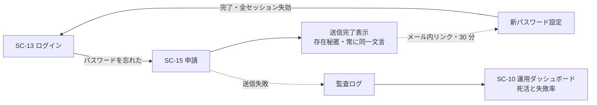

<!-- trace:
ids: [SC-10, SC-13, SC-14, SC-15, FR-05, UC-05]
adrs: [ADR-0026, ADR-0045]
iadrs: [IADR-0197, IADR-0261, IADR-0332, IADR-0344, IADR-0345]
specs: [20260823_issue-438_keycloak-theme-and-smtp, 20260828_issue-439_sc16-account-settings, 20260831_issue-1102_keycloak-smtp-externalsecret-wiring, 20260902_issue-1144_dev-mail-capture-mta, 20260902_issue-1143_reset-existence-concealment]
issues: [#438, #1102, #1143, #1144]
-->

# 画面仕様書: パスワードリセット

> **realm 設定・Keycloak テーマ（ブランド適用）は実装済み。メール送出（`smtpServer`）は実値未投入のまま**
> である。**設定手順とシークレット注入方式（Vault/ESO・kcadm）は整備した**
> （[運用 Runbook](../operations/keycloak-smtp-relay-setup-runbook.md)）。実環境の値（送信元アドレス・
> アプリパスワード）が供給されるまで、メール送出そのものは成立しない（§メール送出は成立していない参照）。
>
> ~~🔴 **さらに、その未成立が「存在秘匿」を破っている。**~~ **［2026-09-02 解消］存在秘匿は成立している。**
> 開発環境には捕捉用 MTA が dev 既定で立ち、**申請が開いている間は実在／非実在のどちらも 200** を返す
> （正規化後の本文も一致。実測）。**送出経路が使えないときは申請そのものを閉じ、両者に同じ 400 を返す**
> （閉じた状態の本文はバイト一致・実測）。成立のさせ方と 4 状態の実測は
> §存在秘匿はどう成立しているか にある。

## ★ 前提の訂正 —— `resetPasswordAllowed = true` は「実装済み」ではない

`realm.json` の `resetPasswordAllowed` は**改名前から `true` であった**が、**これは Keycloak の既定値**であって
本画面の実装ではない。**この 1 つの真を見て「リセットは実装済み」と読むと、パスワードポリシーも
リンク有効期限もセッション失効も存在秘匿も無い状態を「済み」と数えることになる**（#578 が指摘した型）。

**改名前の実測（2026-08-15）**: `passwordPolicy` / `otpPolicyType` ほか OTP 系 / `requiredActions` /
`bruteForceProtected` / `failureFactor` / `actionTokenGeneratedByUserLifespan` / `smtpServer` / `rememberMe` の
**8 項目すべてが未設定**。`resetPasswordAllowed = true` だけが真であった。

## 起点となる計画書（トレーサビリティ）

- 画面: **パスワードリセット**。戻り先はログイン画面、送信失敗の観測は [運用ダッシュボード](./SC-10_operations-dashboard.md)
- 関連ユースケース: ABAC 権限を管理する
- 関連機能要求（FR）: 非機能要件「セキュリティ: 認証・認可」
- 計画書リンク: 計画側の画面設計 §パスワードリセット／認証 UX とアカウント管理の計画 ADR／メール配信の計画 ADR

## 画面概要・目的

メール経由の自己パスワードリセット（Keycloak の `reset-credentials` フロー）。

- 共通シェル: **適用外**（Keycloak テーマ）
- 配信ホスト: 認証基盤ホスト `auth.example.co.jp`

## レイアウト / 主要素

| 要素 | 説明 |
| --- | --- |
| メールアドレス入力 | 申請フォーム |
| 送信完了表示 | **アドレスの登録有無によらず常に「メールを送信しました」**（存在秘匿） |
| 新パスワード設定 | メール内リンクから遷移。**ポリシーを画面に表示する** |

## 表示・入力項目

| 項目 | 種別 | 必須 | 初期値 | 形式・制約 | 説明 |
| --- | --- | --- | --- | --- | --- |
| メールアドレス | メール | 必須 | 空 | メール形式 | 送信後も存在有無を返さない |
| 新パスワード | パスワード | 必須 | 空 | 12 文字以上・英大/小/数字/記号のうち **3 種以上**・**直近 5 世代と不一致** | ポリシーを画面に表示する |
| 新パスワード（確認） | パスワード | 必須 | 空 | 新パスワードと一致 | — |

## バリデーション

| 項目 | 条件 | エラーメッセージ |
| --- | --- | --- |
| メールアドレス | **存在秘匿。登録有無によらず同一の完了文言** | 「メールを送信しました」で固定 |
| リセットリンク | **有効期限 30 分** | 期限切れは再申請を促す |
| 新パスワード | 12 文字以上・3 種以上・直近 5 世代と不一致 | ポリシー違反の内容を表示 |

**realm 側の実装値**（`deploy/keycloak/microservices-platform-realm.json`。レルム改名と認証ポリシー投入の実装 ADR による）:

| キー | 値 | 対応する計画 ADR の確定要件 |
| --- | --- | --- |
| `passwordPolicy` | `length(12) and passwordHistory(5) and regexPattern(...)` | 12 文字以上・直近 5 世代・**3 種以上** |
| `actionTokenGeneratedByUserLifespan` | `1800` | **リセットリンクの有効期限 30 分** |
| `bruteForceProtected` / `failureFactor` | `true` / `5` | **5 回連続失敗** |
| `waitIncrementSeconds` / `maxFailureWaitSeconds` | `900` / `900` | **15 分の一時ロック** |
| `permanentLockout` | `false` | 永久ロックにしない（15 分で解除される） |
| `requiredActions[UPDATE_PASSWORD]` | `enabled: true` | **メール配信の計画 ADR 決定 9-b の代替手順**（管理者が一時パスワード発行時に付与する） |
| `resetPasswordAllowed` | `true` | **既定値。本画面の実装ではない**（上記「前提の訂正」） |

> **「3 種以上」は Keycloak の組み込みポリシーでは表せない。** `upperCase(n)` / `lowerCase(n)` / `digits(n)` /
> `specialChars(n)` はいずれも **AND** であり、「4 種のうち 3 種」という選言を表現できない。
> **`regexPattern` の先読みで 4 通りの組み合わせを選言として書いている**（レルム改名と認証ポリシー投入の実装 ADR の決定 3）。

## アクション・イベント

| 操作 | 挙動 | 遷移先 |
| --- | --- | --- |
| 申請（メールアドレス送信） | リセットメールを送信。**登録有無によらず同一表示** | 送信完了表示 |
| メール内リンク | 新パスワード設定フォーム（有効期限 30 分） | 新パスワード設定 |
| 設定完了 | **既存の全セッションを即時失効させる** | —|

## 画面遷移

## 権限・表示条件

未認証で到達できる（ログインできない利用者が使う画面であるため）。

## ルート

| 用途 | ルート |
| --- | --- |
| 申請 | `auth.example.co.jp` の `/realms/platform/login-actions/reset-credentials` |
| メールリンクからの新パスワード設定 | `auth.example.co.jp` の `/realms/platform/login-actions/action-token?...` |

## ★ メール送出は成立していない —— 足りないもの

**`smtpServer` は realm.json へ投入していない**（意図的。テーマ実装方針・smtp 注入方式を決めた実装 ADR の決定 —— 秘匿値をバージョン管理ファイルへ書かないため）。
実環境の接続値が要るためである（利用者裁定 2026-08-15「実環境が要るものは触らない」）。
**メール配信の計画 ADR 決定 1（組織が管理するメールテナント＝ go-live では Google Workspace への SMTP リレー。第三者の配信 SaaS は用いない）**を満たすために足りないものは次の 3 つである。

| # | 不足 | 供給元 |
| --- | --- | --- |
| 1 | SMTP ホスト / ポート（`smtp.gmail.com` / 587 想定）と STARTTLS 設定 | 実環境（**書式はメール配信の計画 ADR で確定済み**。§運用手順の既定値） |
| 2 | 送信元アドレスと**アプリパスワード相当の認証情報** | 組織のメールテナント。**平文コミット禁止**のため Secret 経由 |
| 3 | 送信元の表示名・返信先 | 運用判断 |

**この 3 つが揃うまで go-live のメール送出は成立しない。値が供給されてからの投入手順（Vault→ExternalSecret→kcadm）は
整備済みである** —— [`docs/operations/keycloak-smtp-relay-setup-runbook.md`](../operations/keycloak-smtp-relay-setup-runbook.md)。

> **［2026-09-02］開発環境の送出は成立している。** 上の 3 点は**組織のメールテナントへ実送信する（go-live）ため**の
> 不足であって、**開発環境の話ではない**。開発環境にはクラスタ内の捕捉用 MTA が dev 既定で立っており、
> realm の既定の送出先もそこを指すため、**申請すればメールは届く**（外へは 1 通も出ない）。
> 稼働クラスタでの実測（2026-09-02）: 実在する利用者名の申請 → 捕捉用 MTA に 1 通、本文はリセットリンクと
> 有効期限 30 分のみ。**陰性対照**として、送出先を届かない宛先へ向けた状態では 0 通で、同じ検査が落ちることも確かめた。
> **本画面の「メール送出」の未成立は、以後 go-live に限った話である。**

### 代替（メール基盤が止まったとき）は realm 設定だけで成立する

メール配信の計画 ADR 決定 9-b の**管理者による本人確認済みリセット**（申請〔本人〕→ 上長が本人性を保証 → 管理者が実行）は、
Keycloak 管理コンソールでの一時パスワード発行と `UPDATE_PASSWORD` 必須アクションで成立し、**SMTP も外部サービスも要さない**。
**本作業で `UPDATE_PASSWORD` を有効な必須アクションとして投入済み**である。一時パスワードは口頭（対面・電話）で伝え、
申請者・承認者・実行者を監査ログへ残す。

## 計画（モックアップ・画面設計）との対応

> **判定基準は [ワンタイムコード（OTP）](./SC-14_otp-mfa.md) の同節と共通である。**

| 計画側の要素 | 実装 | 満たしていない条件 / 理由 | 計画側の該当箇所 |
| --- | --- | --- | --- |
| 12 文字以上・3 種以上・直近 5 世代と不一致（**強制**） | **する** | `passwordPolicy` に投入済み（`regexPattern` の選言で 3 種以上を表現） | 計画側の画面設計 §パスワードリセット |
| **新パスワード設定画面のポリシー表示**（主要素「ポリシー表示付き」） | **しない** | **テーマ未実装**。計画は文言まで規範化している —— **§モック間相違の確定 ⑤ は本項のみ wireframe を正とし、文字種を「英大文字・小文字・数字・記号のうち3種以上」と列挙せよ**と定める。**強制（realm）と表示（画面）は別物であり、前者が済んでも後者は残る** | 計画側の画面設計 §モック間相違の確定 ⑤ ／ §パスワードリセット |
| リセットリンクの有効期限 30 分 | **する** | `actionTokenGeneratedByUserLifespan = 1800` | 同上 |
| 5 回失敗で 15 分ロック | **する** | `bruteForceProtected` / `failureFactor` / `waitIncrementSeconds` | 認証 UX とアカウント管理の計画 ADR §パスワード・ロックアウト |
| メール経由の自己リセット | **開発環境では する**／go-live は未 | **開発環境は捕捉用 MTA が dev 既定で立ち、申請 → 送出 → 受信まで成立する**（2026-09-02 実測・自動試験あり）。**go-live の実リレーの値は未投入**（上記 3 点）。投入手順・シークレット注入方式は整備済み | 計画側の画面設計 §パスワードリセット |
| 存在秘匿（常に「メールを送信しました」） | **する**（**測って確かめた**） | **申請が開いている間、実在／非実在の利用者名で応答が分かれない**（稼働環境での実測: どちらも **HTTP 200**。フローの識別子と、申請者自身が送った利用者名の再表示だけを伏せて正規化した本文も一致）。🔴 **これは「送出経路が使えること」に依存する** —— 送出に失敗すると実在する利用者名だけ 500 になり、その差で利用者名を列挙できる。そこで**申請は送出経路が使える間だけ開く**（使えないなら閉じ、閉じた状態では両者に同じ 400 と**バイト一致の本文**を返す。実測済み）。この結合は宣言・稼働・運用の三層で強制する（§存在秘匿はどう成立しているか） | 同上 |
| 完了時に全セッションを失効 | **しない** | Keycloak の標準挙動に依存する部分と作り込みの境界が未確定。実環境確認が要る（残件） | 同上 |
| 送信失敗を監査ログへ記録し運用ダッシュボードで観測 | **しない** | 送信経路そのものが未設定のため成立しない。メール配信の計画 ADR 決定 8。**利用者向け通知機能（#600・未着手）側の実装に依存** | 計画側の画面設計 §パスワードリセット |
| メール本文はリンクと有効期限のみ | **する**（**測って真と分かった**） | 捕捉用 MTA が受けた本文を機械が検証している —— リセットリンク（`action-token`）と有効期限（30 分）を持ち、**他の URL を 1 つも含まず**添付も 0 件。有効期限の分数は realm の設定から導いており、書き写していない。メール配信の計画 ADR 決定 7 | 同上 |
| 管理者による本人確認済みリセット（代替） | **一部する** | **`UPDATE_PASSWORD` は投入済み**。**本人確認（上長承認）・口頭伝達・監査ログの運用手順書は未作成**（残件） | 計画側の画面設計 §パスワードリセット |

## ★ 存在秘匿はどう成立しているか（実測の 4 状態）

**この画面の存在秘匿は「Keycloak が既定で隠してくれる」では成立していない。** 送出に失敗すると
**実在する利用者名のときだけ 500 が返り**、その差だけで利用者名を 1 リクエストずつ列挙できる。
稼働環境で 4 つの状態を対で測った結果が次である。

| # | 状態 | 実在する利用者名 | 実在しない利用者名 | 区別できるか |
| --- | --- | --- | --- | --- |
| A | 送出経路が使える ＋ 申請が開いている | **200** | **200** | **できない**（正規化後の本文も一致） |
| B | 送出先が未設定 ＋ 申請が開いている | **500** | **200** | 🔴 **できる** |
| C | 送出先へ接続できない ＋ 申請が開いている | **500** | **200** | 🔴 **できる** |
| D | 申請が閉じている | **400** | **400** | **できない**（本文はバイト一致・導線も消える） |

**Keycloak の設定で状態 B / C の 500 を消すことはできない**（実測）。テーマは HTTP ステータスを変えられず、
送信を担う認証器は設定不能・必須固定である。したがって成立させ方は**状態 B / C に居させない**ことになる ——
**申請は送出経路が使える間だけ開き、使えないなら閉じる**（＝状態 D へ倒す）。

この結合を三層で強制する。

| 層 | 何を見るか | 落ち方 |
| --- | --- | --- |
| 宣言（静的） | realm 宣言の「申請の開閉」と「送出先」の対 | `node scripts/check-realm-constraints.js` が fail |
| 稼働（実行時） | 稼働 realm の同じ対 | `node scripts/check-password-reset-mail.js` が**応答を測る前に** fail し、どの状態に居るかを名指しする |
| 運用（手順） | 実リレーへ切り替える前後・送出経路が落ちたとき | [運用 Runbook](../operations/keycloak-smtp-relay-setup-runbook.md) が「先に閉じる／戻してから開く」を持つ |

> 🔴 **稼働状態は放っておくと状態 B へ戻る。** 認証基盤のコンテナが再起動すると、実行時に投入した送出先は
> 消える（データベースがコンテナ層にあるため）。**宣言が正しいことは、稼働状態が正しいことを意味しない** ——
> 上の「稼働（実行時）」の層はそのために置いている。**送出先を宣言そのものへ入れた**ため、
> 再インポートは状態 A へ戻る（以前は状態 B へ戻っていた）。

**送出失敗そのものは隠さない。** realm は送出成功／失敗の監査イベントを記録する設定になっており、
運用側は[運用ダッシュボード](./SC-10_operations-dashboard.md)で観測できる。**利用者向けの応答には出さない。**

## 関連仕様

- 実装 ADR: レルムを `platform` へ改名し、計画 ADR の認証ポリシーを realm へ投入する実装 ADR／
  テーマ実装方針・smtp 注入方式を決めた実装 ADR
- テスト仕様書: [パスワードリセット](../tests/SC-15_password-reset.md)
- 画面仕様書: [ログイン](./SC-13_login.md)／[ワンタイムコード（OTP）](./SC-14_otp-mfa.md)／
  [アカウント設定](./SC-16_account-settings.md)
- 運用 Runbook: [Keycloak smtpServer の設定](../operations/keycloak-smtp-relay-setup-runbook.md)

## 未決事項

- ~~🔴 **存在秘匿の破れをどう塞ぐか（未決・別途起票済み）。**~~ **［2026-09-02 解消］
  「申請は送出経路が使える間だけ開く」で閉じた**（§存在秘匿はどう成立しているか）。
  **応答を揃える方向では解けなかった** —— 認証基盤の設定では 500 を消せないことを実測で確かめている。
- 🔴 **残る窓（未解消）: 送出経路が「開いたまま」落ちた瞬間から、閉じるまでの間。**
  自動で閉じるには①認証基盤の拡張（本リポジトリにビルド基盤が無い）②前段プロキシ
  ③realm を書き換える調停器（最小権限の後退を伴う）のいずれかが要り、**いずれも本画面の実装の裁量を超える**。
  現状は**検出**（起動器の到達判定と上表の「稼働（実行時）」の層）と**運用手順**で塞いでいる。
  なお開発環境では送出先がクラスタ内に閉じており、**外部リレーの停止ではこの窓は開かない**。
- **`smtpServer` の実値投入時期**。実環境の値が供給されてから（手順は整備済み）。
- ~~**開発環境の捕捉用 MTA が未配備（別途起票済み）。**~~ **［2026-09-02 解消］開発環境の捕捉用 MTA を
  dev 既定で配備した。** 送出先の既定（realm の静的既定と Vault seed の既定の両方）は**クラスタ内の
  捕捉用 MTA**を指し、外部の実リレーへは env を明示したときだけ向く。これにより
  [テスト仕様書](../tests/SC-15_password-reset.md) のメール経路の項目が**自動**になった
  （申請 → 送出 → 受信 → 本文まで機械が通しで測る）。**残るのは go-live の実値の投入だけ**である。
- **全セッション失効の実現方式**（Keycloak の標準挙動で足りるか、作り込みが要るか）。実環境での確認が要る。
- **管理者による本人確認済みリセット（メール配信の計画 ADR の決定）の運用手順書**（上長承認・口頭伝達・監査ログ）は未作成。
- **k8s ローカル環境のテーマは自動配線済みである（2026-08-28）。** ConfigMap
  （`keycloak-theme-platform`）の生成は `scripts/k8s-local-up.sh` の `[3/7]` に組み込まれた
  （[ワンタイムコード（OTP）](./SC-14_otp-mfa.md) の画面仕様書と同じ）。
  **実クラスタでの見た目確認のみ環境待ちで残る。**

<!-- trace-table:
row1: SC-13
-->
