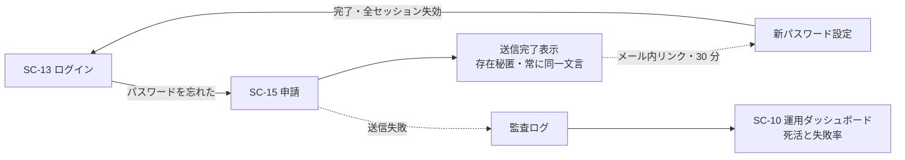

<!-- trace:
ids: [SC-10, SC-13, SC-14, SC-15, FR-05, UC-05, NFR-05, NFR-21]
adrs: [ADR-0006, ADR-0026, ADR-0045, ADR-0078, ADR-0094, ADR-0097, ADR-0103, ADR-0108, ADR-0113]
iadrs: [IADR-0197, IADR-0261, IADR-0329, IADR-0332, IADR-0344, IADR-0347, IADR-0369, IADR-0404, IADR-0421, IADR-0432, IADR-0463, IADR-0468]
specs: [20260823_issue-438_keycloak-theme-and-smtp, 20260828_issue-439_sc16-account-settings, 20260831_issue-1102_keycloak-smtp-externalsecret-wiring, 20260902_issue-1144_dev-mail-capture-mta, 20260902_issue-1143_reset-existence-concealment, 20260906_issue-1245_nearby-mta-relay, 20260907_issue-1245_reset-gate, 20260909_issue-1245_mail-relay-observation, 20260911_issue-1410_reset-timing-floor, 20260925_1470_timing-self-control-step, 20260926_1500_reset-floor-default-on, 20260926_1525_timing-resolution-t25, 20260926_1543_reset-floor-replicas-pdb, 20260926_1546_timing-clock-revert-to-ms, 20260926_1541_timing-rank-sum-test]
issues: [#438, #1102, #1143, #1144, #1245, #1301, #1307, #1410, #1470, #1500, #1525, #1543, #1544, #1546, #1541, planning#650, planning#656, planning#659]
-->

# 画面仕様書: パスワードリセット

> **realm 設定・Keycloak テーマ（ブランド適用）は実装済み。メール送出（`smtpServer`）は実値未投入のまま**
> である。**設定手順とシークレット注入方式（Vault/ESO・kcadm）は整備した**
> （[運用 Runbook](../operations/keycloak-smtp-relay-setup-runbook.md)）。実環境の値（送信元アドレス・
> アプリパスワード）が供給されるまで、メール送出そのものは成立しない（§メール送出は成立していない参照）。
>
> ~~🔴 **さらに、その未成立が「存在秘匿」を破っている。**~~ **［2026-09-02 解消］存在秘匿は成立している。**
> 開発環境には捕捉用 MTA が dev 既定で立ち、**申請が開いている間は実在／非実在のどちらも 200** を返す
> （正規化後の本文も一致。実測）。**送出経路が使えないときは申請そのものを閉じ、両者に同じ 400 を返す**
> （閉じた状態の本文はバイト一致・実測）。成立のさせ方と 4 状態の実測は
> §存在秘匿はどう成立しているか にある。

## ★ 前提の訂正 —— `resetPasswordAllowed = true` は「実装済み」ではない

`realm.json` の `resetPasswordAllowed` は**改名前から `true` であった**が、**これは Keycloak の既定値**であって
本画面の実装ではない。**この 1 つの真を見て「リセットは実装済み」と読むと、パスワードポリシーも
リンク有効期限もセッション失効も存在秘匿も無い状態を「済み」と数えることになる**（#578 が指摘した型）。

**改名前の実測（2026-08-15）**: `passwordPolicy` / `otpPolicyType` ほか OTP 系 / `requiredActions` /
`bruteForceProtected` / `failureFactor` / `actionTokenGeneratedByUserLifespan` / `smtpServer` / `rememberMe` の
**8 項目すべてが未設定**。`resetPasswordAllowed = true` だけが真であった。

## 起点となる計画書（トレーサビリティ）

- 画面: **パスワードリセット**。戻り先はログイン画面、送信失敗の観測は [運用ダッシュボード](./SC-10_operations-dashboard.md)
- 関連ユースケース: ABAC 権限を管理する
- 関連機能要求（FR）: 非機能要件「セキュリティ: 認証・認可」
- 計画書リンク: 計画側の画面設計 §パスワードリセット／認証 UX とアカウント管理の計画 ADR／メール配信の計画 ADR

## 画面概要・目的

メール経由の自己パスワードリセット（Keycloak の `reset-credentials` フロー）。

- 共通シェル: **適用外**（Keycloak テーマ）
- 配信ホスト: 認証基盤ホスト `auth.example.co.jp`

## レイアウト / 主要素

| 要素 | 説明 |
| --- | --- |
| メールアドレス入力 | 申請フォーム |
| 送信完了表示 | **アドレスの登録有無によらず常に「メールを送信しました」**（存在秘匿） |
| 新パスワード設定 | メール内リンクから遷移。**ポリシーを画面に表示する** |

## 表示・入力項目

| 項目 | 種別 | 必須 | 初期値 | 形式・制約 | 説明 |
| --- | --- | --- | --- | --- | --- |
| メールアドレス | メール | 必須 | 空 | メール形式 | 送信後も存在有無を返さない |
| 新パスワード | パスワード | 必須 | 空 | 12 文字以上・英大/小/数字/記号のうち **3 種以上**・**直近 5 世代と不一致** | ポリシーを画面に表示する |
| 新パスワード（確認） | パスワード | 必須 | 空 | 新パスワードと一致 | — |

## バリデーション

| 項目 | 条件 | エラーメッセージ |
| --- | --- | --- |
| メールアドレス | **存在秘匿。登録有無によらず同一の完了文言** | 「メールを送信しました」で固定 |
| リセットリンク | **有効期限 30 分** | 期限切れは再申請を促す |
| 新パスワード | 12 文字以上・3 種以上・直近 5 世代と不一致 | ポリシー違反の内容を表示 |

**realm 側の実装値**（`deploy/keycloak/microservices-platform-realm.json`。レルム改名と認証ポリシー投入の実装 ADR による）:

| キー | 値 | 対応する計画 ADR の確定要件 |
| --- | --- | --- |
| `passwordPolicy` | `length(12) and passwordHistory(5) and regexPattern(...)` | 12 文字以上・直近 5 世代・**3 種以上** |
| `actionTokenGeneratedByUserLifespan` | `1800` | **リセットリンクの有効期限 30 分** |
| `bruteForceProtected` / `failureFactor` | `true` / `5` | **5 回連続失敗** |
| `waitIncrementSeconds` / `maxFailureWaitSeconds` | `900` / `900` | **15 分の一時ロック** |
| `permanentLockout` | `false` | 永久ロックにしない（15 分で解除される） |
| `requiredActions[UPDATE_PASSWORD]` | `enabled: true` | **メール配信の計画 ADR 決定 9-b の代替手順**（管理者が一時パスワード発行時に付与する） |
| `resetPasswordAllowed` | `true` | **既定値。本画面の実装ではない**（上記「前提の訂正」） |

> **「3 種以上」は Keycloak の組み込みポリシーでは表せない。** `upperCase(n)` / `lowerCase(n)` / `digits(n)` /
> `specialChars(n)` はいずれも **AND** であり、「4 種のうち 3 種」という選言を表現できない。
> **`regexPattern` の先読みで 4 通りの組み合わせを選言として書いている**（レルム改名と認証ポリシー投入の実装 ADR の決定 3）。

## アクション・イベント

| 操作 | 挙動 | 遷移先 |
| --- | --- | --- |
| 申請（メールアドレス送信） | リセットメールを送信。**登録有無によらず同一表示** | 送信完了表示 |
| メール内リンク | 新パスワード設定フォーム（有効期限 30 分） | 新パスワード設定 |
| 設定完了 | **既存の全セッションを即時失効させる** | —|

## 画面遷移

## 権限・表示条件

未認証で到達できる（ログインできない利用者が使う画面であるため）。

## ルート

| 用途 | ルート |
| --- | --- |
| 申請 | `auth.example.co.jp` の `/realms/platform/login-actions/reset-credentials` |
| メールリンクからの新パスワード設定 | `auth.example.co.jp` の `/realms/platform/login-actions/action-token?...` |

## ★ メール送出は成立していない —— 足りないもの

**`smtpServer` は realm.json へ投入していない**（意図的。テーマ実装方針・smtp 注入方式を決めた実装 ADR の決定 —— 秘匿値をバージョン管理ファイルへ書かないため）。
実環境の接続値が要るためである（利用者裁定 2026-08-15「実環境が要るものは触らない」）。
**メール配信の計画 ADR 決定 1（組織が管理するメールテナント＝ go-live では Google Workspace への SMTP リレー。第三者の配信 SaaS は用いない）**を満たすために足りないものは次の 3 つである。

| # | 不足 | 供給元 |
| --- | --- | --- |
| 1 | SMTP ホスト / ポート（`smtp.gmail.com` / 587 想定）と STARTTLS 設定 | 実環境（**書式はメール配信の計画 ADR で確定済み**。§運用手順の既定値） |
| 2 | 送信元アドレスと**アプリパスワード相当の認証情報** | 組織のメールテナント。**平文コミット禁止**のため Secret 経由 |
| 3 | 送信元の表示名・返信先 | 運用判断 |

**この 3 つが揃うまで go-live のメール送出は成立しない。値が供給されてからの投入手順（Vault→ExternalSecret→kcadm）は
整備済みである** —— [`docs/operations/keycloak-smtp-relay-setup-runbook.md`](../operations/keycloak-smtp-relay-setup-runbook.md)。

> **［2026-09-02］開発環境の送出は成立している。** 上の 3 点は**組織のメールテナントへ実送信する（go-live）ため**の
> 不足であって、**開発環境の話ではない**。開発環境にはクラスタ内の捕捉用 MTA が dev 既定で立っており、
> realm の既定の送出先もそこを指すため、**申請すればメールは届く**（外へは 1 通も出ない）。
> 稼働クラスタでの実測（2026-09-02）: 実在する利用者名の申請 → 捕捉用 MTA に 1 通、本文はリセットリンクと
> 有効期限 30 分のみ。**陰性対照**として、送出先を届かない宛先へ向けた状態では 0 通で、同じ検査が落ちることも確かめた。
> **本画面の「メール送出」の未成立は、以後 go-live に限った話である。**

### 代替（メール基盤が止まったとき）は realm 設定だけで成立する

メール配信の計画 ADR 決定 9-b の**管理者による本人確認済みリセット**（申請〔本人〕→ 上長が本人性を保証 → 管理者が実行）は、
Keycloak 管理コンソールでの一時パスワード発行と `UPDATE_PASSWORD` 必須アクションで成立し、**SMTP も外部サービスも要さない**。
**本作業で `UPDATE_PASSWORD` を有効な必須アクションとして投入済み**である。一時パスワードは口頭（対面・電話）で伝え、
申請者・承認者・実行者を監査ログへ残す。

## 計画（モックアップ・画面設計）との対応

> **判定基準は [ワンタイムコード（OTP）](./SC-14_otp-mfa.md) の同節と共通である。**

| 計画側の要素 | 実装 | 満たしていない条件 / 理由 | 計画側の該当箇所 |
| --- | --- | --- | --- |
| 12 文字以上・3 種以上・直近 5 世代と不一致（**強制**） | **する** | `passwordPolicy` に投入済み（`regexPattern` の選言で 3 種以上を表現） | 計画側の画面設計 §パスワードリセット |
| **新パスワード設定画面のポリシー表示**（主要素「ポリシー表示付き」） | **しない** | **テーマ未実装**。計画は文言まで規範化している —— **§モック間相違の確定 ⑤ は本項のみ wireframe を正とし、文字種を「英大文字・小文字・数字・記号のうち3種以上」と列挙せよ**と定める。**強制（realm）と表示（画面）は別物であり、前者が済んでも後者は残る** | 計画側の画面設計 §モック間相違の確定 ⑤ ／ §パスワードリセット |
| リセットリンクの有効期限 30 分 | **する** | `actionTokenGeneratedByUserLifespan = 1800` | 同上 |
| 5 回失敗で 15 分ロック | **する** | `bruteForceProtected` / `failureFactor` / `waitIncrementSeconds` | 認証 UX とアカウント管理の計画 ADR §パスワード・ロックアウト |
| メール経由の自己リセット | **開発環境では する**／go-live は未 | **開発環境は捕捉用 MTA が dev 既定で立ち、申請 → 送出 → 受信まで成立する**（2026-09-02 実測・自動試験あり）。**go-live の実リレーの値は未投入**（上記 3 点）。投入手順・シークレット注入方式は整備済み | 計画側の画面設計 §パスワードリセット |
| 存在秘匿（常に「メールを送信しました」） | **する**（**測って確かめた**） | **申請が開いている間、実在／非実在の利用者名で応答が分かれない**（稼働環境での実測: どちらも **HTTP 200**。フローの識別子と、申請者自身が送った利用者名の再表示だけを伏せて正規化した本文も一致）。🔴 **これは「送出経路が使えること」に依存する** —— 送出に失敗すると実在する利用者名だけ 500 になり、その差で利用者名を列挙できる。そこで**申請は送出経路が使える間だけ開く**（使えないなら閉じ、閉じた状態では両者に同じ 400 と**バイト一致の本文**を返す。実測済み）。この結合は宣言・稼働・運用の三層で強制する（§存在秘匿はどう成立しているか） | 同上 |
| 完了時に全セッションを失効 | **しない** | Keycloak の標準挙動に依存する部分と作り込みの境界が未確定。実環境確認が要る（残件） | 同上 |
| 送信失敗を監査ログへ記録し運用ダッシュボードで観測 | **しない** | 送信経路そのものが未設定のため成立しない。メール配信の計画 ADR 決定 8。**利用者向け通知機能（#600・未着手）側の実装に依存** | 計画側の画面設計 §パスワードリセット |
| メール本文はリンクと有効期限のみ | **する**（**測って真と分かった**） | 捕捉用 MTA が受けた本文を機械が検証している —— リセットリンク（`action-token`）と有効期限（30 分）を持ち、**他の URL を 1 つも含まず**添付も 0 件。有効期限の分数は realm の設定から導いており、書き写していない。メール配信の計画 ADR 決定 7 | 同上 |
| 管理者による本人確認済みリセット（代替） | **一部する** | **`UPDATE_PASSWORD` は投入済み**。**本人確認（上長承認）・口頭伝達・監査ログの運用手順書は未作成**（残件） | 計画側の画面設計 §パスワードリセット |

## ★ 存在秘匿はどう成立しているか（実測の 4 状態）

**この画面の存在秘匿は「Keycloak が既定で隠してくれる」では成立していない。** 送出に失敗すると
**実在する利用者名のときだけ 500 が返り**、その差だけで利用者名を 1 リクエストずつ列挙できる。
稼働環境で 4 つの状態を対で測った結果が次である。

| # | 状態 | 実在する利用者名 | 実在しない利用者名 | 区別できるか |
| --- | --- | --- | --- | --- |
| A | 送出経路が使える ＋ 申請が開いている | **200** | **200** | **できない**（正規化後の本文も一致） |
| B | 送出先が未設定 ＋ 申請が開いている | **500** | **200** | 🔴 **できる** |
| C | 送出先へ接続できない ＋ 申請が開いている | **500** | **200** | 🔴 **できる** |
| D | 申請が閉じている | **400** | **400** | **できない**（本文はバイト一致・導線も消える） |

**認証基盤の設定で状態 B / C の 500 を消すことはできない**（実測）。テーマは HTTP ステータスを変えられず、
送信を担う認証器は設定不能・必須固定である。したがって成立させ方は**状態 B / C に居させない**ことになる ——
**申請は送出経路が使える間だけ開き、使えないなら閉じる**（＝状態 D へ倒す）。

この結合を三層で強制する。

| 層 | 何を見るか | 落ち方 |
| --- | --- | --- |
| 宣言（静的） | realm 宣言の「申請の開閉」と「送出先」の対 | `node scripts/check-realm-constraints.js` が fail |
| 稼働（実行時） | 稼働 realm の同じ対 | `node scripts/check-password-reset-mail.js` が**応答を測る前に** fail し、どの状態に居るかを名指しする |
| 運用（手順） | 実リレーへ切り替える前後・送出経路が落ちたとき | [運用 Runbook](../operations/keycloak-smtp-relay-setup-runbook.md) が「先に閉じる／戻してから開く」を持つ |

> 🔴 **稼働状態は放っておくと状態 B へ戻る。** 認証基盤のコンテナが再起動すると、実行時に投入した送出先は
> 消える（データベースがコンテナ層にあるため）。**宣言が正しいことは、稼働状態が正しいことを意味しない** ——
> 上の「稼働（実行時）」の層はそのために置いている。**送出先を宣言そのものへ入れた**ため、
> 再インポートは状態 A へ戻る（以前は状態 B へ戻っていた）。

## ★ ［2026-09-06 更新］送出経路にキュー付きの中継を挟んだ後の 4 状態

**計画の裁定を受けて、送出経路にクラスタ内の中継（キューを持ち、上流が止まっていても投函を受け付けて
後送する）を挟んだ。** 経路は `認証基盤 → 中継 → 上流`（開発環境の上流は捕捉用の受信箱、
go-live は組織のメールテナント）である。**認証基盤の送出は同期で、中継が受理した時点で成功になる ——
以後の上流の失敗は認証基盤に一切戻らない。**

| # | 状態（変更後） | 実在 | 非実在 | 判定 |
| --- | --- | --- | --- | --- |
| A | 中継稼働・上流稼働・申請が開いている | 200 | 200 | **ステータス・本文は一致。🔴 所要時間は一致していない**（下記「所要時間の差」） |
| B | 送出先が未設定 ＋ 開いている | — | — | **構造で作れなくなった**（送出先はバージョン管理下の宣言が正。後追いの差分適用が復元する） |
| C1 | **上流が停止**・中継稼働・開いている | **200** | **200** | 🎯 **一致。** メールは中継のキューへ入り、復旧後に後送される |
| C2 | **中継が停止**（Pod が居ない）・開いている | **500**（即時） | 200 | 🔴 **窓 W1**: 停止から申請が閉じるまで |
| C2' | 中継へ **接続要求が落ちる**（経路の遮断・ノード断） | **500**（**10 秒後**） | 200 | 🔴 **窓 W1'**: 同上。加えて**所要時間の差が 10 秒**になり、ステータスを見ずとも判別できる |
| C3 | 中継は居るが**投函を拒む**（キュー満杯・差出人の拒否） | **500** | 200 | 🔴 **窓 W2**: 同上 |
| D | 申請が閉じている | 400 | 400 | **一致**（本文はバイト一致） |

🔴 **窓 W1 / W1' / W2 は消えていない。** 計画は「投函できない状態を検知したら**機械で**申請を閉じる」と
定めており、その門が入れば窓は**プローブの周期 ＋ 反映の往復**まで縮む。~~**その門はまだ入っていない**~~
**［2026-09-07 更新］門が入った**（次節）。**「窓は無い」と読まないこと。**

## ★ ［2026-09-07 更新］窓を閉じる門が入った（人手 → 機械）

**中継へ投函できない状態を検知して申請を閉じる常駐の門を配備した。** 動きは次のとおりである。

- **中継へ本物の送信取引を周期的に打つ**（送信元は画面が使う差出人と同じ、宛先は決して解決されない
  予約ドメイン。**本文は送らない**ので 1 通も生まれない）。🔴 **Pod が動いているかどうかは見ない** ——
  中継が生きていて**投函だけを拒む**状態（キュー満杯・差出人の拒否・宛先の検証）が実在するからである。
- **1 回の失敗で閉じ、連続した成功で宣言どおりに戻す**（非対称。閉じるのは速く、開けるのは慎重に）。
  **宣言が「閉じる」なら決して開けない**し、**人が手で閉じた状態も開けない**（門が閉じたときの印を見る）。
- 閉じたことと理由は稼働状態に記録され、**後追いの差分適用がそれを開き直さない**ように所有権が分けてある。

窓の上限は**人手の分〜時間**から次の式へ縮んだ。

| 窓 | 変更前の上限 | 変更後の上限 |
| --- | --- | --- |
| W1（中継が停止） | 運用者が気付いて閉じるまで | **プローブ周期 ＋ プローブのタイムアウト ＋ 反映の往復** |
| W1'（接続要求が落ちる） | 同上 | 同上（実在側だけ 10 秒かかる状態は変わらない） |
| W2（投函を拒む） | 同上 | 同上（門は利用者と**同じ取引**を打つので、同じ拒否を受ける） |

🔴 **窓は縮んだだけで、閉じてはいない。** 加えて**門自身が落ちている間は W1 が開いたまま**になる
（門を監視する門は作らない —— 不在は観測側で見せる）。
🔴 **［2026-09-09］中継のキューの観測は入ったが、門の不在はまだ観測に載っていない**（残件）。

🔴 **この節の値は 1 つも実測していない**（稼働クラスタが要る）。プローブ周期・タイムアウト・
連続成功の回数はいずれも配備の宣言が与える初期値であり、**正しさは実測で決めて計画へ返す**。

🔴 **上の表のうち、この変更で実測したものは 1 つも無い**（稼働クラスタが要る）。A・B・D は以前の実測、
C1 は認証基盤の送出が同期でありタイムアウトが固定値であること（上流ソースで確認）からの**導出**である。
**実測とその結果の環流は別途行う。**

🔴 **観測点が移ったことに注意。** 中継を挟んだので、**上流が止まっていても認証基盤から見た送出は成功する**。
認証基盤の監査ログだけを見ていると**上流の停止を見逃す**。見るべきはキューの長さ・滞留時間・後送の失敗率である。

**［2026-09-09 更新］その配線が入った。** 中継のキュー長と滞留時間を可観測性基盤へ流し、
滞留が続いたときと**メールが破棄される直前**にアラートが鳴る。指標・アラート・限界は
[近接 MTA のキューの可観測性仕様書](../observability/mail-relay-queue-metrics.md)が正本であり、
見方は[運用 Runbook](../operations/keycloak-smtp-relay-setup-runbook.md) §キューの観測 にある。

🔴 **「後送の失敗率」は率として測れていない。** 寿命（30 分）を超えたメールはキューから消え、
**届いたものと区別が付かない**ため事後に数えられない。代わりに**破棄される前**に鳴らしている。
🔴 **しきい値は実測前の暫定値である**（計画が「実測してから定める」と定めている）。

**送出失敗そのものは隠さない。** realm は送出成功／失敗の監査イベントを記録する設定になっており、
運用側は[運用ダッシュボード](./SC-10_operations-dashboard.md)で観測できる。**利用者向けの応答には出さない。**

## ★ ［2026-09-11 更新］所要時間の差 —— 判定条件が定まり、塞ぎ方が決まった

🔴 **状態 A ではステータスと本文が一致しているが、所要時間は一致していない。**
稼働クラスタでの実測は **3 反復とも実在する利用者名のほうが 1.9〜3.1 倍遅い**。
**差は偶然ではなく構造である** —— 認証基盤の送出は同期であり、**実在する利用者名のときだけ
中継との送信取引 1 往復が挟まる**。**非実在の利用者名はメールを作らず、送らない。**
中継を近くへ置いたことで往復は短くなったが、**往復そのものが消えない限り差は消えない。**

🔴 **単発で分布が重なっても防御にならない。** 申請には**回数制限が 1 つも無い**
（連続失敗のロックはログインにしか効かず、申請は資格情報を出さないので失敗回数に計上されない）。
**攻撃者は同じ名前を何度でも投げて中央値を取れる。**

**判定条件（計画の裁定。［2026-09-26 改訂］順位和検定へ改めた）**: 測定条件を揃えた反復を 3 回行い
（1 反復あたり実在・非実在とも 12 標本を交互に取る）、**1 回目は暖機として捨て**、残る 2 反復の標本を**まとめて**
（片側 24 標本）、実在と非実在を**順位和検定（両側）**で比べる。**p 値が 0.01 未満なら不合格**とする。
p 値は正確法で求める（全組合せを数える。同じ値は平均の順位で扱う）。
🔴 **有意水準 1% は「系統差が無いときに偶然不合格になる率」であり、所要時間の許容幅（ms や倍率）ではない。**
差があるかどうかは、同じ反復で取った標本どうしの順位から判断する —— 許容の値を固定値で置かず**環境自身に測らせる**趣旨は変わらない。
🔴 **系統差が無くても約 100 回に 1 回は赤になる。** 1 回の赤で床を疑う前に、p 値の小ささと赤の続き方を見る。

**自己対照**（実在側の標本を取得順の交互で 2 群に分けた中央値の比＝その環境の測定ノイズの大きさ）は、
**`評価不能` の判定にだけ使う。** 判定に使う反復のどれかで自己対照が 2 倍以上なら、不合格でない限り
🔴 **`評価不能` であり、合格ではない。** **「ノイズに埋もれて見えない」を「差が無い」と読まない。**

**取り下げた判定（経緯）**: 以前は各反復で「実在／非実在の中央値の比が自己対照を超えないこと」を条件とし、
［2026-09-25］からはその前に「中央値の差が自己対照の刻み以下なら合格」（段 1）を置いていた。
🔴 **「比が自己対照を超えない」は同じ大きさの雑音どうしを比べる形である。** 標本を単調時計の整数 ns で測ると段 1 が実質消え、
**系統差が無くても実行の約 6 割が不合格になった**（整数 ms の時計の頃は段 1 がそれを覆っていたが、代わりに 1 ms の系統差を見逃していた）。
そのため時計を一度整数 ms へ戻し、**時計の変更は判定式の変更と同時に入れた。** いまは**単調時計の整数 ns**で測る。

**合成試験**（床 150 ms に半正規の揺れを足し、実在・非実在を同じ分布から取る。各 20,000 実行）:
系統差 0 の不合格は揺れ 20 µs〜1 ms で **0.95〜1.13%**（雑音の形を指数・対数正規・5% の外れ値に替えても 0.94〜1.08%）。
検出率は、揺れ 100 µs で差 0.1 ms を 99.7%、揺れ 300 µs で差 0.1 ms を 29%・差 1 ms を 100%、揺れ 1 ms で差 1 ms を 99.8%。
床を 5 ms 超える差と、床が無い形（実在 37 ms・非実在 19 ms）は、どの揺れでも 100% 検出する。

🔴 **受け入れたリスク**: 検査で検出できる差の下限は**雑音の大きさ・標本数・有意水準**で決まり（時計の分解能は雑音より粗い場合に限って効く）、
それ未満の差は検査としては見逃す（上の試験では、揺れ 300 µs のとき差 0.1 ms の 7 割を見逃す）。
従前の根拠「刻み未満の差は、同じ測定器を使う攻撃者にも見えない」は**取り下げた** —— 申請には回数制限が無く、
攻撃者は大量の標本を平均でき、より細かい時計も使える。それでも受け入れるのは、検査の役割が
「床が効いていること」の回帰検知であり、**稼働環境で存在秘匿を守るのは床だから**である。
🔴 **残るリスク**: 床の実装そのものに系統的な偏り（例: 待機の計算が実在・非実在で数十 µs 違う）があれば、
攻撃者は回数制限の無さを使って推定し得る。検査はそれを検出の下限未満では検出しない。

**塞ぎ方（計画の裁定）**: **認証基盤の前段に床（最小応答時間）を置き、床に達するまで応答を返さない。**
実在・非実在のいずれも床の時間で返る。
🔴 **「遅延を足す」部品では足りない。** 固定の遅延は両側に同じだけ足すので**比が変わらない**
（154:49 に 100 を足せば 254:149 で、縮むが 0 にはならない）。**要るのは床である。**

**現況**: **［2026-09-26 更新］床は既定で入る**（計画の追加の裁定）。床の器は近接 MTA と同じ配備単位に
置かれ、Istio のエッジを立てると**リセット申請の POST だけ**を床へ向ける経路が既定で足される。
床を入れた構成の CI 実測で、実在／非実在の中央値の比は自己対照の内側（1.00 倍）に収まった。
**全申請が床（150 ms）まで遅くなる**が、リセット申請は頻度の低い経路であり、計画がこのトレードオフを引き受けた。
🔴 **床の器がすべて落ちている間、リセット申請はすべて 503 で失敗する**（経路は器だけを向き、認証基盤へ戻る
予備の経路は無い）。起動器は器が準備できるまで待ってから先へ進む。

**［2026-09-26 更新］床の可用性（計画の追加の裁定）**:

| | |
| --- | --- |
| **統制** | 器は **2 レプリカ以上**で動かし、**退避の予算（PodDisruptionBudget・`minAvailable: 1`）**で自発的な退避によって準備のできた器が 0 になるのを防ぐ。**予備の経路（認証基盤へ直接戻る経路）は持たない。** 器がすべて落ちたときの 503 は**申請を閉じた状態**として保ち、**床を外さない** |
| **現在の実現手段** | 器の宣言が 2 レプリカ・退避の予算・分散（単一ノードでも 2 つ目が載る「できれば」の分散）を持つ。経路の宛先は器 1 つだけ。器の準備完了の判定は認証基盤を映さない。静的試験（T-26）がこの形を固定する |
| **暫定手段（器がすべて落ちたとき）** | 503 のまま器を戻す。利用者は**管理者による一時パスワード発行**で復旧する（上の「代替（メール基盤が止まったとき）」と同じ手順）。🔴 **器が全滅したことを自動で知らせる手段はまだ無い**（通知の配線は未着手） |

実在・非実在とも同じ 503 であり、閉じている間も存在秘匿は保たれる。手順は
[運用 Runbook](../operations/keycloak-smtp-relay-setup-runbook.md) の「器がすべて落ちたとき」。

- **外すとき（検証で床の有無を比べる用途に限る）**: エッジを立てるときに `RESET_FLOOR=0` を与える。経路だけが外れ、
  **所要時間で利用者名を判別できる状態に戻る**。🔴 **本番では退路として使わない**（申請には回数制限が無く、
  外している間は実在する利用者名を列挙できる）。`0` / `1` 以外の値は起動器が拒む。
- 🔴 **Traefik のエッジ（Istio を使わない既定のローカル経路）には床への経路が無い。** 器は立つが誰も通らない。
- 🔴 **稼働クラスタではまだ測っていない**（CI の k3d で測った）。クラスタ再構築後に測り、差が出れば見直す。
- テスト仕様書の所要時間の項目が赤なら、**床が外れている**（`RESET_FLOOR=0`・Istio 無し）か、
  **床を超える応答が出ている**（床の値を引き直す契機）か、［2026-09-26 追記］**約 1% の偶然の赤**（系統差が無くても出る）かである。
  偶然の赤は p 値が有意水準をわずかに下回る形で単発に出る。床が外れていれば p 値はごく小さく、赤が続く。

## 関連仕様

- 実装 ADR: レルムを `platform` へ改名し、計画 ADR の認証ポリシーを realm へ投入する実装 ADR／
  テーマ実装方針・smtp 注入方式を決めた実装 ADR
- テスト仕様書: [パスワードリセット](../tests/SC-15_password-reset.md)
- 画面仕様書: [ログイン](./SC-13_login.md)／[ワンタイムコード（OTP）](./SC-14_otp-mfa.md)／
  [アカウント設定](./SC-16_account-settings.md)
- 運用 Runbook: [Keycloak smtpServer の設定](../operations/keycloak-smtp-relay-setup-runbook.md)

## 未決事項

- ~~🔴 **存在秘匿の破れをどう塞ぐか（未決・別途起票済み）。**~~ **［2026-09-02 解消］
  「申請は送出経路が使える間だけ開く」で閉じた**（§存在秘匿はどう成立しているか）。
  **応答を揃える方向では解けなかった** —— 認証基盤の設定では 500 を消せないことを実測で確かめている。
- 🔴 **残る窓（未解消）: 送出経路が「開いたまま」落ちた瞬間から、閉じるまでの間。**
  **［2026-09-06 更新］窓は狭くなったが消えていない。** 中継を挟んだことで**上流の停止**（旧 C）は
  応答に現れなくなった（C1）。**残るのは中継自身が居ない・接続要求が落ちる・投函を拒む の 3 つ**
  （上表の W1 / W1' / W2）である。**W1' では所要時間が 10 秒になり、ステータスを見ずとも判別できる。**
  自動で閉じる手段は計画が裁定し、③realm を書き換える調停器（最小権限の後退を伴う）が採られた ——
  利用者が権限を承諾済みだが、**その門はまだ実装されていない**。現状は**検出**（起動器の到達判定と
  上表の「稼働（実行時）」の層）と**運用手順**で塞いでいる。
- **`smtpServer` の実値投入時期**。実環境の値が供給されてから（手順は整備済み）。
- ~~**開発環境の捕捉用 MTA が未配備（別途起票済み）。**~~ **［2026-09-02 解消］開発環境の捕捉用 MTA を
  dev 既定で配備した。** 送出先の既定（realm の静的既定と Vault seed の既定の両方）は**クラスタ内の
  捕捉用 MTA**を指し、外部の実リレーへは env を明示したときだけ向く。これにより
  [テスト仕様書](../tests/SC-15_password-reset.md) のメール経路の項目が**自動**になった
  （申請 → 送出 → 受信 → 本文まで機械が通しで測る）。**残るのは go-live の実値の投入だけ**である。
- **全セッション失効の実現方式**（Keycloak の標準挙動で足りるか、作り込みが要るか）。実環境での確認が要る。
- **管理者による本人確認済みリセット（メール配信の計画 ADR の決定）の運用手順書**（上長承認・口頭伝達・監査ログ）は未作成。
- **k8s ローカル環境のテーマは自動配線済みである（2026-08-28）。** ConfigMap
  （`keycloak-theme-platform`）の生成は `scripts/k8s-local-up.sh` の `[3/7]` に組み込まれた
  （[ワンタイムコード（OTP）](./SC-14_otp-mfa.md) の画面仕様書と同じ）。
  **実クラスタでの見た目確認のみ環境待ちで残る。**

<!-- trace-table:
row1: SC-13
-->
