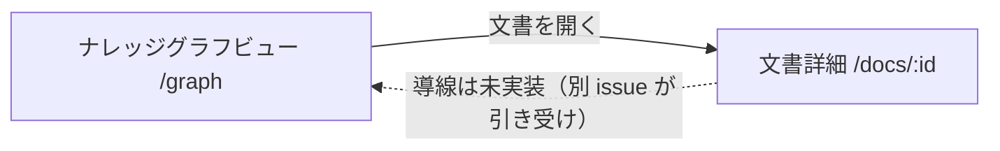

<!-- trace:
ids: [FR-05, FR-17, SC-03, SC-09, SC-18, SC-20, UC-10]
adrs: [ADR-0031, ADR-0033, ADR-0034, ADR-0039, ADR-0049, ADR-0054]
iadrs: [IADR-0122, IADR-0124, IADR-0134, IADR-0242, IADR-0274]
specs: [20260823_issue-917_sc18-graph-view]
issues: [#452, #911, #917, #962, #980, planning#446]
-->

# 画面仕様書: ナレッジグラフビュー

> **［実装状態］`status: completed` は「本仕様書が記述する範囲の実装とテストが揃った」ことを表す**
> （`docs/README.md` 運用ルール 6）。任意要素（レイアウト切替・次数比例のノードサイズ）と
> 文書詳細画面からの導線は未実装である。詳細は §計画（モックアップ・画面設計）との対応 と
> §未決事項 を見ること。

## 画面概要・目的

文書どうしの関係（辺）をたどり、検索では辿り着けない関連文書へ到達するための画面。
**起点ありの近傍探索が主用途**であり、**読み取り専用**（グラフ上での辺の追加・削除は行わない）。

- ルート: `/graph`（起点・探索深さ・間引き基準・辺の型フィルタはクエリで持つ。
  例: `/graph?root=<文書ID>&hops=2`）
- アクセス: **認証済みの全利用者**（ロール限定なし）。可視性はサーバ側の属性ベースアクセス制御が
  ホップごとに判定し、権限外の文書は**辺ごと存在しないもの**として扱われる（グレーアウト・
  鍵アイコン等の示唆表現を用いない）。

## レイアウト / 主要素

| # | 要素 | 実装 |
| --- | --- | --- |
| 1 | グラフ描画領域（力学レイアウト・ズーム / パン / ノード選択） | ECharts GraphChart（SVG レンダラ・遅延チャンク） |
| 2 | 起点ノードの明示 | 太い輪郭＋大きいサイズで強調 |
| 3 | 探索深さ（hops）コントロール | 1 / 2 / 3 のみの選択（既定 2） |
| 4 | 辺の種別フィルタ | 型ごとの ON/OFF チェックボックス。**適用はサーバ側**（後述） |
| 5 | ノード選択時のサイドパネル | タイトル / 種別 / 更新日 / タグ / 「文書を開く」/ 接続辺の一覧 |
| 6 | 表示上限と間引きの表示 | 打ち切り帯＋間引き基準の 3 択 |
| 7 | 検索ボックス（グラフ内検索） | 表示中ノードのタイトル部分一致・該当へフォーカス |
| 8 | 空状態の描き分け | 「関係する文書がありません」/「権限のある文書がありません」の 2 種 |

### ノードと辺の描き分け（色だけで意味を持たせない）

- **組織文書＝円＋📄 / 個人資料＝角丸四角＋👤（破線の輪郭）**。ホバーでタイトルと種別ラベルを表示。
- 孤立文書（表示中の辺が 0 本）は点線の輪郭＋薄い塗りでハイライトする。
- 辺は中核 5 種を線種・太さ・矢印で区別する: `related` 実線・細（無向）/ `cites` 実線・矢印 /
  `supersedes` 太実線・矢印 / `derived-from` 破線・矢印 / `embeds` 点線・矢印。
  **AI 提案由来の辺は型を問わず破線**で示す（承認済みのみが応答に載る）。
  推奨追加 4 種（`implements` / `refines` / `depends-on` / `part-of`）は細い実線で描き、凡例に明記する。
- 凡例はグラフ領域の直下に常時表示する（折りたたみ可・既定は開）。
- **文書スコープ属性の値が無い文書は組織文書として描く。** 暫定ではなく決定である
  （根拠と経緯は実装の意思決定記録を参照 —— trace ブロック）。

## 表示・入力項目

| 項目 | 種別 | 必須 | 初期値 | 形式・制約 | 説明 |
| --- | --- | --- | --- | --- | --- |
| root | クエリ | 任意 | なし | 文書 ID（UUID） | 起点文書。未指定は起点の指定を促す案内を出し、照会しない |
| hops | 選択 | 必須 | 2 | 1 / 2 / 3 のみ | 探索深さ。**上限超過は丸めずエラー**（サーバが 400）。UI は範囲外を作れない。URL の不正値は既定 2 へ正規化 |
| by | 選択 | 必須 | 距離順 | 距離 / 更新日 / 次数 | 間引きの基準。未知の値はサーバが既定へ縮退 |
| 辺の種別フィルタ | 複数選択 | 任意 | 全型 ON | 型辞書に定義済みの値のみ（辞書から取得） | **最後の 1 つは外せない**（全 OFF の探索は意味を持たない）。全 ON はクエリから省略 |
| グラフ内検索 | テキスト | 任意 | 空 | 部分一致 | **権限内で表示中のノードだけ**が対象。新たな探索は行わない |

## バリデーション

| 項目 | 条件 | 挙動 |
| --- | --- | --- |
| hops | 1〜3 の範囲外 | クライアントは既定 2 へ正規化。サーバは 400（丸めない）——防壁は両層に置く |
| 辺の型フィルタ | GUID として読めない値 | サーバが 400。**検証は認可より前**（不正値の応答から文書の存在が漏れない） |
| 辺の型フィルタ | 実在しない型 ID（形式は正しい） | エラーにしない（1 本も一致しないだけ。型辞書は公開済みの語彙） |

## アクション・イベント

| 操作 | 挙動 | 遷移先 |
| --- | --- | --- |
| ノードをクリック | サイドパネルを表示（詳細は 1 件だけ文書 API から取得。404 は縮退表示） | — |
| 「文書を開く」 | 文書詳細画面へ遷移 | `/docs/:id` |
| hops / 間引き基準 / 型フィルタの変更 | URL を更新し**サーバへ再照会**（URL が条件の単一情報源） | — |
| グラフ内検索で一致を選択 | 該当ノードを強調しサイドパネルを表示 | — |

## 表示上限と間引き

- 表示上限は**ノード 200 / 辺 500**。上限到達時は「上位 N 件を表示（全 M 件）」の帯を出す。
  **件数には閲覧権限のない文書を含めない**（サーバが認可判定を通過した品目だけを数える）。
- 総数の算出はサーバが表示上限を超えて探索する（算出用上限 ノード 2,000 / 辺 5,000）。
  **算出用上限にも達した場合は「全 M 件以上」の形**で示し、「更新日順」「次数順」が厳密な
  上位 N 件ではないことを帯に明記する。
- 帯の文言は**フィルタを絞ることを促す**。「もっと読み込む」は置かない（無制限展開を許さない）。
- **辺の種別フィルタはサーバ側で適用される。** クライアントで打ち切り後に絞ると「上位 200 件の
  うち一致したもの」になり、利用者が見る範囲が意図せず狭まるためである。総数もフィルタ後の
  母集合で数え直される。

## 空状態・ヘルプ

| 状態 | 判定 | 表示 |
| --- | --- | --- |
| 起点未指定 | root なし | 起点の指定を促す案内（照会しない） |
| 関係なし | 200 応答で辺 0 本 | 「関係する文書がありません」 |
| 権限なし / 不存在 | 404 | 「権限のある文書がありません」＋**どちらかは区別できない**旨 |

ヘルプ固定文言（**結果が 0 件でないときにも常に表示する**）:

> 関係が表示されない場合、関係が存在しないのか、閲覧権限がないのかは区別できません。
> これは、閲覧権限のない文書の存在を知られないようにするための仕様です。

個人資料がグラフに現れるのは、所有者が「ナレッジグラフに表示する」を ON にした資料に限る
（既定 OFF。個人資料管理・連携側の設定）。AI 提案の辺は承認済みのみ表示される。

## 画面遷移

## 権限・表示条件

- 全利用者が利用できる（左ナビ「利用者」グループ「ナレッジグラフ」）。
- 可視性はロールではなくサーバ側の属性判定が決める。権限外・不存在はいずれも 404 で
  秘匿され、画面はどちらも同じ中立表示にする。

## 計画（モックアップ・画面設計）との対応

計画側の画面設計 §ナレッジグラフビュー（必須 8 要素・辺の型の描き分け表・入力 / バリデーション表・
表示上限と間引き・アクセス制御・ヘルプ文言）とハイファイモックアップに対する判定。

| 計画側の要素 | 実装 | 満たしていない条件 / 理由 |
| --- | --- | --- |
| 主要素 1〜8（上表） | する | — |
| 辺の型の描き分け表（中核 5 種） | する | `embeds` は「二重線または点線」のうち**点線**を採った（描画ライブラリに二重線の線種が無い。計画が択一で認める範囲） |
| 表示上限と間引き（総数・以上・基準 3 択・促し文言） | する | — |
| 入力 / バリデーション表 | する | — |
| アクセス制御（辺ごと不可視・ホップごと判定・404 秘匿） | する | サーバ側実装（既存）に依拠。画面は示唆表現を置かない |
| ヘルプ固定文言（常時） | する | — |
| 個人資料の描き分け | **一部する** | 描き分け（形＋アイコン＋種別ラベル）は実装済み。ただし**属性複製の取り込みが未配線**のため、実データの個人資料ノードはまだ流れてこない（連携側の別 issue） |
| クラスタ表示 | **一部する** | 力学レイアウトの空間的な凝集で示す。**クラスタ要約の表示形式は計画側で未確定**（画面設計 §未確定）のため、要約・色分けは作らない |
| 任意要素（ノードサイズの次数比例・レイアウト切替〔力学 / 階層〕） | しない | 任意要素であり繰り延べ。階層レイアウトは系列辿りの需要が確認された時点で再評価（実装の意思決定記録 §結果） |
| 文書詳細画面からの導線（「ナレッジグラフで表示」） | しない | 別 issue（#452）が引き受けると文書詳細画面の実装コメントに明記済み。本画面の範囲外 |
| モックの右レール AI チャット | しない | 共通シェルの要素であり本画面の範囲外（シェル側で実装済み） |

## 関連仕様

- テスト仕様書: [ナレッジグラフビュー](../tests/SC-18_knowledge-graph.md)
- 通信仕様書: `docs/api/openapi.yaml`（グラフ読み取り・辺の型カタログ・近傍探索の `types` / `by` / `hops`）

## 未決事項

- クラスタ要約の表示形式・全体俯瞰時の間引きアルゴリズムの詳細（計画側で未確定）。
- 文書詳細画面からの導線（別 issue #452）。
- 実データの個人資料ノード・文書スコープ属性は属性複製の配線（#911）後に流れ始める。
  到来後に描き分けを実データで確認する。
