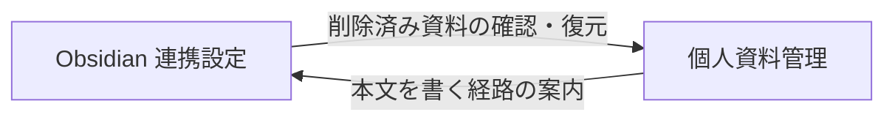

<!-- trace:
ids: [FR-19, FR-20, FR-22, SC-19, SC-20, UC-11]
adrs: [ADR-0031, ADR-0036, ADR-0037, ADR-0046, ADR-0054]
iadrs: [IADR-0121, IADR-0124, IADR-0125, IADR-0127, IADR-0131, IADR-0134, IADR-0135, IADR-0262, IADR-0270, IADR-0338, IADR-0352, IADR-0437]
specs: [20260828_issue-451c_sc19-sc20-screens, 20260828_issue-451a_private-notes-bff, 20260902_issue-1098_obsidian-plugin-pull-stage1, 20260903_issue-1153_obsidian-plugin-push-delete-conflict-stage2, 20260912_1441-1442_private-note-contract-gaps]
issues: [#451, #1098, #1153, #1441, #1442, planning#614, planning#618]
-->

# 画面仕様書: Obsidian 連携設定

> **［実装状態］`status: completed` は「本仕様書が記述する範囲の実装とテストが揃った」ことを表す**
> （`docs/README.md` 運用ルール 6）。**本書の範囲は、公開 API に口がある機能に限る。**
>
> ［2026-09-12］**同期対象範囲（フォルダの指定）と競合の解決（一覧・2 ペイン差分・3 択）を実装した。**
> 契約にその 5 口が足されたためである。**プラグイン本体は 2026-09-03 に双方向**（取り込み・送信・論理削除・
> 競合の 3 択）になっており（[機能仕様書 §Obsidian プラグイン](../functional/FR-20_obsidian-sync.md)）、
> **同じ 3 択を本画面からも行えるようになった**（プラグインを開かなくても解決できる）。
> 🔴 **同期履歴と一時停止／再開は依然として実装していない。** 履歴は**表示件数と保持期間が未確定**
> （計画側の裁定待ち）、一時停止／再開は**呼ぶ口が無い**。
> 見送りの一覧は §計画（画面設計）との対応 にある。

## 画面概要・目的

Obsidian プラグイン（社内配布）から個人資料を同期するための**端末とトークンを本人が管理する**画面。
私物端末を認めるため、端末は複数・本人管理とし、**管理者承認のステップを置かない**。
**個別失効は端末紛失時の唯一の防御線**であり必須である。

- ルート: `/my/obsidian`（URL に持つ状態は無い。**発行直後のトークンを URL に載せない**）
- アクセス: **認証済みの全利用者**（ロール限定なし）。表示範囲は本人の端末のみ。
  **管理者が他人の同期設定を見る導線は置かない。**

## レイアウト / 主要素

| # | 要素 | 実装 |
| --- | --- | --- |
| 1 | 同期範囲の固定文言 | 「同期できるのは本人が作成した個人資料のみ」「公開範囲を変えても同期は継続」 |
| 2 | 削除の扱いの固定文言 | 90 日保管・**90 日を過ぎると復元できない**・週次と 7 日前の通知。削除済み一覧への導線を添える |
| 3 | 業務関連資料としての扱いの固定文言 | 退職日から 30 日・**同期対象に入れた私的なメモも同じ扱い**。🔴 **削除の説明とは別の段落**に置き、**同期対象範囲の区画の中**（フォルダを足す入力欄の隣）へ置く |
| 4 | 接続手順 | 端末名 → トークン発行 → プラグインへ貼る。有効期限 30 日・**自動更新は行わない**旨を明記 |
| 5 | 発行結果 | **平文のトークンをその場に一度だけ表示**し、「再表示できない（再発行のみ可）」を同じ枠に置く |
| 6 | 再発行の注意（固定文言） | 期限切れのトークンは**プラグイン設定に残る**ので入れ直しが要る |
| 7 | 端末一覧 | 端末名 / 最終同期 / 有効期限 / 状態 / 操作の 5 列 |
| 8 | 状態の描き分け | 有効（残り N 日）/ 期限切れ間近（残り 7 日以内）/ 期限切れ / 失効済みの 4 値 |
| 9 | 個別失効 | **失効済み以外の全行**に置く（期限切れの行にも残す） |
| 10 | 再発行 | 失効済み以外の全行。**期限切れの行では同じ行から入れ直せる** |
| 11 | 全端末の一括失効 | 一覧の見出し脇。**復元不可を明示した確認ダイアログ**を伴う |
| 12 | 空状態 | 「接続している端末はまだありません」（発行の導線は残す） |
| 13 | 取得失敗 | 空状態へ縮退させず、取得できなかったことを示す |
| 14 | 露出設定の所在 | 資料ごとに個人資料の一覧から設定する旨と、その画面への導線 |
| 15 | 同期対象範囲 | フォルダの一覧（パス / 配下の資料数 / 最終同期）＋ 追加 ＋ 「対象フォルダから外す」。**未設定は「すべての個人資料が対象」**と明言する |
| 16 | 「外す」と「削除」の区別 | 外す操作の確認に **「これは削除ではありません」** を最初の文として置く |
| 17 | 競合の一覧 | タイトル / パス / 検出日時 / 端末 / 版。未解決のみ。0 件は「競合はありません」 |
| 18 | 競合の詳細と 3 択 | 行を選ぶと 2 ペイン（ローカル版 / サーバ版）を並べ、**ローカル採用 / サーバ採用 / 両方を残す**の 3 択 ＋ 確認ダイアログ。🔴 **自動解決の選択肢を置かない** |

### 状態の示し方（色だけで意味を持たせない）

状態は共有 UI の状態バッジで示す。**色 ＋ アイコン ＋ テキスト**が型で強制される。

| 条件 | 表示 | 意味 |
| --- | --- | --- |
| 失効済み | 中立（情報）「失効済み」 | 本人が能動的に止めた |
| 期限切れ | 危険（×）「期限切れ（同期は停止しています）」 | **同期が既に止まっている** |
| 残り 7 日以内 | 警告（三角）「期限切れ間近（残り N 日）」 | 通知が出る状態と一致させる |
| それ以外 | 成功（チェック）「有効（残り N 日）」 | 予告 |

🔴 **失効済みと期限切れを同じ見え方にしない。** 同じ列で連続的に見せると、
利用者が「もう止まっている」ことに気づかない。**判定は失効を最優先**する ——
失効済みの端末に「期限切れ間近」を出すと、まだ生きているように読める。

## 表示・入力項目

| 項目 | 種別 | 必須 | 初期値 | 形式・制約 | 説明 |
| --- | --- | --- | --- | --- | --- |
| 端末名 | テキスト | 任意 | 空 | — | 発行時に送る |
| 同期トークン | — | — | — | 発行時に自動生成 | **発行・再発行の応答にだけ現れる。**画面はその場の状態として持ち、次の操作で捨てる。保存もコピー履歴も残さない |
| 端末の失効 | 操作 | — | — | 個別 ＋ 一括の 2 系統 | いずれも確認ダイアログを伴う |
| 同期対象フォルダ | テキスト | 任意 | 空 | Vault 内の相対パス。**正規化と値域の検査はサーバが持つ** | 画面は前後の空白と `/` を落とした形で送り、空・重複のときは追加ボタンを押させない |
| 競合の解決 | 選択（3 択） | — | 未選択 | ローカル採用 / サーバ採用 / 両方を残す | 確認ダイアログを伴う。**サーバ採用だけを破壊的として扱う**（端末側の本文が失われる択だから） |
| 露出 3 トグル | — | — | — | — | 🔴 **本画面には置かない**（資料ごとに個人資料の一覧で設定する。§計画との対応） |

## バリデーション

| 項目 | 条件 | エラーメッセージ |
| --- | --- | --- |
| 一括失効 | 端末が 0 台のときは実行できない | （出さない。ボタンを無効化する） |
| 端末一覧の取得 | 失敗したら**空状態へ縮退しない** | 「接続端末の一覧を取得できませんでした。時間をおいて再度お試しください。」 |
| 書き込みの失敗 | 直近の操作の結果だけを出す | サーバの詳細（あれば）／無ければ「操作に失敗しました。…」 |

## アクション・イベント

| 操作 | 挙動 | 遷移先 |
| --- | --- | --- |
| トークンを発行する | 端末を登録し、平文を一度だけ表示する | 同じ画面 |
| 再発行する | 同じ端末へ新しいトークンを発行し、平文を一度だけ表示する | 同じ画面 |
| この端末を失効する | 確認ダイアログ → 失効 | 同じ画面 |
| すべての端末を失効する | 確認ダイアログ（復元不可・対象台数）→ 一括失効 | 同じ画面 |
| フォルダを追加する | いまの一覧に足した**全量**を送る（差分の口は無い） | 同じ画面 |
| 対象フォルダから外す | 確認ダイアログ（削除ではない旨）→ 外した 1 件を除いた全量を送る | 同じ画面 |
| 本文を見て解決する | 選んだ 1 件の両版の本文を引き、2 ペインで並べる | 同じ画面 |
| ローカル採用 / サーバ採用 / 両方を残す | 確認ダイアログ → 解決を送り、競合の一覧と個人資料の一覧を引き直す | 同じ画面 |
| 削除済みの個人資料を確認する | 個人資料管理の削除済みタブへ | 個人資料管理画面 |
| 個人資料の一覧へ | 露出を設定する画面へ | 個人資料管理画面 |

**置かない操作**: 自動更新（リフレッシュ）・端末登録の承認申請・管理者による他人の設定の閲覧／変更・
組織文書を同期対象に加える導線・**競合の自動解決（後勝ち・一括解決）**。
不在は単体テストが陽性対照つきで固定する。

## 画面遷移

## 権限・表示条件

- ロール限定なし（「個人」グループの画面）。左ナビに「Obsidian連携」として出す。
- **同期トークンはブラウザのセッションとは別系統の資格情報**である。
  **画面はトークンで API を呼ばない** —— 呼ぶのはプラグインだけである。

## 計画（画面設計）との対応

| 計画側の要素 | 実装 | 満たしていない条件 / 理由 |
| --- | --- | --- |
| 接続端末の一覧（端末名 / 最終同期 / 状態 / 個別失効） | する | 4 状態を区別。個別失効は失効済み以外の全行 |
| 管理者承認フローを置かない | する | 承認・申請の語が画面に無いことを陽性対照つきで固定 |
| 接続手順とトークン発行（一度だけ表示・再表示不可） | する | 平文が現れるのは発行・再発行の応答だけ |
| 有効期限 30 日・残り日数の表示 | する | 有効期限の列と残り日数つきの状態バッジ |
| 全端末の一括失効（復元不可の明示） | する | 確認ダイアログに復元不可と対象台数 |
| 手動再発行のみ（自動更新を行わない） | する | 自動更新の導線が無いことを陽性対照つきで固定 |
| 期限切れ時の導線（期限切れ表示 → 再発行 → 入れ直し案内） | する | 期限切れの行に再発行を同居させる |
| 期限切れトークンがプラグインに残る旨の固定文言 | する | 一覧の直前に常時表示 |
| 期限切れ間近／期限切れ／残り日数の区別 | する | 強さを変えた 2 段の警告色 ＋ 文言 |
| 期限切れ前の通知（7 日前・当日は出さない） | **画面の範囲外** | 通知は削除通知と同じ枠組みへ相乗りする（サーバ側の関心）。画面は同じ 7 日の境界で表示を切り替えるところまでを担う |
| 同期対象範囲の設定（フォルダ指定・ファイル数・最終同期） | する | フォルダの一覧・追加・「外す」。**「外す」≠「削除」**を確認ダイアログの最初の文で言い切る。未設定は「すべての個人資料が対象」と明言する |
| 同期方向の表示（双方向・削除は論理削除） | **一部する** | 削除が論理削除で 90 日保管である旨は固定文言で出す。双方向であることの図示は同期そのものが未実装のため置いていない |
| 競合の一覧と解決 UI（2 ペイン差分・3 択） | する | 一覧（未解決のみ）→ 行を選んで 2 ペイン → 3 択 ＋ 確認ダイアログ。**自動解決の選択肢が無いこと**を陽性対照つきで固定。プラグイン側のダイアログ（2026-09-03）と**同じ 3 択**であり、どちらからでも解決できる |
| 同期履歴 / エラー表示 | **しない** | 🔴 **表示件数と保持期間が未確定**である（計画側の裁定待ち。§未決事項 2）。画面が勝手に件数を決めると、裁定後に「画面に出ている長さ」と「実際に保持している長さ」が食い違う |
| 同期の一時停止 / 再開 | **しない** | 同上 |
| 露出設定（3 つを別々に・既定オフ） | **一部する** | 🔴 **資料ごとの設定は個人資料管理画面に置いた。** 公開 API にあるのは資料単位の口だけで、**利用者単位の既定を保存する口が無い**。本画面には所在の案内と導線だけを置く |
| 固定文言 3 段落（同期範囲・削除と 90 日・業務関連資料） | する | 3 段落を**別々の枠**に置く。2 段落目の「90 日を過ぎると……」を含むことを単体テストが固定 |
| 業務関連資料の段落を削除の説明と同じ段落にまとめない | する | 単体テストが「同じ段落に 90 日の文が無いこと」を固定 |
| 管理者による他利用者の設定の閲覧・変更を描かない | する | 陽性対照つきで固定 |
| 公開資料・組織文書を同期する導線を描かない | する | 同上 |
| 端末登録時の管理者承認ステップを描かない | する | 同上 |

## 関連仕様

- 通信仕様書: [BFF 境界](../api/BFF_bff-surface.md)（個々の要求・応答は [`openapi.yaml`](../api/openapi.yaml) を正とする）
- テスト仕様書: [Obsidian 連携設定画面](../tests/SC-20_obsidian-settings-screen.md) /
  [Obsidian 同期](../tests/FR-20_obsidian-sync.md)
- 画面仕様書: [個人資料管理](SC-19_private-notes.md)（露出設定の実体はそちらにある）

## 未決事項

1. ~~同期対象フォルダの設定 UI が無い~~ **［2026-09-12 解消］** 区画を実装し、
   **業務関連資料の固定文言を区画の中（フォルダを足す入力欄の隣）へ移した**。
   画面上部には残していない（2 箇所に置くと片方が古くなる）。単体テストが隣接と非重複を固定する。
2. 🔴 **同期履歴と一時停止／再開が無い。** 履歴は**表示件数と保持期間が裁定待ち**であり、
   一時停止／再開は呼ぶ口が無い。**競合の解決は 2026-09-12 に実装済み**である。
   なお、未解決のまま残る競合のローカル本文をいつ消すかも、履歴の保持期間と揃えて裁定後に定める。
3. 🔴 **利用者単位の露出の既定が無い。** 資料単位の上書きだけが在る状態であり、
   計画の「本画面の設定を利用者単位の既定とし、資料単位の上書きが優先する」を満たしていない。
4. 計画が未確定としている論点のうち**同期の監査ログの閲覧者と記録内容**はそのまま残っている。
   **プラグインへの受け渡し方法は、プラグイン第 1 段（2026-09-02）が「本画面で表示された平文を
   プラグイン設定へ貼り付ける（手入力）」で受けている** —— 本画面側は変えていない。計画がワンタイム
   コード方式へ裁定した場合は、本画面の発行結果とプラグインの入力欄の両方を直す。
