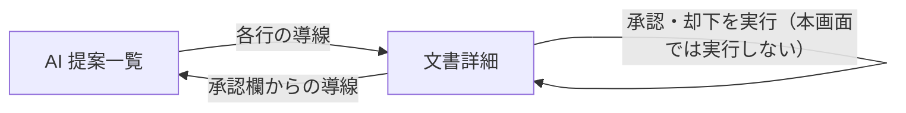

<!-- trace:
ids: [FR-05, FR-17, FR-18, SC-03, SC-09, SC-18, SC-21, UC-10]
adrs: [ADR-0031, ADR-0033, ADR-0034, ADR-0043, ADR-0050]
iadrs: [IADR-0121, IADR-0122, IADR-0124, IADR-0125, IADR-0131, IADR-0134, IADR-0135, IADR-0271, IADR-0272, IADR-0276, IADR-0300]
specs: [20260823_issue-918_sc21-ai-suggestions, 20260829_issue-450_ai-suggestion-approval]
issues: [#450, #452, #911, #914, #915, #918]
-->

# 画面仕様書: AI 提案一覧

> **［実装状態］`status: completed` は「本仕様書が記述する範囲の実装とテストが揃った」ことを表す**
> （`docs/README.md` 運用ルール 6）。**一覧と導線までが本書の範囲である。**
> **［2026-08-29］導線の先にある承認欄（文書詳細画面）が実装された。** 従前ここには
> 「承認欄はまだ無い」と書いてあったが、その記述は失効している。各行の「文書詳細で確認」から
> 遷移した先で、**リンク提案は承認・却下でき、タグ提案は却下だけできる**
> （タグの反映経路が未実装のため。詳細は文書詳細画面の仕様書）。
> 🔴 **本画面が書き込みをしないことは変わらない。** 承認・却下は文書詳細でのみ実行する。
> 再提示理由の表示は、**理由が実際に付く経路がまだ通っていない**
> （§計画（モックアップ・画面設計）との対応 と §未決事項）。

## 画面概要・目的

AI が提案したリンク候補・タグ候補を**棚卸しするための一覧**。「どの文書に提案が溜まっているか」を
横断して把握するのが目的である。

🔴 **本画面は書き込みを一切しない。従（サブ）の画面である。**
承認・却下の主導線は文書詳細画面であり、本画面は各行から文書詳細へ遷移させるだけである。
理由は計画側が明記している —— 一覧の 1 行に収まる情報では承認を判断できず、
**タイトルだけを見て機械的に承認する運用**に落ちるためである。

- ルート: `/ai-suggestions`（既定は `?state=pending`。絞り込みはクエリで持つ）
- アクセス: **認証済みの全利用者**（ロール限定なし）。可視性はサーバ側の属性ベースアクセス制御が
  決め、**閲覧権限のない文書に関する提案は件数を含め一切現れない**。

## レイアウト / 主要素

| # | 要素 | 実装 |
| --- | --- | --- |
| 1 | 提案の一覧（種類 / 提案 / 状態 / 文書詳細への導線の 4 列） | ヘッドレスの表（並べ替えのみ登録）＋ 共有 UI の表構造 |
| 2 | 状態フィルタ | 選択（承認待ち〔既定〕/ 承認済み / 却下 / すべて） |
| 3 | 種類フィルタ | 選択（すべて〔既定〕/ リンク / タグ）。**同じ一覧の絞り込みであり画面を分けない** |
| 4 | 各行から文書詳細への導線 | 全行に必ず置く（種類を問わない） |
| 5 | 再提示の理由（固定文言） | 再提示された行にのみ表示。回転アイコン＋文言 |
| 6 | 提案の根拠 | 「提案」列の中に補助テキストとして表示 |
| 7 | 位置づけの説明文 | 常時表示（承認はこの画面では行わない・まとめて承認する操作は無い・権限外は件数にも出ない） |
| 8 | 空状態 / 取得失敗 | **別々に描き分ける**（「1 件も無い」と「引けない」は別の意味である） |

### 状態の示し方（色だけで意味を持たせない）

状態は共有 UI の状態バッジで示す。**色 ＋ アイコン ＋ テキスト**の 3 点セットが型で強制される。

| 値 | 表示 | 意味 |
| --- | --- | --- |
| 承認待ち | 中立（情報アイコン） | 承認 UI にのみ現れる。探索結果には含まれない |
| 承認済み | 成功（チェック） | 確定リンクとして探索結果に含まれる |
| 却下 | 危険（×）・**「却下（再提示を抑止中）」** | 探索結果に含めず、同じ組み合わせの再提示を抑止する |

「却下」に「再提示を抑止中」を添えるのは、状態名だけだと**手続きが終わった**ように読めるためである。
却下は記録であり、両端いずれかの文書の本文が変わるまで効き続ける。

### 「提案」列の書式

- リンク提案: `<起点の文書名> → <終点の文書名>（<辺の型名>）`
- タグ提案: `<対象の文書名> に「<タグ値>」を付与`

🔴 **辺の型名は辞書（型カタログ）で解決する。** 提案の応答は型の識別子しか持たない。
型を改名しても一覧が追随するようにするためであり、応答へ名前を焼き込まない。
辞書が引けないときは識別子を出さず「型不明」に倒す（識別子を見せても判断の役に立たない）。

## 表示・入力項目

| 項目 | 種別 | 必須 | 初期値 | 形式・制約 | 説明 |
| --- | --- | --- | --- | --- | --- |
| 状態フィルタ | 選択 | 任意 | 承認待ち | 承認待ち / 承認済み / 却下 / すべて | URL の `state`。**「すべて」は絞りの解除**であり、状態の値ではない |
| 種類フィルタ | 選択 | 任意 | すべて | すべて / リンク / タグ | URL の `kind`。「すべて」のときは問い合わせに載せない |
| 承認・却下 | — | — | — | — | 🔴 **本画面では実行しない。** 各行の導線から文書詳細へ遷移して実行する |

## バリデーション

| 項目 | 条件 | エラーメッセージ |
| --- | --- | --- |
| 状態フィルタ | URL の未知の値は既定（承認待ち）へ倒す | （出さない。選択肢しか無い UI にエラー状態を持ち込まない） |
| 種類フィルタ | 同上（既定はすべて） | 同上 |
| 一覧の取得 | 取得に失敗したら**空の一覧へ縮退しない** | 「提案の一覧を取得できませんでした。時間をおいて再度お試しください。」 |

値域の防壁はサーバ側にある（範囲外は 400）。画面は丸めるだけである。

## アクション・イベント

| 操作 | 挙動 | 遷移先 |
| --- | --- | --- |
| 状態フィルタの変更 | URL を書き換えて再取得する | 同じ画面 |
| 種類フィルタの変更 | 同上。**表は 1 つのまま**（別画面へ行かない） | 同じ画面 |
| 行の「文書詳細で確認」 | 提案の起点文書へ遷移する | 文書詳細画面（`/docs/<文書ID>`） |
| 列見出しのクリック | 並べ替え（`aria-sort` ＋ 矢印の向きで示す） | 同じ画面 |

**置かない操作**: 一括承認・一括却下・行の選択（チェックボックス）・行内の承認/却下。
不在は単体テストが陽性対照つきで固定し、公開 API 側も口の不在をルート表の走査で固定する。

## 画面遷移

## 権限・表示条件

- ロール限定なし（利用者グループの画面）。左ナビの「利用者」グループに「AI提案」として出す。
- 可視性はサーバ側が判定する。**権限のない文書に関する提案は一覧にも件数にも現れない。**
  画面側では絞らない —— クライアントで間引くと、表示件数と権限内の全件がずれ、
  利用者が棚卸しの残量を読み違える。

## 計画（モックアップ・画面設計）との対応

計画側の画面設計 §AI 提案一覧（主要素 6 件・入力 / バリデーション表・「描いてはいけないもの」・
アクセス制御・タグ提案の値域・未確定事項）とハイファイ／ワイヤーフレームのモックアップに対する判定。

| 計画側の要素 | 実装 | 満たしていない条件 / 理由 |
| --- | --- | --- |
| 提案の一覧（種類 / 提案の内容 / 状態 / 導線の 4 列） | する | — |
| 状態による絞り込み（承認待ち既定・3 状態＋すべて） | する | — |
| 種類による絞り込み（同一の一覧に同居） | する | — |
| 各行から文書詳細へ飛ぶリンク（全行） | する | — |
| 再提示の理由表示（固定文言） | **一部する** | 🔴 **表示は実装したが、理由が付く経路が通っていない。** 却下解除を発火させるのは文書更新イベントの購読（別 issue・未着手）であり、そのイベントは「本文が変更されたこと」を判定できない（判定手段は別の計画 ADR で具体化された段階）。**したがって実運用でこの文言が出ることは現時点で無い。** |
| 提案の根拠の提示 | する | — |
| 一括承認のボタンを置かない | する | 単体テスト（陽性対照つき）と公開 API のルート表走査で不在を固定 |
| 導線を持たない行を作らない | する | 全行の導線を単体テストで固定 |
| リンクとタグを分けた別画面を作らない | する | ルート表を走査して 1 ルートであることを固定 |
| 承認・却下は本画面で実行しない | する | 本画面は書き込みを 1 つも行わない（不在を単体テストで固定）。**［2026-08-29］承認・却下の口は公開 API に在る**（文書詳細の承認欄が呼ぶ）——従前の「公開 API にも置いていない」は失効した。**一括承認の不在はルート表の走査で引き続き固定している** |
| 権限外の提案が件数にも現れない | する | サーバ側で判定（両端の複製属性で判定し、片方でも引けなければ出さない） |
| タグ提案がタグ辞書の値域に収まる | **しない** | 🔴 **どの層も強制していない。** 提案の生成は言語モデルが返したタグ値をそのまま保存する。辞書は文書サービス側にあり**管理者・運用者限定**のため、一般利用者の画面からは引けず、画面側での検証は原理的に不可能である。サーバ間で引くにはサービス間依存と認可主体の決定が要り、生成側の変更単位＋新しい決定記録が要る。**繰り延べであって放棄ではない。** |
| 一覧の既定の並び順 | **一部する** | 計画側が**未確定**としている。実装は作成日時の昇順（サーバ側）で、画面は列見出しから並べ替えられる。確定したら追随する |

## 関連仕様

- 通信仕様書: [BFF 境界](../api/BFF_bff-surface.md)（個々の要求・応答は [`openapi.yaml`](../api/openapi.yaml) を正とする）
- テスト仕様書: [AI 提案一覧](../tests/SC-21_ai-suggestion-list.md)
- 画面仕様書: [ナレッジグラフビュー](SC-18_knowledge-graph.md)（辺の型カタログの利用が共通）

## 未決事項

1. ~~🔴 **導線の先（文書詳細の承認欄）が未実装である。**~~
   **［2026-08-29 解消］承認欄は実装された。** 各行の導線から遷移した先で 1 件ずつ承認・却下できる。
   **ただしタグ提案は承認できない**（タグの反映経路が未実装であり、押せる承認ボタンを置くと
   無い作用を約束することになるため）。**この差異は計画側へ環流する。**
2. **再提示理由が実際に付く経路が通っていない**（上表参照）。
3. **タグ提案の値域強制が無い**（上表参照）。計画側の受け入れ基準を満たしていない。
4. **提案の生成頻度・滞留時の扱い・提案件数の通知の要否**は計画側が未確定である。
   通知が要ると決まれば、左ナビのバッジ等は本画面ではなく共通シェルの関心になる。
