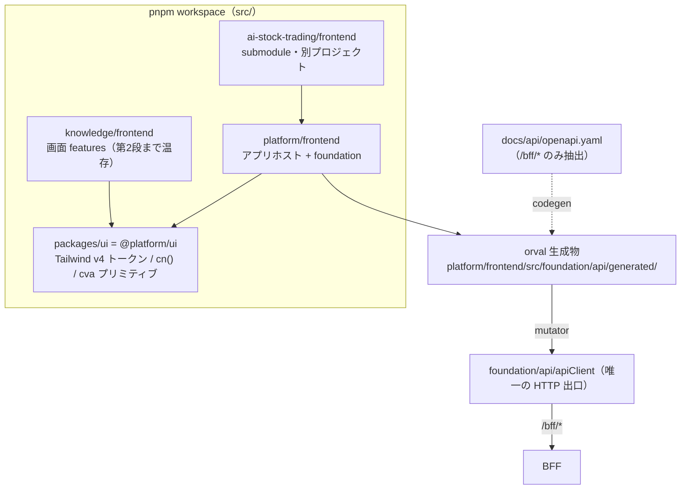

# 仕様書: SPA 基盤の React 19 + Vite + TanStack 移行（段階分割と第 1 段）

> 本仕様書は実装着手前に作成する。計画書（`project-planning` の `projects/<name>/`）を一次情報とし、
> 本書は「この作業で何をどう実装するか」を確定するための作業仕様である。

## 起点となる計画書（トレーサビリティ）

- 機能要求（FR）: なし（NFR: 保守性・移植性。SPA 全画面 SC-01〜21 の土台）
- ユースケース（UC）/ 画面（SC）: SC 全画面共通（画面個別の実装は #452）
- 関連 ADR（計画）:
  [ADR-0031](../../planning/projects/microservices-platform/07_adr/ADR-0031_frontend-stack.md)（Accepted。
  フロントエンド技術スタック確定 ＋ 2026-07-30 裁定の追補）／
  [ADR-0032](../../planning/projects/microservices-platform/07_adr/ADR-0032_spa-auth-bff-session.md)（BFF セッション認証）
- 関連する技術検討（計画）:
  [13_frontend-stack](../../planning/projects/microservices-platform/06_technical/13_frontend-stack.md)（fixed。採用技術一覧が正）／
  [08_data-egress-policy](../../planning/projects/microservices-platform/06_technical/08_data-egress-policy.md)（外部 CDN・Web フォント・analytics 禁止）
- 関連 IADR:
  [IADR-0121](../adr/IADR-0121_spa-stack-migration-staging.md)（本作業の内部設計判断。**本書と対で読む**）／
  [IADR-0033](../adr/IADR-0033_frontend-spa-foundation.md)（現行 SPA 基盤。本作業で Superseded）／
  [IADR-0034](../adr/IADR-0034_frontend-coverage-gate.md)（フロント カバレッジ ratchet）／
  [IADR-0056](../adr/IADR-0056_repo-unit-structure-platform-knowledge.md)（ユニット第一構成・依存規則）／
  [IADR-0116](../adr/IADR-0116_reimplementation-branching-and-pr-policy.md)（再実装の進行方式。**規約 4・5 が本書の段階分割を規定する**）
- 本リポジトリの起点: #446（親 #454）

## 目的・背景

計画 [ADR-0031](../../planning/projects/microservices-platform/07_adr/ADR-0031_frontend-stack.md) は
フロントエンドスタックを **React 19 + Vite + TanStack** に確定し、2026-07-30 の利用者裁定
（planning#78）は「計画書は絶対的な正である。実装を計画へ合わせる」とした。現行実装
（[IADR-0033](../adr/IADR-0033_frontend-spa-foundation.md)）は React 18.3 / react-router-dom 6 /
npm workspaces / `oidc-client-ts` であり、計画の採用技術一覧とほぼ全面的に食い違っている。

移行対象は「パッケージマネージャ・フレームワーク・ルーティング・状態管理・API 契約生成・CSS/UI・
認証方式・テスト基盤・CI」の**9 系統**にわたる。#446 の 1 PR に全量を入れるのは
[IADR-0116](../adr/IADR-0116_reimplementation-branching-and-pr-policy.md) 規約 4（1 PR が大きくなる場合は
issue を分割する）に反し、レビュー可能性（CLAUDE.md「人間がレビューできる変更単位を維持する」）も
成り立たない。**本書はまず移行全体を段階へ分割し、そのうえで第 1 段の実装仕様を確定する。**

## 対象範囲

### 段階分割（全体設計）

| 段 | 内容 | 起票 | 本 PR |
| --- | --- | --- | --- |
| **第 1 段** | **新スタックの土台**: pnpm workspace / React 19 / TanStack Query / Tailwind v4 ＋ `packages/ui` / orval（BFF OpenAPI → 型・フック・MSW モック）/ 機械強制 lint / CI の pnpm 化 | #446（本 issue） | **○** |
| 第 2 段 | **ルーティングとアプリシェル**: TanStack Router 移行・共通シェル（ナビ／ユーザーアイコン→SC-16／通知）・旧 13 画面の削除・shadcn/ui コンポーネント本移植・Lingui(ja/en)・Storybook | 要起票（#452 と同一 PR 群 or 直前） | × |
| ↳ **第 2 段は 2 つに分かれた**［2026-08-04 追記］ | **#490 で消化**: TanStack Router 移行・共通シェル（ナビ／ユーザーアイコン→SC-16／通知）・旧画面のルート載せ替え。**未起票の残件**: shadcn/ui コンポーネント本移植・Lingui(ja/en)・Storybook。**旧 13 画面の削除・再実装は #452**（feedback §完了条件 の割り当て）。現行値は [IADR-0124](../adr/IADR-0124_tanstack-router-unit-composition.md) と [#490 仕様書](./20260804_issue-490_spa-router-shell.md) を正とする | #490 ＋ 要起票 | × |
| 第 3 段 | **認証**: BFF セッション方式（ADR-0032）へ移行し `oidc-client-ts` を撤去 | #439 と協調 | × |
| 第 4 段 | **画面機能の土台**: 右レール AI チャット（SSE）の状態管理・Zustand・TanStack Table・ECharts・RHF/Zod | #452 に随伴 | × |
| 第 5 段 | **運用系**: Knip / Plop.js / Renovate / Husky + lint-staged / Commitlint | 要起票 | × |

段の順序は依存関係である。第 1 段はどの段からも参照される土台であり、**第 2 段以降を単独では進められない**
（pnpm と `packages/ui` と orval が無いと、画面実装は手書きクライアントと個別 CSS に逆戻りする）。

> **［2026-08-04 追記 / #490］第 2 段の分割について。** 本表は
> [IADR-0121](../adr/IADR-0121_spa-stack-migration-staging.md) 決定 1 が「段の内容・境界の正」と
> 指定する表であるため、実際の起票と食い違ったまま放置しない。#490 はルータ・共通シェル・
> 旧画面のルート載せ替えに限定して起票された（理由: [IADR-0116](../adr/IADR-0116_reimplementation-branching-and-pr-policy.md)
> 規約 4。ルータ差し替えと UI ライブラリ・i18n・カタログの導入を 1 PR に入れるとレビューが成立しない）。
> 本決定 1 自身が起票先を「#452 と同一 PR **群**、または直前の独立 issue」と複数形で書いており、
> この分割は決定の枠内にある。残件の起票内容は
> [#490 仕様書 §親への申し送り](./20260804_issue-490_spa-router-shell.md#親への申し送り) を参照。

#### なぜ TanStack Router を第 1 段に入れないか（判断と根拠）

計画は「一括で移行する。段階分け・並行運用は行わない」（13_frontend-stack §実装への移行方針）とするが、
これは**旧スタックと新スタックを並行運用しない**という意味であり、PR 分割の禁止ではない
（PR 分割は [IADR-0116](../adr/IADR-0116_reimplementation-branching-and-pr-policy.md) 規約 4 が要求する）。
そのうえで、ルーティングの差し替えは次の 3 点から**画面再実装（#452）と同一の変更単位に属する**。

1. **画面を巻き込まずには終わらない。** `react-router-dom` の `Link` / `useParams` / `useSearchParams` は
   knowledge の 13 画面のうち 6 ファイルで使われ、`MemoryRouter` は 13 のテストファイルで使われている
   （実測は「§実測: 移行の結合度」）。TanStack Router へ差し替えるには、この 19 ファイルを一度書き換える
   必要がある。ところが #452 は同じ 13 画面を Bulletproof React ＋ shadcn/ui ＋ orval 生成フックで
   **作り直す**（計画の裁定「旧画面は完全に削除する」）。第 1 段で書き換えれば、**同じ画面を 2 回書く**。
2. **型安全という採用理由が第 1 段では得られない。** TanStack Router を選んだ理由は「ルート・検索パラメータ
   まで型安全にできる」（ADR-0031 §理由）である。現行の合成点は `FeatureModule.routes`（`RouteObject[]`）を
   **実行時に配列連結**して木を組む構造で、この形のままでは型付きルート ID が生成されず、`Link` の `to` も
   `useSearch` も型が付かない。型安全を得るにはルート定義そのものを画面側で書き直す必要があり、それは
   #452 の作業である。第 1 段で入れても「型の付かない TanStack Router」という最悪の中間状態にしかならない。
3. **[IADR-0116](../adr/IADR-0116_reimplementation-branching-and-pr-policy.md) 規約 5** は「既存実装は各 issue の
   範囲内で置換する。リポジトリ規模の一括削除は行わない」と定める。13 画面の削除は #452 の範囲であり、
   #446 で削除すると develop の SPA が数週間「画面ゼロ」になる。

したがって第 1 段は**ルーティングに触れない**。`react-router-dom` 6.30 の peer は `react >= 16.8` であり
React 19 と共存できる（§実測で確認）ため、React 19 化とルータ据え置きは両立する。

### 対象（第 1 段）

- `src/` の npm workspaces → **pnpm workspace** 移行（lockfile・CI・Dockerfile・`scripts/setup.sh`・how-to）
- React 18.3 → **19**（`react` / `react-dom` / `@types/react` / `@types/react-dom`）
- **TanStack Query** の導入（`QueryClientProvider` をアプリ合成ルートへ。サーバー状態の唯一の入口）
- **orval** の導入（BFF OpenAPI → 型・TanStack Query フック・MSW モック。生成物はコミットし CI で差分検査）
- **Tailwind CSS v4** ＋ 共有 UI パッケージ **`@platform/ui`**（`src/packages/ui`）の骨格
- **機械強制**（ESLint）: Redux 不使用・手書き HTTP クライアント禁止・BFF 境界・`packages/ui` の公開面
- CI（`frontend.yml` / `frontend-tests.yml`）の pnpm 化と codegen 差分検査
- 技術要件書（`docs/tech/tech-requirements.md`）の該当節更新、`src/README.md` の依存規則追記
- [IADR-0033](../adr/IADR-0033_frontend-spa-foundation.md) の Superseded 化と
  [IADR-0121](../adr/IADR-0121_spa-stack-migration-staging.md) の起票

### 対象外（第 1 段。送り先を明記する）

| 対象外 | 送り先 | 理由 |
| --- | --- | --- |
| TanStack Router 移行・共通アプリシェル | 第 2 段（#452 と同一 PR 群） | 上記「なぜ第 1 段に入れないか」 |
| 旧 13 画面の削除・再実装 | #452 | IADR-0116 規約 5（issue の範囲内で置換） |
| shadcn/ui コンポーネントの本移植（Dialog / Table / Form 等） | 第 2 段 | 画面が決まらないと必要な部品が決まらない。第 1 段は初期化と 2 プリミティブに留める |
| `oidc-client-ts` の撤去・BFF セッション認証 | 第 3 段（#439） | ADR-0032 のサーバ側実装が前提。**先に撤去すると SPA がログインできなくなる** |
| Zustand / TanStack Table / ECharts / RHF + Zod / dayjs | 第 4 段 | 使う画面が無い段階での導入は「計画外の過剰実装」（CLAUDE.md 禁止事項） |
| Lingui / Storybook / Knip / Plop / Renovate / Husky | 第 2・5 段 | 同上 |
| 右レール AI チャット（SSE）の実装 | 第 4 段 | ただし**状態管理パターンの決定**は IADR-0121 で先に確定する（計画の申し送り事項のため） |
| `ai-stock-trading`（AST）ユニットの新スタック追随 | AST 側リポジトリ | 別プロジェクト（[IADR-0120](../adr/IADR-0120_excluded-units-from-gitmodules.md)）。第 1 段は AST を壊さない |

### 既存実装の扱い（裁定）

計画の裁定は「旧画面（13 画面）は完全に削除する」である。本書はこれを**否定せず、実行時期のみ #452 へ
割り当てる**。第 1 段時点での扱いを明示する。

| 既存物 | 第 1 段での扱い | 最終的な扱い |
| --- | --- | --- |
| `knowledge/frontend` の 13 画面（`home` + `sc01`〜`sc11`） | **温存**（React 19 上で動作させる） | #452 で削除・再実装（計画裁定どおり） |
| `platform/frontend/src/foundation/api`（`apiFetch` / `apiStream` / `ApiError`） | **温存・拡張**。orval の mutator 経路として再利用する | 第 3 段で認証ヘッダ部のみ差し替え。SSE は第 4 段で利用 |
| `platform/frontend/src/foundation/auth`（oidc-client-ts） | **温存**（#439 未着手のため） | 第 3 段で撤去（ADR-0032） |
| `platform/frontend/src/foundation/routing`（react-router-dom） | **温存** | 第 2 段で TanStack Router へ置換 |
| `platform/frontend/src/foundation/ui/Layout`（インライン style） | Tailwind ＋ `@platform/ui` で**最小限に再スタイル**（パイプライン疎通の証明） | 第 2 段で共通シェルへ作り直し |
| `src/package-lock.json` | **削除**（pnpm へ移行） | — |

## 設計

### 全体構成（第 1 段の到達点）

### 1. pnpm workspace 移行

- `src/pnpm-workspace.yaml`: `packages: ['*/frontend', 'packages/*']`
- `src/package.json`: `workspaces` を削除し `packageManager: "pnpm@<実測版>"` と `engines.node: ">=22"` を追加。
  スクリプトは `npm run --workspace X` → `pnpm --filter X run` へ書き換える。
- `src/package-lock.json` を削除し `src/pnpm-lock.yaml` をコミットする。
- **`node_modules` の配置が変わる**（pnpm は厳密解決）。各パッケージが使う依存は各 `package.json` に
  宣言されている必要がある。phantom dependency（宣言せず親から借りていた依存）が露見したら、その
  パッケージへ正しく宣言を足す（これは pnpm 採用の目的そのもの。ADR-0031 §理由）。
- Volta はローカル任意（`packageManager` フィールドで corepack / pnpm が版を解決する）。
  **CI は Volta を使わず `pnpm/action-setup`** を用いる（13_frontend-stack §リスク・未決事項）。

### 2. React 19

- `react` / `react-dom` を `^19`、`@types/react` / `@types/react-dom` を `^19` へ。
- `@vitejs/plugin-react` は **4.x を維持**する（最新 6.x は peer `vite ^8`）。Vite は当初 5 を維持する
  方針だったが、依存レビューの high advisory（GHSA-fx2h-pf6j-xcff）に Vite 5 系の修正版が無く、
  **6.4.3 へ上げた**（経緯と根拠は §依存レビューの指摘と対応）。
- `react-helmet-async` は元々未使用のため作業なし（React 19 ネイティブメタデータで代替される）。
- `react-router-dom` は 6.30 系のまま据え置く（peer `react >= 16.8`。§実測で共存を確認）。

### 3. TanStack Query

- `platform/frontend/src/foundation/api/queryClient.ts` に `QueryClient` を 1 つ生成する。
  既定は `retry: 1` / `refetchOnWindowFocus: false` / `staleTime: 30_000`（画面が増える前の保守的な既定。
  画面固有の要求は各 feature が上書きする）。
- `App.tsx` に `QueryClientProvider` を追加する（`ErrorBoundary` の内側、`AuthProvider` の外側）。
- **サーバー状態は TanStack Query に一元化**し、グローバルストア（Redux）を持たない（ADR-0031）。

### 4. orval（BFF OpenAPI → 型・フック・MSW モック）

- 設定は `src/orval.config.ts`。入力は `docs/api/openapi.yaml`。
- **`/bff/*` 以外を除外する**。同 OpenAPI は BFF とサービス直接 API を 1 ファイルに束ねており、
  SPA が触れてよいのは `/bff/*` だけである（BFF 境界。IADR-0033 決定 5 を新スタックへ引き継ぐ）。
  orval の `input.filters` はタグ／スキーマ単位でしか効かず、`/feedback` と `/bff/feedback` のように
  **同一タグに BFF と非 BFF が混在する**ため使えない（実測）。よって
  `input.override.transformer`（`src/orval-bff-only.cjs`）で `paths` を前処理して落とす。
- 出力: `platform/frontend/src/foundation/api/generated/`（`mode: 'tags-split'`・`client: 'react-query'`・
  `httpClient: 'fetch'`・`mock: true`）。**生成物はコミットする**（CI・IDE・レビューが codegen 実行順に
  依存しないため）。`pnpm run codegen` で再生成し、CI で `git diff --exit-code` により乖離を検出する。
- **mutator で `foundation/api` 経由に固定する**。orval 既定の生成コードは素の `fetch('/bff/...')` を呼び、
  実行時 config（`bffBaseUrl`）も 401 導線も無視する。`foundation/api/orvalMutator.ts` の `bffFetch` を
  mutator に指定し、生成コードの HTTP 出口を `apiClient` 1 箇所へ収束させる。
- 生成物は lint とカバレッジの対象から除外する（自動生成物の品質は生成器の責務）。typecheck は行う
  （生成物と mutator・スキーマの不整合は型で気付きたい）。

### 5. Tailwind CSS v4 ＋ `@platform/ui`

- `src/packages/ui`（パッケージ名 `@platform/ui`）を新設する。**切り出し単位は IADR-0121 決定 4 で確定**する
  （要旨: デザイントークン ＋ `cn()` ＋ shadcn/ui 派生プリミティブのみ。ドメイン・通信・ルーティング・認証を含めない）。
- Tailwind v4 は設定ファイル不要（CSS-first）。`@platform/ui` が `styles.css`（`@import "tailwindcss"` ＋
  `@theme` トークン）を公開し、各ユニットの SPA がそれを import する。
- ビルドは `@tailwindcss/vite`（peer `vite ^5.2 || ^6 || ^7 || ^8`）。
- **アセットは全て自己ホスト**する（08_data-egress-policy）。Web フォントは読み込まず OS のシステム
  フォントスタックを用いる。アイコンは `lucide-react`（npm パッケージ＝自己ホストバンドル）。
- shadcn/ui は「コピーして所有する」方式のため、第 1 段では `components.json`（初期化）と、規約の実例と
  なる 2 プリミティブのみを置く: `Button`（cva によるバリアント）と `StatusBadge`。
  `StatusBadge` は**色だけで意味を持たせない**（INDEX 決定 21）の実装上の型を示すため、色に加えて
  **アイコンとテキストラベルを必須**にする。

### 6. 機械強制（ESLint）

| 規則 | 対象 | 目的（計画の根拠） |
| --- | --- | --- |
| `no-restricted-imports`: `redux` / `react-redux` / `@reduxjs/toolkit` / `redux-*` | 全ユニットの frontend | Redux 不使用（ADR-0031 §決定・13_frontend-stack） |
| `no-restricted-imports`: `axios` / `superagent` / `ky` 等の HTTP クライアント | 同上 | 手書きクライアント禁止・BFF 境界 |
| `no-restricted-globals` / `no-restricted-properties`: `fetch` / `XMLHttpRequest` / `EventSource` | `foundation/api/**` と生成物**以外** | HTTP 出口を `foundation/api` の 1 箇所へ収束させる |
| `no-restricted-imports`: `@platform/ui/src/*`（深い参照） | 全ユニットの frontend | 共有 UI の公開面を `@platform/ui` のエントリに固定する |
| 既存のユニット依存方向規則 | 現状維持 ＋ `packages/ui` を許可先に追加 | `src/README.md` 依存規則 例外 2（IADR-0056 決定 3 の系）の拡張（IADR-0121 決定 4） |

`foundation/api` 自身と `foundation/api/generated/**` は当然に除外する（そこが唯一の出口だから）。
テストファイルは `fetch` のモック定義のため除外する。

### 7. CI

- `frontend.yml` / `frontend-tests.yml`: `actions/setup-node` の `cache: npm` を廃し、
  `pnpm/action-setup` → `actions/setup-node`(`cache: pnpm`) → `pnpm install --frozen-lockfile` とする。
  `paths` トリガの `src/package-lock.json` を `src/pnpm-lock.yaml` / `src/pnpm-workspace.yaml` へ差し替える。
- `frontend.yml` に **codegen 差分検査**ステップを足す（`pnpm run codegen` 後に `git diff --exit-code`）。
- Playwright は `npx playwright install` を CI では従来どおり実行する（ローカル実行時は
  既設ブラウザ `/opt/pw-browsers/chromium` を実行パス指定で使い、install は行わない）。
- `.github/workflows/` は GitHub App 権限では編集不可のため、ローカル（`workflow` スコープ）で
  コミット／プッシュする（CLAUDE.md）。

### 8. カバレッジ ratchet の扱い

[IADR-0034](../adr/IADR-0034_frontend-coverage-gate.md) の ratchet は「下げたままにしない」。第 1 段は
**画面を削除しない**ため母数の急減が起きず、追加コード（`queryClient` / `orvalMutator` / `@platform/ui`）
には同 PR でテストを付ける。**しきい値は下げず、実測に合わせて引き上げる。**
orval 生成物はカバレッジ対象から除外する（自動生成物を母数へ入れると床が意味を失う）。

床の置き方には 1 つ判断が要る。横断計測には `ai-stock-trading`（AST）の実装が含まれ、AST の実測は
高いため横断値を押し上げる。しかし AST は独自の計画と ADR を持つ**別プロジェクト**（submodule）であり、
横断値に床を合わせると **AST の pin 更新だけで本リポのゲートが動く**。これは
[IADR-0118](../adr/IADR-0118_backend-coverage-floor.md) 決定 4 がバックエンドの床で名指しした
「他プロジェクトのカバレッジを合算した濁り」と同じ失敗である。したがって
**床は MSP 所有分（platform/frontend + knowledge/frontend + packages/*）の実測を基準に置く**。
実測値と新しい床は「§検証（実測）」に記す。

なお「フロントの計測**範囲**から AST を外すか」は IADR-0118 決定 4 との整合の問題であり、本作業の
対象外とする（別 issue で判断する。§未決事項）。

## 受け入れ基準

- [x] 移行全体が段へ分割され、各段の内容・順序・起票先・#452 / #439 との境界が本書に記録されている
- [x] 第 1 段の内部設計判断が [IADR-0121](../adr/IADR-0121_spa-stack-migration-staging.md) に記録され、
      [IADR-0033](../adr/IADR-0033_frontend-spa-foundation.md) が Superseded になっている
- [x] `src/` が pnpm workspace で解決でき、`pnpm install --frozen-lockfile` が成功する
- [x] React 19 で `typecheck` / `lint` / 単体テスト / `build` が全て成功する（既存テストの退行ゼロ）
- [x] `pnpm run codegen` が `/bff/*` のみから型・TanStack Query フック・MSW モックを生成し、
      再実行しても差分が出ない
- [x] 生成されたクライアントの HTTP 出口が `foundation/api` の mutator 1 箇所である（生成物に素の `fetch(` が無い）
- [x] `@platform/ui` が Tailwind v4 のトークンとプリミティブを公開し、`platform/frontend` のビルド成果物に
      Tailwind の CSS が含まれる（＝パイプラインが疎通している）
- [x] 外部ホストへの参照がビルド成果物に無い（Web フォント・CDN・analytics の 0 件を確認する）
- [x] Redux・手書き HTTP クライアント・BFF 境界外アクセスが lint で機械的に落ちる（違反サンプルで確認）
- [x] CI（`frontend.yml` / `frontend-tests.yml`）が pnpm で動作する定義になっている
- [x] カバレッジしきい値を下げていない。下げた場合は値・理由・回復計画が本書にある
- [x] Playwright E2E スモークが 1 本以上 green
- [x] バックエンド非破壊: `node scripts/scripts.test.js` / `node scripts/check-doc-links.js` /
      `node scripts/check-commit-messages.js --base origin/develop` が green
- [x] AST（submodule・別プロジェクト）の typecheck / lint / テストが壊れていない

## テスト方針

- **`@platform/ui`**: `cn()` のマージ規則（後勝ち・条件付きクラス）と `StatusBadge` の
  「色だけで意味を持たせない」（アイコン ＋ テキストが常に描画される）を Vitest ＋ Testing Library で固定する。
- **`orvalMutator`**: 生成コードが渡す `/bff/...` 形式の URL を `apiClient` の経路へ正しく写像すること、
  401 で再ログイン導線が起動すること、`{ data, status, headers }` 形状を返すことをテストで固定する。
- **`queryClient`**: 既定オプション（retry / refetchOnWindowFocus / staleTime）を回帰として固定する。
- **既存テスト**: React 19 化・pnpm 化での退行ゼロを、**移行前の既存 193 テスト**（31 files）の全 green で
  確認する。この 193 は `src/ai-stock-trading` を populate した横断計測の値であり、submodule 未 populate だと
  1 スイートが解決不能で失敗する（§実測: 移行の結合度）。MSP 所有分（platform / knowledge）のみでは 122 テストである。
- **E2E**: 既存のログイン画面スモーク（未認証 → `/login` 誘導）を新ツールチェーンで green にする。
- **機械強制**: lint 規則は「違反コードを書いて落ちること」を手で 1 度確認し、結果を本書へ実測記録する
  （規則そのものの単体テストは ESLint 側の責務であり、ここでは配線の確認に留める）。

## 実測: 移行の結合度（測定条件つき）

判断の根拠にした数値である。**測定条件**: worktree `feat/ADR-0031-spa-foundation-migration`（`origin/develop`
= `5031483`）、submodule は `planning` 未 populate・`src/ai-stock-trading` **populate 済み**
（`655e2ed`）。コマンドは `grep -rn "react-router" <dir>`。

| 対象 | react-router 参照ファイル数 | 内訳 |
| --- | --- | --- |
| `knowledge/frontend/src` | 13 | 実装 6（`Link` × 4・`useSearchParams` × 1・`useParams` × 1）／テスト 7（`MemoryRouter`） |
| `platform/frontend/src` | 9 | 実装 6（`App` / `router` / `featureRegistry` の型 / `RequireAuth` / `Layout` / auth ページ 2）／テスト 2 |
| `ai-stock-trading/frontend` | 7 | テスト 3（`MemoryRouter` ラッパ）／standalone スタブ 1 ／E2E ハーネス 1 ／`package.json`・lock 2 |

`ai-stock-trading` の**本体実装は react-router API を一切使っていない**（`FeatureModule` の
`{ path, element }` 形と `RequireRole` / `useAuth` / `apiClient` のみに依存）。第 2 段のルータ移行では、
`FeatureModule` の形を保つ限り AST 側の変更を要さない見込みである（第 2 段で再検証する）。

`npm run test:coverage` の**ローカル実測は submodule 未 populate だと 1 スイートが失敗する**
（`platform/frontend/src/foundation/ui/Layout.test.tsx` が合成点経由で `@ai-stock-trading/features` を解決できない）。
本作業では AST を populate して測る。この条件を書かない計測値は再現しない。

## 検証（実測）

**測定条件**（これを書かない実測値は再現不能）: worktree `feat/ADR-0031-spa-foundation-migration`
（起点 `origin/develop` = `5031483`）／Node **22.22.2**／pnpm **10.33.0**／**Vitest 3.2.7 ＋ Vite 6.4.3**／submodule は
`src/ai-stock-trading` を **populate 済み**（`655e2ed`。CI の `frontend*.yml` も `src/*` の submodule を
取得するため CI と同条件）・`planning` は未 populate。コマンドはすべて `src/` で実行。

| 検証項目 | コマンド | 結果 |
| --- | --- | --- |
| 依存解決 | `pnpm install` | 成功（workspace 5 プロジェクト: root / platform/frontend / knowledge/frontend / ai-stock-trading/frontend / packages/ui） |
| 型検査 | `pnpm run typecheck` | **OK**（platform / knowledge / packages/ui / ai-stock-trading の 4 パッケージ） |
| lint | `pnpm run lint` | **0 error**（warning 2 件＝ `react-refresh/only-export-components`。AST の E2E ハーネスと `@platform/ui` の Button。既存の運用と同じく warn 止まり） |
| 単体テスト | `pnpm run test` | **35 files / 227 tests 全 green**（移行前は 31 files / 193 tests。退行 0・純増 34） |
| カバレッジ | `pnpm run test:coverage` | lines/statements **91.46%** / branches **82.33%** / functions **83.58%**（しきい値 83 / 83 / 74 / 75 を上回る） |
| ビルド | `pnpm run build` | 成功。`dist/assets/index-*.css` **5.90 kB**（gzip 2.07 kB）＝ Tailwind のパイプラインが疎通している |
| API 契約生成 | `pnpm run codegen` | 成功。BFF の 5 タグ（analysis / config / dashboard / feedback / search）から 16 ファイル生成。**再実行しても差分なし** |
| E2E スモーク | `playwright test`（Chromium は既設 `/opt/pw-browsers/chromium` を実行パス指定。install はしない） | **6 passed**（`login` / `sc01-search` / `sc04-wiki` / `sc08-analysis` / `sc10-operations` / `sc11-config`。いずれも未認証時の `/login` 誘導） |
| バックエンド非破壊 | `node scripts/scripts.test.js` | **197 tests passed** |
| ドキュメント | `node scripts/check-doc-links.js` | **OK**（399 Markdown。planning 配下 687 件は未 populate のため対象外） |
| コミット規約 | `node scripts/check-commit-messages.js --base origin/develop` | **✓ すべて適合** |
| Actions 版数 | `node scripts/check-action-versions.js` | **退行なし**（`pnpm/action-setup` の下限は `scripts/action-versions.repo.json` に追加） |
| 受け入れ基準 → テスト | `node scripts/check-test-traceability.js` | **OK**（仕様書のある起点 ID 27 件中 27 件が写像済み） |

### カバレッジ ratchet の更新（下げていない）

| 基準 | lines / statements | branches | functions |
| --- | --- | --- | --- |
| 実測（全ユニット横断＝ゲートが見る値） | 91.46% | 82.33% | 83.58% |
| 実測（MSP 所有分のみ。AST の実装を母数から除外して測り直した値） | 88.07% | 80.00% | 80.76% |
| **新しい床**（MSP 所有分の実測から約 5pt 下） | **83**（← 78） | **74**（据置） | **75**（← 68） |

引き上げであり、**下げた項目は無い**（回復計画は不要）。branches のみ据え置きなのは、MSP 所有分の実測
80.00% に同じ 5pt の余裕を取ると 75 となり、現行値 74 とほぼ一致するためである（1pt の差は
計測ゆらぎの範囲として据え置いた）。床を横断値ではなく MSP 所有分に
合わせた理由は「§設計 8」に記した。

### BFF 境界・データ egress の実測

- 生成物 16 ファイル中、素の `fetch(` は **0 件**（全て `bffFetch` = `foundation/api` の mutator 経由）。
- ビルド成果物の外部参照: CSS の `url()` **0 件**、CSS 中の外部 URL は Tailwind のコメント 1 件のみ、
  JS 中の `http(s)://` は XML 名前空間・`localhost` 既定・React のエラーページ URL（文字列）のみ。
  **Web フォント・CDN・analytics への参照は 0 件**（08_data-egress-policy 準拠）。

### 依存レビュー（`security.yml` / `dependency-review-action`）の指摘と対応

PR #489 の CI で `Dependency review` ジョブが fail した。**pnpm-lock 化で全依存が「新規追加」扱いになり、
移行前から使っていた版も含めて全量がレビューされた**結果の顕在化である（`fail-on-severity: high`）。

CI ログに出ていたのは 1 件だが、`pnpm audit` で**全量を測り直したところ、しきい値（high 以上）で
落ちる advisory は 2 件あった**。1 件だけ直しても次の実走でまた止まるため、両方まとめて解消した。

| 重大度 | パッケージ | GHSA | 該当版 | patched | 対応 |
| --- | --- | --- | --- | --- | --- |
| **critical** | vitest | [GHSA-5xrq-8626-4rwp](https://github.com/advisories/GHSA-5xrq-8626-4rwp)（UI サーバ稼働時に任意ファイルの読み取り・実行） | `<3.2.6` | `>=3.2.6` | **3.2.7** へ更新（`@vitest/coverage-v8` も同版に揃える） |
| **high** | vite | [GHSA-fx2h-pf6j-xcff](https://github.com/advisories/GHSA-fx2h-pf6j-xcff)（Windows の代替パスによる `server.fs.deny` バイパス） | `<=6.4.2` | `>=6.4.3` | **6.4.3** へ更新（**Vite 5 系に修正版が存在しない**ため、5 の維持と両立しない） |

#### 版の選定根拠

- **vitest 3.2.7**: advisory の `patched_versions` は `>=3.2.6`。3.2 系の最新である 3.2.7 を採る
  （4.x は Vite 8 を要求し、TypeScript・ESLint 周辺まで巻き込むため本作業の範囲を超える）。
- **vite 6.4.3**: advisory の `patched_versions` は `>=6.4.3` で、**6.4.3 が該当条件を満たす最小の版**である。
  7.x / 8.x を選ばないのは `@vitejs/plugin-react` 4.x の peer が `^4.2 || ^5 || ^6 || ^7` であり、
  8 系へ行くとプラグインのメジャー更新を巻き込むためである。6.4.3 は peer 互換を全て満たす
  （`@vitejs/plugin-react` 4.7.0 / `@tailwindcss/vite` 4（peer `^5.2 || ^6 || ^7 || ^8`）/
  vitest 3.2.7 の vite 依存 `^5 || ^6 || ^7`）。副次的に esbuild の moderate advisory
  （GHSA-67mh-4wv8-2f99・`<=0.24.2`）も解消した。
- **TypeScript 5.6 は維持**した（advisory 対象外であり、動かす理由がない）。

> **計画・指示との差異（Vite 5 の維持を諦めた点）**: 当初の方針は「Vite 5 / TS 5.6 は維持」だったが、
> GHSA-fx2h-pf6j-xcff は **high** かつ **Vite 5 系に修正版が存在しない**（`patched: >=6.4.3`）。
> Vite 5 を維持すると `fail-on-severity: high` の依存レビューが恒久的に fail し、PR をマージできない。
> 「上げない」ことに実行可能な選択肢がないため、影響が最小の 6.4.3 を採った。
> CLAUDE.md と技術要件書の「Vite 5」表記も追随させた。

#### 可変ユニット（submodule）側の同一 advisory

上記を root の `devDependencies` で上げても、**`ai-stock-trading` が自前で宣言する vitest 2.1.1 /
vite 5.4.8 が lockfile に残るため advisory は消えなかった**（実測）。AST は別プロジェクトで本リポジトリ
からは是正できない（[IADR-0120](../adr/IADR-0120_excluded-units-from-gitmodules.md)）。横断 Vitest は
ルートの vitest で全ユニットのテストを走らせるので**これらは実際には使われない版**だが、lockfile に
載る以上は依存レビューの対象になる。React と同じく `pnpm.overrides` でワークスペース 1 本に揃えて解消した
（override は本リポジトリでの合成時のみ効き、AST 単独リポジトリのビルドには影響しない）。

#### 残存 advisory（しきい値未満・対応不要）

`react-router` / `react-router-dom` の **moderate 3 件**（`GHSA-jjmj-jmhj-qwj2` は
`patched: <0.0.0` ＝ **修正版なし**、他 2 件は `>=7.18.0` で修正）。`fail-on-severity: high` の下では
ブロックしない。**移行第 2 段で `react-router-dom` 自体を撤去する**ため、v7 への移行や override は
行わない（撤去する依存に手を入れるのは二重作業になる）。

#### 更新後の実測（差分のみ）

| 項目 | Vitest 2.1.9 / Vite 5.4.21 | **Vitest 3.2.7 / Vite 6.4.3** |
| --- | --- | --- |
| 単体テスト | 35 files / 213 tests green | **35 files / 213 tests green**（ツールチェーン更新による増減なし） |
| カバレッジ（横断） | 91.69 / 82.04 / 83.14 | **91.44 / 82.15 / 83.52** |
| カバレッジ（MSP 所有分） | 88.36 / 79.53 / 80.00 | **88.03 / 79.70 / 80.64** |
| しきい値 83 / 74 / 75 | 充足 | **充足**（床の導出値は変更なし） |
| ビルド | CSS 5.91 kB / JS 464.43 kB | CSS 5.90 kB / JS 475.88 kB |
| `pnpm audit` で high 以上 | 2 件 | **0 件** |
| E2E スモーク | 6 passed | **6 passed** |

カバレッジが ±0.4pt 未満動いたのは v8 provider の計上差（母数が 3831 → 3940 行）であり、この時点では
テストの増減は無い。**床（83 / 74 / 75）は据え置いた**——MSP 所有分の実測に対して従来と同じ約 5pt の
余裕が残っており、導出をやり直しても同じ値になるためである。

> 本表は**ツールチェーン更新だけを切り出した**比較である。この後の再試行述語の是正（§再試行の既定値）で
> テストが 14 件増えたため、本書の他所に載る最終値（227 tests / 横断 91.46 / 82.33 / 83.58）とは
> 一致しない。

### 再試行の既定値（AI レビュー 🟡 の是正）

`DEFAULT_QUERY_OPTIONS.retry` は当初 `1`（数値）で、コメントには「4xx（権限・検証）は再試行しても
無駄なため深追いしない」と書いていた。**この記述は実装と一致していなかった**——TanStack Query の数値
`retry` はエラー種別を区別せず、全ての失敗を同じ回数だけ再試行する。

**コメントに合わせて実装を直す**方を採った（コメントを実態へ書き換える選択肢もあったが採らない）。
理由は、このシステムでは **4xx が異常ではなく通常の応答**だからである。
[IADR-0009](../adr/IADR-0009_wiki-browsing-404-hides-existence.md) の存在秘匿により、権限外の資源への
アクセスは 404 として返り、画面は「不在」と「権限による秘匿」を区別しない。つまり **404 は日常的に
発生する**。数値の `retry: 1` のままだと、その 404 が毎回 2 往復になり、確実に失敗する 2 回目のぶんだけ
エラー表示が遅れ、BFF と後段サービスへ無駄な負荷がかかる。しかも**画面は正しく動いて見える**ため、
気付ける類の問題ではない。「起こり得ないケースへの防御」ではなく、既に文書化された頻出経路の是正である。

実装は述語 `shouldRetryQuery(failureCount, error)` に置き換えた（`queryClient.ts`）。

- 4xx は再試行しない。ただし **408（要求タイムアウト）と 429（要求過多）は時間で解消し得るため再試行**する。
- 状態コードを持たない失敗（ネットワーク断 = `ApiError('network', …, null)`）と 5xx は 1 度だけ再試行する。
- 上限は `MAX_QUERY_RETRIES = 1`。TanStack Query は `failureCount` を **0 起点で渡し判定後に加算**する
  （`@tanstack/query-core` の `retryer.js` を実読して確認）ため、`failureCount < 1` が数値指定の
  `retry: 1` と同じ回数になる。

テストは**述語そのもの（純関数）を対象**にした 14 件を追加した。TanStack Query の内部再試行機構を
再現するテストは、ライブラリの実装詳細に依存して脆くなるため書かない。結果、単体テストは
213 → **227 件**、横断カバレッジは 91.44 → **91.46%**（branches 82.15 → **82.33%**）。しきい値は据え置き。

### pnpm のビルドスクリプト許可（`onlyBuiltDependencies`）と msw

pnpm 10 は既定でパッケージの `postinstall` を実行しない（サプライチェーン対策）。install ログには
`Ignored build scripts: msw@2.15.0` が出るが、**msw は許可リストへ入れない**。実測の根拠は次のとおり。

- msw の `postinstall` は `config/scripts/postinstall.js` を呼ぶだけで、その中身は
  **親プロジェクトの `package.json` に `msw.workerDirectory` フィールドが無ければ即 return する**
  （実装を読んで確認）。本リポジトリにそのフィールドは無いため、実行しても何も起こらない。
- `workerDirectory` が要るのは **ブラウザの Service Worker（`mockServiceWorker.js`）を配る場合**である。
  本作業で入れた MSW は orval が生成する `*.msw.ts`（Node 側の `setupServer` 用ハンドラ）であり、
  Service Worker は使わない。
- 現時点で `msw` を import しているのは生成物 5 ファイルのみで、**テストからはまだ使われていない**
  （画面実装 #452 で使う）。単体テスト 227 件は許可なしで全て green である。

許可リストは「実行させる必要が実証できたものだけ」に保つ。効果のない `postinstall` に install 時の
コード実行権限を与えるのは、得るものが無いまま攻撃面を広げるだけである。現在の許可は
`esbuild`（Vite / Vitest のネイティブバイナリ取得に必要）1 件のみ。

### CI 固有の失敗と、ローカル検証がそれを見逃した理由（実測）

第 1 段の CI（PR #489）は 3 回失敗した。いずれも**ローカルでは緑のまま再現しない**種類であり、
記録に残す価値がある。

| # | 失敗 | 原因 | 対応 |
| --- | --- | --- | --- |
| 1 | 全ジョブが起動直後に `Error: No pnpm version is specified.` | `pnpm/action-setup` の既定はリポジトリ直下の `package.json` を読む。本リポジトリの workspace ルートは `src/` | 全 3 ステップへ `package_json_file: src/package.json`。ローカルの pnpm は `packageManager` を直接読むため差が出ない |
| 2 | `Dependency review` が critical で fail | pnpm-lock 化で全依存が「新規追加」扱いになり全量レビューされた | vitest 3.2.7 / vite 6.4.3 へ（§依存レビューの指摘と対応） |
| 3 | e2e の `pnpm exec playwright install` が `ERR_PNPM_RECURSIVE_EXEC_FIRST_FAIL Command "playwright" not found` | `@playwright/test` は workspace ルートではなく `platform/frontend` の devDependency。pnpm は各パッケージの `.bin` しか見せない | `pnpm --filter @platform/frontend exec …` へ |

**3 はローカル検証が「成功」と誤答していた。** 検証環境には `/opt/node22/bin/playwright`（**1.56.1**）が
グローバル導入されており、`src/` での `pnpm exec playwright` がそこへフォールバックして通っていた。
CI ランナーにグローバル導入は無いため落ちる。`--filter` を付けた場合の解決先は
`./node_modules/.bin/playwright`（**1.62.1** ＝ `platform/frontend` が宣言した版）であり、
**版番号がそのまま「どちらを引いたか」の判別子になる**。

同種の見落としが他に無いか、CI が呼ぶ全バイナリの解決先を機械的に確認した（グローバルには
`eslint` / `prettier` / `tsc` / `chromedriver` 等も存在する）。結果、`eslint` / `vitest` / `orval` /
`prettier` / `tsc` / `vite` はいずれも `./node_modules/.bin/` を引いており、**フォールバックしていたのは
`playwright` のみ**だった。

### 機械強制の発火確認（違反サンプル。確認後に削除済み）

`knowledge/frontend/src` と `packages/ui/src` に故意の違反ファイルを置いて `eslint` を実行した結果、
**8 件すべてが error として検出**された。

| 違反 | 検出ルール |
| --- | --- |
| `import { createStore } from 'redux'` | `no-restricted-imports`（Redux 不採用） |
| `import axios from 'axios'`（2 箇所） | `no-restricted-imports`（手書きクライアント禁止） |
| `import { cn } from '@platform/ui/src/lib/cn'` | `no-restricted-imports`（共有 UI の公開面） |
| `fetch('/bff/search')`（2 箇所） | `no-restricted-globals`（BFF 境界） |
| `new XMLHttpRequest()` | `no-restricted-globals` |
| `new EventSource('/bff/stream')` | `no-restricted-globals` |

### `src/packages/` が `.gitignore` に飲まれていた（実測・是正済み）

`.gitignore` の `**/[Pp]ackages/*`（NuGet の packages フォルダ用）が、新設した `src/packages/` と
名前で衝突しており、`git add -A` しても `@platform/ui` の全ファイルが**静かに無視されていた**。
作業ツリーにはファイルがあるため typecheck・lint・テスト・ビルドはすべて green で、`git status` にも
現れず、**クリーンな checkout の CI で初めて壊れる**類の失敗である。`!src/packages/**` で除外を解除し、
`src/README.md` にも注意書きを残した。是正後に**クリーンな worktree を切り直して全コマンドを再実行し**、
typecheck 4 パッケージ OK / lint 0 error / カバレッジ 91%台 / build 成功 / codegen 差分なし を確認した。

### React 19 移行で判明した非自明な事実（実測）

pnpm は npm と違い各パッケージの宣言を厳密に守るため、submodule ユニット（AST）が React 18 を
宣言したままだと **React 19 の要素を React 18 の DOM で描画する**状態になる。override を入れる前の実測は
**横断 Vitest 59 件が失敗**（`Objects are not valid as a React child`）、**AST の typecheck が TS2786**
（`@types/react` の二重解決）だった。`pnpm.overrides` で React の実体をワークスペースで 1 つに固定して解消した。
この事象は npm workspaces のホイスティングでは表面化しないため、pnpm 移行と React 19 を同じ段で行った
本作業でのみ観測できた。

## 計画書との差異

- 差異: **あり（実行時期のみ）**。
  1. 13_frontend-stack §実装への移行方針は「一括で移行する。段階分け・並行運用は行わない」とするが、
     本書は移行を 5 段の PR へ分割する。**旧新スタックの並行運用は行わない**（各系統は 1 度だけ切り替える）ため
     計画の趣旨は保たれる。分割は [IADR-0116](../adr/IADR-0116_reimplementation-branching-and-pr-policy.md)
     規約 4・5 の要求である。
  2. 「旧画面は完全に削除する」は #452 で実行する（本書 §既存実装の扱い）。第 1 段で削除すると develop の
     SPA が長期間「画面ゼロ」になり、IADR-0116 規約 5 に反する。
  3. `oidc-client-ts` は 13_frontend-stack で「不採用」だが、ADR-0032 のサーバ側（#439）未着手のため
     第 1 段では温存する。第 3 段で撤去する。
- **計画への環流（1 について）**: 差異 1 は計画の決定内容を変えないが、**裁定の 1 行の解釈**に依存する
  判断であり、解釈が揺れると第 2 段以降の PR 構成が根本から変わる。したがって記録を残さない選択は取らず、
  [feedback/20260804_frontend-migration-staging-interpretation.md](../../feedback/20260804_frontend-migration-staging-interpretation.md)
  を起票した（当初「`/plan-feedback` は起こさない」としていた判断は撤回した）。
  **本件は利用者裁定により確定済みである**——裁定原文「**段階分けは認めます。最終的に一括になっていれば
  問題なし**」（2026-08-04）。すなわち禁止対象は旧新スタックの並行運用であり、PR / issue の分割は
  認められる。ただし「最終的に一括」は完了条件を伴う（第 2〜5 段の全消化＝13_frontend-stack §採用技術一覧と
  実装の完全一致。`react-router-dom` と `oidc-client-ts` の消滅を含む）。**残タスクは計画リポジトリへの
  1 行追補の反映操作のみ**で、実装側の判断待ちはない。
- 差異 2・3 は計画の決定内容を変えず、実行する段が違うだけであるため追加の環流は行わない。
- 13_frontend-stack §実装への移行方針が「移行完了の定義・テストの作り直し・カバレッジしきい値の扱いは
  未確定であり、実装引き継ぎ時に確定する」としている点については、本書と IADR-0121 が実装側の確定値を与える
  （移行完了の定義は上記 feedback の「§完了条件」）。

## 未決事項

- 第 2 段の起票（TanStack Router ＋ アプリシェル ＋ 旧画面削除）を #452 に含めるか独立 issue にするかは、
  #454 のチェックリスト運用者（利用者）が決める。本書は**独立 issue を推奨**する（#452 は画面 13 枚で
  それ自体が大きいため）。[IADR-0116](../adr/IADR-0116_reimplementation-branching-and-pr-policy.md) 規約 4
  に従い、第 2 段以降は **issue を分割**して #454 のチェックリストへ追加する（#446 に複数 PR をぶら下げない）。
- フロントのカバレッジ計測範囲から `ai-stock-trading` を外すか否か（[IADR-0118](../adr/IADR-0118_backend-coverage-floor.md)
  決定 4 との整合）。本作業では床の**基準**を MSP 所有分に寄せるに留めた。
- Vite のメジャー更新（5 → 7/8）と Vitest 4 / TypeScript 7 系への追随は本作業の対象外。別途 issue 化する。
- `@platform/ui` に置いた 2 プリミティブ以外（Input / Dialog / Table / Form …）の shadcn/ui 移植は
  第 2 段。ダークテーマのトークンも画面確定後に追加する。
- **`knowledge/frontend` はまだ `@platform/ui` を依存として宣言していない**（第 2 段メモ）。第 1 段では
  knowledge 側の画面に手を入れないため、宣言だけ先に足しても未使用の依存が増えるだけである
  （pnpm は宣言のない依存の解決を許さないので、**使い始める段で必ず気付く**——気付けない失敗にはならない）。
  第 2 段で画面を再実装する際に `@platform/ui: workspace:*` を `knowledge/frontend/package.json` へ追加する。
