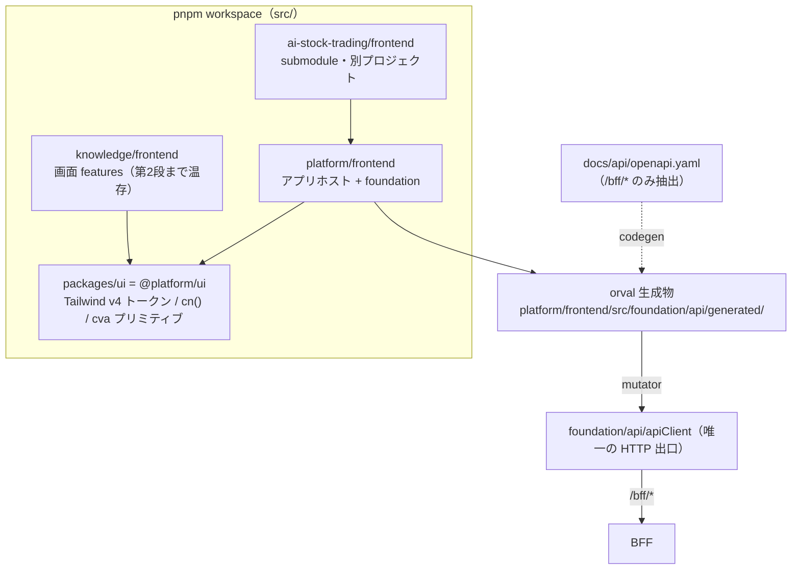

# 仕様書: SPA 基盤の React 19 + Vite + TanStack 移行（段階分割と第 1 段）

> 本仕様書は実装着手前に作成する。計画書（`project-planning` の `projects/<name>/`）を一次情報とし、
> 本書は「この作業で何をどう実装するか」を確定するための作業仕様である。

## 起点となる計画書（トレーサビリティ）

- 機能要求（FR）: なし（NFR: 保守性・移植性。SPA 全画面 SC-01〜21 の土台）
- ユースケース（UC）/ 画面（SC）: SC 全画面共通（画面個別の実装は #452）
- 関連 ADR（計画）:
  [ADR-0031](../../planning/projects/microservices-platform/07_adr/ADR-0031_frontend-stack.md)（Accepted。
  フロントエンド技術スタック確定 ＋ 2026-07-30 裁定の追補）／
  [ADR-0032](../../planning/projects/microservices-platform/07_adr/ADR-0032_spa-auth-bff-session.md)（BFF セッション認証）
- 関連する技術検討（計画）:
  [13_frontend-stack](../../planning/projects/microservices-platform/06_technical/13_frontend-stack.md)（fixed。採用技術一覧が正）／
  [08_data-egress-policy](../../planning/projects/microservices-platform/06_technical/08_data-egress-policy.md)（外部 CDN・Web フォント・analytics 禁止）
- 関連 IADR:
  [IADR-0121](../adr/IADR-0121_spa-stack-migration-staging.md)（本作業の内部設計判断。**本書と対で読む**）／
  [IADR-0033](../adr/IADR-0033_frontend-spa-foundation.md)（現行 SPA 基盤。本作業で Superseded）／
  [IADR-0034](../adr/IADR-0034_frontend-coverage-gate.md)（フロント カバレッジ ratchet）／
  [IADR-0056](../adr/IADR-0056_repo-unit-structure-platform-knowledge.md)（ユニット第一構成・依存規則）／
  [IADR-0116](../adr/IADR-0116_reimplementation-branching-and-pr-policy.md)（再実装の進行方式。**規約 4・5 が本書の段階分割を規定する**）
- 本リポジトリの起点: #446（親 #454）

## 目的・背景

計画 [ADR-0031](../../planning/projects/microservices-platform/07_adr/ADR-0031_frontend-stack.md) は
フロントエンドスタックを **React 19 + Vite + TanStack** に確定し、2026-07-30 の利用者裁定
（planning#78）は「計画書は絶対的な正である。実装を計画へ合わせる」とした。現行実装
（[IADR-0033](../adr/IADR-0033_frontend-spa-foundation.md)）は React 18.3 / react-router-dom 6 /
npm workspaces / `oidc-client-ts` であり、計画の採用技術一覧とほぼ全面的に食い違っている。

移行対象は「パッケージマネージャ・フレームワーク・ルーティング・状態管理・API 契約生成・CSS/UI・
認証方式・テスト基盤・CI」の**9 系統**にわたる。#446 の 1 PR に全量を入れるのは
[IADR-0116](../adr/IADR-0116_reimplementation-branching-and-pr-policy.md) 規約 4（1 PR が大きくなる場合は
issue を分割する）に反し、レビュー可能性（CLAUDE.md「人間がレビューできる変更単位を維持する」）も
成り立たない。**本書はまず移行全体を段階へ分割し、そのうえで第 1 段の実装仕様を確定する。**

## 対象範囲

### 段階分割（全体設計）

| 段 | 内容 | 起票 | 本 PR |
| --- | --- | --- | --- |
| **第 1 段** | **新スタックの土台**: pnpm workspace / React 19 / TanStack Query / Tailwind v4 ＋ `packages/ui` / orval（BFF OpenAPI → 型・フック・MSW モック）/ 機械強制 lint / CI の pnpm 化 | #446（本 issue） | **○** |
| 第 2 段 | **ルーティングとアプリシェル**: TanStack Router 移行・共通シェル（ナビ／ユーザーアイコン→SC-16／通知）・旧 13 画面の削除・shadcn/ui コンポーネント本移植・Lingui(ja/en)・Storybook | 要起票（#452 と同一 PR 群 or 直前） | × |
| 第 3 段 | **認証**: BFF セッション方式（ADR-0032）へ移行し `oidc-client-ts` を撤去 | #439 と協調 | × |
| 第 4 段 | **画面機能の土台**: 右レール AI チャット（SSE）の状態管理・Zustand・TanStack Table・ECharts・RHF/Zod | #452 に随伴 | × |
| 第 5 段 | **運用系**: Knip / Plop.js / Renovate / Husky + lint-staged / Commitlint | 要起票 | × |

段の順序は依存関係である。第 1 段はどの段からも参照される土台であり、**第 2 段以降を単独では進められない**
（pnpm と `packages/ui` と orval が無いと、画面実装は手書きクライアントと個別 CSS に逆戻りする）。

#### なぜ TanStack Router を第 1 段に入れないか（判断と根拠）

計画は「一括で移行する。段階分け・並行運用は行わない」（13_frontend-stack §実装への移行方針）とするが、
これは**旧スタックと新スタックを並行運用しない**という意味であり、PR 分割の禁止ではない
（PR 分割は [IADR-0116](../adr/IADR-0116_reimplementation-branching-and-pr-policy.md) 規約 4 が要求する）。
そのうえで、ルーティングの差し替えは次の 3 点から**画面再実装（#452）と同一の変更単位に属する**。

1. **画面を巻き込まずには終わらない。** `react-router-dom` の `Link` / `useParams` / `useSearchParams` は
   knowledge の 13 画面のうち 6 ファイルで使われ、`MemoryRouter` は 13 のテストファイルで使われている
   （実測は「§実測: 移行の結合度」）。TanStack Router へ差し替えるには、この 19 ファイルを一度書き換える
   必要がある。ところが #452 は同じ 13 画面を Bulletproof React ＋ shadcn/ui ＋ orval 生成フックで
   **作り直す**（計画の裁定「旧画面は完全に削除する」）。第 1 段で書き換えれば、**同じ画面を 2 回書く**。
2. **型安全という採用理由が第 1 段では得られない。** TanStack Router を選んだ理由は「ルート・検索パラメータ
   まで型安全にできる」（ADR-0031 §理由）である。現行の合成点は `FeatureModule.routes`（`RouteObject[]`）を
   **実行時に配列連結**して木を組む構造で、この形のままでは型付きルート ID が生成されず、`Link` の `to` も
   `useSearch` も型が付かない。型安全を得るにはルート定義そのものを画面側で書き直す必要があり、それは
   #452 の作業である。第 1 段で入れても「型の付かない TanStack Router」という最悪の中間状態にしかならない。
3. **[IADR-0116](../adr/IADR-0116_reimplementation-branching-and-pr-policy.md) 規約 5** は「既存実装は各 issue の
   範囲内で置換する。リポジトリ規模の一括削除は行わない」と定める。13 画面の削除は #452 の範囲であり、
   #446 で削除すると develop の SPA が数週間「画面ゼロ」になる。

したがって第 1 段は**ルーティングに触れない**。`react-router-dom` 6.30 の peer は `react >= 16.8` であり
React 19 と共存できる（§実測で確認）ため、React 19 化とルータ据え置きは両立する。

### 対象（第 1 段）

- `src/` の npm workspaces → **pnpm workspace** 移行（lockfile・CI・Dockerfile・`scripts/setup.sh`・how-to）
- React 18.3 → **19**（`react` / `react-dom` / `@types/react` / `@types/react-dom`）
- **TanStack Query** の導入（`QueryClientProvider` をアプリ合成ルートへ。サーバー状態の唯一の入口）
- **orval** の導入（BFF OpenAPI → 型・TanStack Query フック・MSW モック。生成物はコミットし CI で差分検査）
- **Tailwind CSS v4** ＋ 共有 UI パッケージ **`@platform/ui`**（`src/packages/ui`）の骨格
- **機械強制**（ESLint）: Redux 不使用・手書き HTTP クライアント禁止・BFF 境界・`packages/ui` の公開面
- CI（`frontend.yml` / `frontend-tests.yml`）の pnpm 化と codegen 差分検査
- 技術要件書（`docs/tech/tech-requirements.md`）の該当節更新、`src/README.md` の依存規則追記
- [IADR-0033](../adr/IADR-0033_frontend-spa-foundation.md) の Superseded 化と
  [IADR-0121](../adr/IADR-0121_spa-stack-migration-staging.md) の起票

### 対象外（第 1 段。送り先を明記する）

| 対象外 | 送り先 | 理由 |
| --- | --- | --- |
| TanStack Router 移行・共通アプリシェル | 第 2 段（#452 と同一 PR 群） | 上記「なぜ第 1 段に入れないか」 |
| 旧 13 画面の削除・再実装 | #452 | IADR-0116 規約 5（issue の範囲内で置換） |
| shadcn/ui コンポーネントの本移植（Dialog / Table / Form 等） | 第 2 段 | 画面が決まらないと必要な部品が決まらない。第 1 段は初期化と 2 プリミティブに留める |
| `oidc-client-ts` の撤去・BFF セッション認証 | 第 3 段（#439） | ADR-0032 のサーバ側実装が前提。**先に撤去すると SPA がログインできなくなる** |
| Zustand / TanStack Table / ECharts / RHF + Zod / dayjs | 第 4 段 | 使う画面が無い段階での導入は「計画外の過剰実装」（CLAUDE.md 禁止事項） |
| Lingui / Storybook / Knip / Plop / Renovate / Husky | 第 2・5 段 | 同上 |
| 右レール AI チャット（SSE）の実装 | 第 4 段 | ただし**状態管理パターンの決定**は IADR-0121 で先に確定する（計画の申し送り事項のため） |
| `ai-stock-trading`（AST）ユニットの新スタック追随 | AST 側リポジトリ | 別プロジェクト（[IADR-0120](../adr/IADR-0120_excluded-units-from-gitmodules.md)）。第 1 段は AST を壊さない |

### 既存実装の扱い（裁定）

計画の裁定は「旧画面（13 画面）は完全に削除する」である。本書はこれを**否定せず、実行時期のみ #452 へ
割り当てる**。第 1 段時点での扱いを明示する。

| 既存物 | 第 1 段での扱い | 最終的な扱い |
| --- | --- | --- |
| `knowledge/frontend` の 13 画面（`home` + `sc01`〜`sc11`） | **温存**（React 19 上で動作させる） | #452 で削除・再実装（計画裁定どおり） |
| `platform/frontend/src/foundation/api`（`apiFetch` / `apiStream` / `ApiError`） | **温存・拡張**。orval の mutator 経路として再利用する | 第 3 段で認証ヘッダ部のみ差し替え。SSE は第 4 段で利用 |
| `platform/frontend/src/foundation/auth`（oidc-client-ts） | **温存**（#439 未着手のため） | 第 3 段で撤去（ADR-0032） |
| `platform/frontend/src/foundation/routing`（react-router-dom） | **温存** | 第 2 段で TanStack Router へ置換 |
| `platform/frontend/src/foundation/ui/Layout`（インライン style） | Tailwind ＋ `@platform/ui` で**最小限に再スタイル**（パイプライン疎通の証明） | 第 2 段で共通シェルへ作り直し |
| `src/package-lock.json` | **削除**（pnpm へ移行） | — |

## 設計

### 全体構成（第 1 段の到達点）

### 1. pnpm workspace 移行

- `src/pnpm-workspace.yaml`: `packages: ['*/frontend', 'packages/*']`
- `src/package.json`: `workspaces` を削除し `packageManager: "pnpm@<実測版>"` と `engines.node: ">=22"` を追加。
  スクリプトは `npm run --workspace X` → `pnpm --filter X run` へ書き換える。
- `src/package-lock.json` を削除し `src/pnpm-lock.yaml` をコミットする。
- **`node_modules` の配置が変わる**（pnpm は厳密解決）。各パッケージが使う依存は各 `package.json` に
  宣言されている必要がある。phantom dependency（宣言せず親から借りていた依存）が露見したら、その
  パッケージへ正しく宣言を足す（これは pnpm 採用の目的そのもの。ADR-0031 §理由）。
- Volta はローカル任意（`packageManager` フィールドで corepack / pnpm が版を解決する）。
  **CI は Volta を使わず `pnpm/action-setup`** を用いる（13_frontend-stack §リスク・未決事項）。

### 2. React 19

- `react` / `react-dom` を `^19`、`@types/react` / `@types/react-dom` を `^19` へ。
- `@vitejs/plugin-react` は **4.x を維持**する（最新 6.x は peer `vite ^8`。Vite は CLAUDE.md の
  「Vite 5」を維持し、Vite のメジャー更新は本作業の対象外とする）。
- `react-helmet-async` は元々未使用のため作業なし（React 19 ネイティブメタデータで代替される）。
- `react-router-dom` は 6.30 系のまま据え置く（peer `react >= 16.8`。§実測で共存を確認）。

### 3. TanStack Query

- `platform/frontend/src/foundation/api/queryClient.ts` に `QueryClient` を 1 つ生成する。
  既定は `retry: 1` / `refetchOnWindowFocus: false` / `staleTime: 30_000`（画面が増える前の保守的な既定。
  画面固有の要求は各 feature が上書きする）。
- `App.tsx` に `QueryClientProvider` を追加する（`ErrorBoundary` の内側、`AuthProvider` の外側）。
- **サーバー状態は TanStack Query に一元化**し、グローバルストア（Redux）を持たない（ADR-0031）。

### 4. orval（BFF OpenAPI → 型・フック・MSW モック）

- 設定は `src/orval.config.ts`。入力は `docs/api/openapi.yaml`。
- **`/bff/*` 以外を除外する**。同 OpenAPI は BFF とサービス直接 API を 1 ファイルに束ねており、
  SPA が触れてよいのは `/bff/*` だけである（BFF 境界。IADR-0033 決定 5 を新スタックへ引き継ぐ）。
  orval の `input.filters` はタグ／スキーマ単位でしか効かず、`/feedback` と `/bff/feedback` のように
  **同一タグに BFF と非 BFF が混在する**ため使えない（実測）。よって
  `input.override.transformer`（`src/scripts/orval-bff-only.cjs`）で `paths` を前処理して落とす。
- 出力: `platform/frontend/src/foundation/api/generated/`（`mode: 'tags-split'`・`client: 'react-query'`・
  `httpClient: 'fetch'`・`mock: true`）。**生成物はコミットする**（CI・IDE・レビューが codegen 実行順に
  依存しないため）。`pnpm run codegen` で再生成し、CI で `git diff --exit-code` により乖離を検出する。
- **mutator で `foundation/api` 経由に固定する**。orval 既定の生成コードは素の `fetch('/bff/...')` を呼び、
  実行時 config（`bffBaseUrl`）も 401 導線も無視する。`foundation/api/orvalMutator.ts` の `bffFetch` を
  mutator に指定し、生成コードの HTTP 出口を `apiClient` 1 箇所へ収束させる。
- 生成物は lint / typecheck / カバレッジの対象から除外する（自動生成物の品質は生成器の責務）。

### 5. Tailwind CSS v4 ＋ `@platform/ui`

- `src/packages/ui`（パッケージ名 `@platform/ui`）を新設する。**切り出し単位は IADR-0121 決定 4 で確定**する
  （要旨: デザイントークン ＋ `cn()` ＋ shadcn/ui 派生プリミティブのみ。ドメイン・通信・ルーティング・認証を含めない）。
- Tailwind v4 は設定ファイル不要（CSS-first）。`@platform/ui` が `styles.css`（`@import "tailwindcss"` ＋
  `@theme` トークン）を公開し、各ユニットの SPA がそれを import する。
- ビルドは `@tailwindcss/vite`（peer `vite ^5.2 || ^6 || ^7 || ^8` のため Vite 5 で動く）。
- **アセットは全て自己ホスト**する（08_data-egress-policy）。Web フォントは読み込まず OS のシステム
  フォントスタックを用いる。アイコンは `lucide-react`（npm パッケージ＝自己ホストバンドル）。
- shadcn/ui は「コピーして所有する」方式のため、第 1 段では `components.json`（初期化）と、規約の実例と
  なる 2 プリミティブのみを置く: `Button`（cva によるバリアント）と `StatusBadge`。
  `StatusBadge` は**色だけで意味を持たせない**（INDEX 決定 21）の実装上の型を示すため、色に加えて
  **アイコンとテキストラベルを必須**にする。

### 6. 機械強制（ESLint）

| 規則 | 対象 | 目的（計画の根拠） |
| --- | --- | --- |
| `no-restricted-imports`: `redux` / `react-redux` / `@reduxjs/toolkit` / `redux-*` | 全ユニットの frontend | Redux 不使用（ADR-0031 §決定・13_frontend-stack） |
| `no-restricted-imports`: `axios` / `superagent` / `ky` 等の HTTP クライアント | 同上 | 手書きクライアント禁止・BFF 境界 |
| `no-restricted-globals` / `no-restricted-properties`: `fetch` / `XMLHttpRequest` / `EventSource` | `foundation/api/**` と生成物**以外** | HTTP 出口を `foundation/api` の 1 箇所へ収束させる |
| `no-restricted-imports`: `@platform/ui/src/*`（深い参照） | 全ユニットの frontend | 共有 UI の公開面を `@platform/ui` のエントリに固定する |
| 既存のユニット依存方向規則 | 現状維持 ＋ `packages/ui` を許可先に追加 | IADR-0056 例外 2 の拡張（IADR-0121 決定 4） |

`foundation/api` 自身と `foundation/api/generated/**` は当然に除外する（そこが唯一の出口だから）。
テストファイルは `fetch` のモック定義のため除外する。

### 7. CI

- `frontend.yml` / `frontend-tests.yml`: `actions/setup-node` の `cache: npm` を廃し、
  `pnpm/action-setup` → `actions/setup-node`(`cache: pnpm`) → `pnpm install --frozen-lockfile` とする。
  `paths` トリガの `src/package-lock.json` を `src/pnpm-lock.yaml` / `src/pnpm-workspace.yaml` へ差し替える。
- `frontend.yml` に **codegen 差分検査**ステップを足す（`pnpm run codegen` 後に `git diff --exit-code`）。
- Playwright は `npx playwright install` を CI では従来どおり実行する（ローカル実行時は
  既設ブラウザ `/opt/pw-browsers/chromium` を実行パス指定で使い、install は行わない）。
- `.github/workflows/` は GitHub App 権限では編集不可のため、ローカル（`workflow` スコープ）で
  コミット／プッシュする（CLAUDE.md）。

### 8. カバレッジ ratchet の扱い

[IADR-0034](../adr/IADR-0034_frontend-coverage-gate.md) の ratchet は「下げたままにしない」。第 1 段は
**画面を削除しない**ため母数の急減が起きず、追加コード（`queryClient` / `orvalMutator` / `@platform/ui`）
には同 PR でテストを付ける。**しきい値は下げない**ことを原則とし、実測が床を割る場合に限り、
下げた値・理由・回復計画（回復させる段と条件）を「§検証（実測）」へ記録する。
orval 生成物はカバレッジ対象から除外する（自動生成物を母数へ入れると床が意味を失う）。

## 受け入れ基準

- [ ] 移行全体が段へ分割され、各段の内容・順序・起票先・#452 / #439 との境界が本書に記録されている
- [ ] 第 1 段の内部設計判断が [IADR-0121](../adr/IADR-0121_spa-stack-migration-staging.md) に記録され、
      [IADR-0033](../adr/IADR-0033_frontend-spa-foundation.md) が Superseded になっている
- [ ] `src/` が pnpm workspace で解決でき、`pnpm install --frozen-lockfile` が成功する
- [ ] React 19 で `typecheck` / `lint` / 単体テスト / `build` が全て成功する（既存テストの退行ゼロ）
- [ ] `pnpm run codegen` が `/bff/*` のみから型・TanStack Query フック・MSW モックを生成し、
      再実行しても差分が出ない
- [ ] 生成されたクライアントの HTTP 出口が `foundation/api` の mutator 1 箇所である（生成物に素の `fetch(` が無い）
- [ ] `@platform/ui` が Tailwind v4 のトークンとプリミティブを公開し、`platform/frontend` のビルド成果物に
      Tailwind の CSS が含まれる（＝パイプラインが疎通している）
- [ ] 外部ホストへの参照がビルド成果物に無い（Web フォント・CDN・analytics の 0 件を確認する）
- [ ] Redux・手書き HTTP クライアント・BFF 境界外アクセスが lint で機械的に落ちる（違反サンプルで確認）
- [ ] CI（`frontend.yml` / `frontend-tests.yml`）が pnpm で動作する定義になっている
- [ ] カバレッジしきい値を下げていない。下げた場合は値・理由・回復計画が本書にある
- [ ] Playwright E2E スモークが 1 本以上 green
- [ ] バックエンド非破壊: `node scripts/scripts.test.js` / `node scripts/check-doc-links.js` /
      `node scripts/check-commit-messages.js --base origin/develop` が green
- [ ] AST（submodule・別プロジェクト）の typecheck / lint / テストが壊れていない

## テスト方針

- **`@platform/ui`**: `cn()` のマージ規則（後勝ち・条件付きクラス）と `StatusBadge` の
  「色だけで意味を持たせない」（アイコン ＋ テキストが常に描画される）を Vitest ＋ Testing Library で固定する。
- **`orvalMutator`**: 生成コードが渡す `/bff/...` 形式の URL を `apiClient` の経路へ正しく写像すること、
  401 で再ログイン導線が起動すること、`{ data, status, headers }` 形状を返すことをテストで固定する。
- **`queryClient`**: 既定オプション（retry / refetchOnWindowFocus / staleTime）を回帰として固定する。
- **既存テスト**: React 19 化・pnpm 化での退行ゼロを、既存 117 テストの全 green で確認する。
- **E2E**: 既存のログイン画面スモーク（未認証 → `/login` 誘導）を新ツールチェーンで green にする。
- **機械強制**: lint 規則は「違反コードを書いて落ちること」を手で 1 度確認し、結果を本書へ実測記録する
  （規則そのものの単体テストは ESLint 側の責務であり、ここでは配線の確認に留める）。

## 実測: 移行の結合度（測定条件つき）

判断の根拠にした数値である。**測定条件**: worktree `feat/ADR-0031-spa-foundation-migration`（`origin/develop`
= `5031483`）、submodule は `planning` 未 populate・`src/ai-stock-trading` **populate 済み**
（`655e2ed`）。コマンドは `grep -rn "react-router" <dir>`。

| 対象 | react-router 参照ファイル数 | 内訳 |
| --- | --- | --- |
| `knowledge/frontend/src` | 13 | 実装 6（`Link` × 4・`useSearchParams` × 1・`useParams` × 1）／テスト 7（`MemoryRouter`） |
| `platform/frontend/src` | 9 | 実装 6（`App` / `router` / `featureRegistry` の型 / `RequireAuth` / `Layout` / auth ページ 2）／テスト 2 |
| `ai-stock-trading/frontend` | 7 | テスト 3（`MemoryRouter` ラッパ）／standalone スタブ 1 ／E2E ハーネス 1 ／`package.json`・lock 2 |

`ai-stock-trading` の**本体実装は react-router API を一切使っていない**（`FeatureModule` の
`{ path, element }` 形と `RequireRole` / `useAuth` / `apiClient` のみに依存）。第 2 段のルータ移行では、
`FeatureModule` の形を保つ限り AST 側の変更を要さない見込みである（第 2 段で再検証する）。

`npm run test:coverage` の**ローカル実測は submodule 未 populate だと 1 スイートが失敗する**
（`platform/frontend/src/foundation/ui/Layout.test.tsx` が合成点経由で `@ai-stock-trading/features` を解決できない）。
本作業では AST を populate して測る。この条件を書かない計測値は再現しない。

## 検証（実測）

<!-- 実装後に実測値で埋める -->

## 計画書との差異

- 差異: **あり（実行時期のみ）**。
  1. 13_frontend-stack §実装への移行方針は「一括で移行する。段階分け・並行運用は行わない」とするが、
     本書は移行を 5 段の PR へ分割する。**旧新スタックの並行運用は行わない**（各系統は 1 度だけ切り替える）ため
     計画の趣旨は保たれる。分割は [IADR-0116](../adr/IADR-0116_reimplementation-branching-and-pr-policy.md)
     規約 4・5 の要求である。
  2. 「旧画面は完全に削除する」は #452 で実行する（本書 §既存実装の扱い）。第 1 段で削除すると develop の
     SPA が長期間「画面ゼロ」になり、IADR-0116 規約 5 に反する。
  3. `oidc-client-ts` は 13_frontend-stack で「不採用」だが、ADR-0032 のサーバ側（#439）未着手のため
     第 1 段では温存する。第 3 段で撤去する。
- いずれも計画の**決定内容そのものは変更していない**ため、`/plan-feedback` は起こさない。ただし
  13_frontend-stack §実装への移行方針が「移行完了の定義・テストの作り直し・カバレッジしきい値の扱いは
  未確定であり、実装引き継ぎ時に確定する」としている点について、本書と IADR-0121 が実装側の確定値を与える。

## 未決事項

- 第 2 段の起票（TanStack Router ＋ アプリシェル ＋ 旧画面削除）を #452 に含めるか独立 issue にするかは、
  #454 のチェックリスト運用者（利用者）が決める。本書は**独立 issue を推奨**する（#452 は画面 13 枚で
  それ自体が大きいため）。
- Vite のメジャー更新（5 → 7/8）と Vitest 4 / TypeScript 7 系への追随は本作業の対象外。別途 issue 化する。
