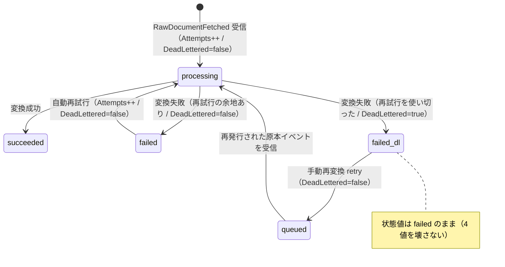

# 仕様書: 変換ジョブのデッドレター標識と試行上限（issue #533）

> 本仕様書は実装着手前に作成する。計画書（`project-planning` の `projects/<name>/`）を一次情報とし、
> 本書は「この作業で何をどう実装するか」を確定するための作業仕様である。

## 起点となる計画書（トレーサビリティ）

- 機能要求（FR）: **FR-12**（取得した原本を、AI が扱いやすい正規化形式へ変換して管理する）
- ユースケース（UC）: **UC-06**（変換・正規化。例外「恒久失敗はデッドレターへ送る」）
- 画面（SC）: **SC-07**（変換ジョブ画面。§主要素「デッドレター状態の表示」）
- 関連 ADR（計画）: ADR-0003（再試行・デッドレターで回復性を確保する）／ADR-0012（変換パイプラインの失敗時縮退方針）
- 関連 IADR: [[IADR-0042]]（変換ジョブ読み取りモデル）／[[IADR-0043]]（同・永続化）／
  [[IADR-0131]] 決定 1・決定 5（OpenAPI が BFF 契約の単一情報源／値集合を `enum` にしない）／
  [[IADR-0132]] 決定 1・決定 2（`required` は C# の非 null 性から起こす）／
  **[[IADR-0137]]（本作業で起票。標識を導出せず記録する）**
- 裁定: **質問票 第12回 Q13**（2026-08-05 確定）／環流元 planning#198 ／実装 issue #533
- 参照した計画書の版: planning submodule pin `e36b592`

## 目的・背景

issue 本文は「`ConversionJobDto` にデッドレター標識と試行上限を追加する」の 1 行しかない。
**受け入れ基準は計画書から導出した**（下の引用が出所である）。

### 受け入れ基準の導出（計画書の引用）

| # | 計画書の文（引用） | 出所 | 導いた基準 |
| --- | --- | --- | --- |
| 引用 1 | 「`ConversionJobDto` へ**デッドレター標識（または失敗種別）と試行上限**を加える。従前は `Attempts`（試行回数）しか無く上限が契約に無いため、回数からも導けなかった。」 | `05_screens/01_screens.md:324` | AC-1 / AC-2（**加えるのは 2 つ**。標識と試行上限） |
| 引用 2 | 「**ジョブ状態モデルは 4 値である**: `queued` … `failed`。**デッドレターの表示は `failed` の内訳として扱う。**」 | 同 `:308` | AC-3（**5 番目の状態にしない**。独立した標識にする） |
| 引用 3 | 「内訳が見えないと、運用者は「再実行すれば直るもの」と「二度と直らないもの（形式非対応・原本破損）」を区別できず、**直らないジョブに再実行を繰り返す**。」 | 同 `:325` | AC-4（標識は `failed` の中で**区別が付く**こと。`failed` 全部に立つ標識は意味を持たない） |
| 引用 4 | 「**手動再変換の回数上限は設けない。** … **自動再試行はパイプライン側の責務であり**、手動再変換は人が結果を見て判断した操作であるため、回数で縛る意味が薄い。」 | 同 `:310` | AC-5（**試行上限は自動再試行の上限**である。手動再変換を縛る値ではない） |
| 引用 5 | 「「**継続失敗**」のしきい値は**再試行上限に達した時点**とする」（SC-06 の同期健全性。同じ裁定回で確定した琥珀の充て先） | 同 `:291` | AC-6（「上限に達した」が標識の意味である、という読み方の裏付け） |
| 引用 6 | 「本文変換（pandoc）・資産保存の恒久失敗（＝本文そのものが作れない失敗）は**再試行する。継続失敗はデッドレターキューへ送り**、管理者に通知する。」 | `04_workflows/03_conversion-flow.md:65` | AC-7（デッドレター＝**再試行を使い切った継続失敗**が `<queue>_error` へ送られた事実） |

**「デッドレターとは何を指すか」**は引用 6 と ADR-0003 が答える——**メッセージが再試行を使い切って
`<queue>_error` キューへ送られること**であり、実装上も MassTransit がその移送を行う。
**「試行上限は誰が決めるか」**は引用 4 が答える——**パイプライン側**（＝ブローカ設定側）であり、
本リポジトリでは `Platform.Shared.Infrastructure` の `UsePlatformRetry()` が単一情報源である。
計画書は具体的な回数を定めていない（SC-06 の hi-fi「3/5」は**データソース同期**の描写であって
変換ジョブの値ではない）。したがって**回数は既存実装の実測値を契約へ載せるだけ**であり、
本作業で新たに決めた数字は無い。

## 着手時の実測（何が有って何が無いか）

コマンドと結果は §検証 に置く。実測の対象コミットは `a9c0e6b`（= `origin/develop`）。

| 観点 | 実測 |
| --- | --- |
| `ConversionJobDto` の定義 | `src/knowledge/backend/Shared/Knowledge.Contracts/Dtos/ConversionJobDto.cs`。11 個の位置引数（`Id, SourceId, SourceType, OriginalPath, Status, Error, DocumentId, MarkdownUri, Attempts, CreatedAt, UpdatedAt`）。**デッドレター標識・試行上限のいずれも無い**（引用 1 の記述と一致する） |
| 状態モデル | 同ファイルの `ConversionJobStatus`（`const` 4 個）。フロント側は `jobStatus.ts` の `JOB_STATUSES` が 4 値を固定し、`jobStatus.test.ts` が値集合そのものを回帰させている。**4 値は既存テストで固定されている** |
| 自動再試行の実装 | **有る。** `ConversionService.Worker/Program.cs` が `cfg.UsePlatformRetry()` を呼ぶ。実体は `Platform.Shared.Infrastructure/.../MassTransitExtensions.cs` の `UseMessageRetry(r => r.Intervals(2s, 10s, 30s))` ＝ **再試行 3 回**（初回と合わせて **4 試行**）。使い切ると MassTransit が `<queue>_error` へ移す |
| メッセージング基盤 | **MassTransit 8.4.1**（`Directory.Packages.props`）。ADR-0027 / ADR-0030 が定める Wolverine への移行は ConversionService では**未実施**であり、`scripts/backend-library-baseline.json` に `ConversionService.Worker` の `MassTransit` が ratchet 済みで載っている。**したがって既存の再試行機構は MassTransit のものであり、それに揃える**（無いものを有ることにしない） |
| 失敗の記録 | `RawDocumentFetchedConsumer` が `catch` で `jobs.FailAsync(...)` を呼び、**例外を再送出**して再試行→デッドレターの挙動を保つ（[[IADR-0042]]）。**「この失敗で再試行を使い切ったか」は記録していない** |
| `Attempts` の意味 | `ConversionJob.MarkProcessing` が受信・再試行の都度 `Attempts++`。**手動再変換（`TryRequeue`）でリセットしない**ため、**手動再変換をまたいで累積する** |

## 対象範囲

- 対象:
  - `Knowledge.Contracts` の `ConversionJobDto` へ `DeadLettered` / `MaxAttempts` を追加（既定値つき）
  - 試行上限の単一情報源（`MassTransitExtensions.MaxAttempts`）の公開と、契約側 `const` との束縛テスト
  - `ConversionJob`（読み取りモデル）・`IConversionJobStore`・`RawDocumentFetchedConsumer` の最小配線
  - EF マイグレーション（列 `DeadLettered` の追加）
  - `docs/api/openapi.yaml` の `ConversionJobDto` スキーマ（`required` を含む）と orval 生成物の再生成
  - 単体テスト（読み取りモデル・ストア・コンシューマ・エンドポイント・契約定数）
  - 既存文書のうち「契約に標識が無い」と書いてある箇所の是正（母集合は §計画書との差異 の表）
- 対象外（**本 issue の射程は契約と最小の配線である**）:
  - **SC-07 画面での「⚠ デッドレター」表示。** 契約が載ったので着手可能になるが、画面の要素追加は
    i18n カタログ・`StatusBadge` の写像・画面テスト・カバレッジ床に波及する別作業である
    （#531 が SC-02 の切替 UI を対象外にしたのと同じ切り方）。§未決事項 1
  - **デッドレターキュー（`<queue>_error`）の新設・再処理ワーカー**。ADR-0003 / MassTransit が既に持つ
  - **`Attempts` の意味の変更**（手動再変換でのリセット等）。既存契約の意味変更であり裁定の範囲外。§未決事項 2
  - **失敗種別**（引用 1 の「または失敗種別」）。裁定は「標識**または**失敗種別」であり、**標識を採れば足りる**。
    失敗種別は値集合を新たに決める必要があり（計画に値の定めが無い）、本作業では採らない

## 設計

| # | 決定 | 内容と理由 |
| --- | --- | --- |
| D1 | **標識は独立した真偽値**（`DeadLettered`） | 引用 2 が「4 値」「`failed` の内訳」と明記する。5 番目の状態にすると `JOB_STATUSES` / `jobStatus.test.ts` が固定した 4 値を壊し、**裁定の範囲を超える** |
| D2 | **標識は導出せず記録する** | `Attempts >= MaxAttempts` による導出は**手動再変換で壊れる**——`Attempts` は手動再変換をまたいで累積するため（実測）、2 回目以降の配信中に一時的に真になる（まだ `<queue>_error` へ送られていないのに立つ）。コンシューマは自分が最後の試行かを知れるので、**事実として記録する**。詳細と棄却案は [[IADR-0137]] |
| D3 | **試行上限の単一情報源は再試行設定** | `MassTransitExtensions` の間隔配列（要素数 = 再試行回数）から `MaxAttempts = 要素数 + 1` を導く。数字を 2 か所に書かない |
| D4 | 契約側 `const` は `ConversionJobRetryPolicy.MaxAttempts`（`Knowledge.Contracts`） | record の**既定値には `const` が要る**。`Knowledge.Contracts`（契約）から `Platform.Shared.Infrastructure`（MassTransit 依存の基盤）を参照するのは筋が悪いため、値は契約側に `const` で置き、**両者の一致を単体テストで束ねる**（D3 の単一情報源が壊れたらテストが落ちる） |
| D5 | **DTO への追加は既定値つき** | 既定値の無いメンバー追加は `check-contract-schema.js` が**破壊的**に分類する（[[IADR-0122]] 決定 2）。`bool DeadLettered = false` / `int MaxAttempts = ConversionJobRetryPolicy.MaxAttempts` を**末尾へ追加**する（位置の入れ替えも破壊的） |
| D6 | **OpenAPI では `required` に入れる** | [[IADR-0132]] 決定 1（C# の非 null 性から起こす）・決定 2（**既定値つきメンバーも入れる**。C# の既定値は引数の既定でありシリアライズの省略ではない）。`bool` / `int` はいずれも非 null |
| D7 | **`enum` にしない** | [[IADR-0131]] 決定 5。ただし本作業が足すのは `boolean` / `integer` であり値集合を持たない（該当なし。**新しい値集合を作らない**ことが D7 の実効） |
| D8 | 標識の生存期間 | `failed` のときだけ真。**再処理が始まったら落とす**——`MarkProcessing`（新しい配信の開始）と `TryRequeue`（手動再変換の受付）で `false` に戻す。落とさないと「`queued` なのにデッドレター」という自己矛盾した行が一覧に出る |

### 判定の位置と前提

コンシューマの `catch` で、**この失敗が自動再試行の最後かどうか**を判定する。

```
deadLettered = context.GetRetryAttempt() + 1 >= MassTransitExtensions.MaxAttempts
```

`GetRetryAttempt()` は初回 0・再試行ごとに +1 を返す（MassTransit の再試行フィルタが設定する）。
**前提**: 本サービスの受信エンドポイントが `UsePlatformRetry()` で構成されていること。
`Program.cs` がそう構成しており、判定はその設定を単一情報源として参照する（D3）。
**別の再試行方針でバスを組むと判定は一致しなくなる**——その場合は判定側も設定側も
`MassTransitExtensions` を経由するため、変えるなら 1 か所である。

### 状態遷移（標識の観点）



## 受け入れ基準

- [x] **AC-1**: `ConversionJobDto` に**デッドレター標識**がある（引用 1）
- [x] **AC-2**: `ConversionJobDto` に**試行上限**がある（引用 1）
- [x] **AC-3**: 状態モデルは **4 値のまま**で、標識は独立している（引用 2）
- [x] **AC-4**: 標識は `failed` の**内訳**を区別する（再試行の余地がある失敗では立たない）（引用 3）
- [x] **AC-5**: 試行上限は**自動再試行の上限**であり、手動再変換を縛らない（引用 4。`retry` は従来どおり回数を見ない）
- [x] **AC-6**: 上限に達した時点で標識が立つ（引用 5）
- [x] **AC-7**: 標識は「再試行を使い切って `<queue>_error` へ送られた」ことを表す（引用 6・ADR-0003）
- [x] **AC-8**: 手動再変換を受け付けたら標識は落ちる（D8。「`queued` なのにデッドレター」を出さない）
- [x] **AC-9**: OpenAPI に 2 項目が載り、`required` に入っている（[[IADR-0131]] 決定 1 ／[[IADR-0132]]）
- [x] **AC-10**: 契約変更は**非破壊**である（`check-contract-schema.js` が破壊的 0 件）
- [x] **AC-11**: 試行上限の値が再試行設定とずれたらテストが落ちる（D3・D4）

## テスト方針

受け入れ基準を `[Fact]` へ写像する。**新しいテストクラスは作らず、既存 3 ファイルへ 8 件足す**
（`check-test-spec-coverage.js` の床〔仕様書 × テストクラスの対〕を動かさずに済む）。

| テスト | 写像する AC | 置き場所 |
| --- | --- | --- |
| `Job_carries_max_attempts_and_is_not_dead_lettered_initially` | AC-1 / AC-2 / AC-4 | `ConversionJobStoreTests` |
| `Fail_without_reaching_attempt_limit_does_not_mark_dead_letter` | AC-4 | 同上 |
| `Fail_at_attempt_limit_marks_dead_letter_without_changing_status` | AC-3 / AC-6 / AC-7 | 同上 |
| `Reprocessing_clears_dead_letter_marker` | AC-8 | 同上 |
| `PrepareRetry_clears_dead_letter_marker` | AC-5 / AC-8 | 同上 |
| `Consume_failure_records_failed_job_and_rethrows`（既存へ追加） | AC-4 | `RawDocumentFetchedConsumerJobTests` |
| `Consume_failure_exhausting_retries_marks_dead_lettered` | AC-3 / AC-6 / AC-7 | 同上（**本番と同じ試行上限**を構成したハーネス。`Fault<T>` の発行を待つ） |
| `MaxAttempts_contract_constant_matches_platform_retry_policy` | AC-11 | 同上（契約 `const` と再試行設定の束縛） |
| `GetById_ExposesDeadLetterMarkerAndMaxAttempts` | AC-1 / AC-2 / AC-3 | `ConversionJobEndpointTests`（HTTP 越し） |

**HTTP 越しに「再変換で標識が落ちる」ことは見ない。** 既存の `Retry_KnownFailedJob_Returns202` が
同じ理由（再発行イベントがハーネスのコンシューマに即時消費されて状態が進む）で status の断定を避けており、
**本作業でも solution 一括実行時にだけ落ちるフレークとして実際に観測した**（単体実行では 3 回連続で通る）。
AC-8 は決定的な `PrepareRetry_clears_dead_letter_marker` で担保する。

**変異試験で「壊すと落ちる」ことを実測する**（結果は §検証）。

## 計画書との差異

- 差異: **なし**（引用 1〜6 のとおり実装した）。
- ただし計画書が「標識**または**失敗種別」と選択肢を示している点について、**標識を採った**
  （§対象範囲 のとおり。失敗種別は値集合が計画に無い）。

### 是正した既存記述（母集合）

「`ConversionJobDto` にデッドレターの標識が無い」と書いた箇所を `grep` で数え切った（7 箇所 / 5 ファイル）。

| ファイル | 箇所 | 是正 |
| --- | --- | --- |
| `src/knowledge/frontend/.../ConversionJobsPage.tsx` | 1（コメント） | 「契約に無い」→「契約に載った（#533）が画面は別作業」 |
| `docs/screens/SC-07_conversion-jobs.md` | 4（冒頭注記・確定事項表・対応表 #7・§実装しない要素 (b)・§未決事項 2） | 同上の 2026-08-06 追記 |
| `docs/tests/SC-07_conversion-jobs.md` | 1 | 同上 |
| `docs/data/conversion-job.md` | 属性表・DTO 射影の注・未決事項 | 列と DTO 射影を追加 |
| `docs/adr/IADR-0127_*.md` | 1（導出表） | **決定は変えない**。前提が解消した旨の日付つき追記のみ |

`feedback/20260805_sc05-07-admin-contract-gaps.md` は**環流時点の記録**であり、当時の実測として正しいので
本文は変えない（このリポジトリの feedback 記録の扱いに従う）。

## 未決事項

1. **SC-07 画面の「⚠ デッドレター」表示**（hi-fi 421・計画 §主要素）。契約は本作業で載ったため
   着手可能になったが、**画面側の作業として別 issue が要る**。親の判断を仰ぐ。
2. **`Attempts` の意味**。手動再変換をまたいで累積するため、画面に「n / N」（試行 / 上限）と出すと
   **手動再変換を重ねた行で上限を超えた表示になる**。SC-06 の hi-fi「3/5」に倣った表示を SC-07 でも
   採るなら、`Attempts` を配信ごとにリセットするか「今回の配信での試行回数」を別に持つ必要がある。
   **どちらも既存契約の意味変更であり、裁定（Q13）の範囲外**と判断して本作業では触っていない。
3. **IADR の採番衝突は実際に起きた。改番済みである。** 着手時点の最大は `IADR-0135` で、本作業は
   当初 `IADR-0136` を採った。しかし**並行作業の #538（SC-06 の次回同期）も同じ `IADR-0136` を採っており**、
   コミット時刻は #538 が `15:43`、本作業が `15:57` であった。`.claude/rules/traceability.md`
   §採番衝突時の改番手順（**先着尊重・後発は次の空き番号へ・欠番を作らない**）に従い、
   **本作業を `IADR-0137` へ改番した**。追随先は同節が挙げる 4 点すべてを母集合として数え切った
   —— ファイル名 ＋ 本文の自番号・索引（`docs/adr/README.md`）・関連文書（本書 / `docs/data/conversion-job.md` /
   `docs/functional/FR-12_*.md` / `IADR-0127`）・コード内コメントとテスト名の**計 24 箇所**。
   置換後に `IADR-0136` の残存が 0 件であることを確認した。
   **PR タイトルには IADR 番号を含めていない**ため、同節が「最も漏れやすい」とする 4 点目の追随は不要である。

## 検証

**実際に走らせた結果のみを記す。走らせていないものは §未検証 に明記する。**
.NET SDK はホストに無いため、`mcr.microsoft.com/dotnet/sdk:10.0` コンテナで実行した。

| コマンド | 結果 |
| --- | --- |
| `dotnet build src/knowledge/backend/backend.slnx` | **成功**（0 error / 2 warning。warning は既存の `MinioBuilder` 廃止予定） |
| `dotnet test src/knowledge/backend/backend.slnx` | **全 11 アセンブリ合格**（ConversionService.Worker.Tests は 62 合格。うち本作業 8 件） |
| `dotnet format src/knowledge/backend/backend.slnx --verify-no-changes` | **exit 0**（EF が生成した migration 2 ファイルの BOM を剥がして解消。初回は `error CHARSET`） |
| `dotnet build src/platform/backend/backend.slnx`（**ソリューション全体**） | **成功**（0 error）。**`src/ai-stock-trading` の populate が要る**（下記） |
| `dotnet format src/platform/backend/backend.slnx --verify-no-changes` | **exit 0** |
| `dotnet test`（platform の submodule 非依存 2 本） | LlmGateway 145 合格 / AuthorizationService 58 合格 |
| `dotnet test src/platform/backend/Bff/Platform.Bff.Tests` | **148 合格 / 1 skip** |

> **`platform/backend` のビルドには `src/ai-stock-trading` の populate が要る。** 未 populate だと
> `BffEndpointComposition.cs(1,7): error CS0246: … 'AiStockTrading' could not be found` で落ちる。
> `git submodule update --init -- src/ai-stock-trading` で解消し、**pin は動かない**ので実装ブランチで
> 行ってよい。同じ populate で `pnpm run typecheck` の `@ai-stock-trading/features` 解決失敗も消える。
| `node scripts/check-contract-schema.js` | **OK**（差分 3 件はすべて**非破壊**。破壊的 0 件。`--update` で baseline へ反映済み） |
| `node scripts/check-doc-links.js` | **OK**（440 件。未 populate submodule 配下 2 件は対象外） |
| `node scripts/check-backend-libraries.js` | **OK**（新規混入 0 件。既知残件 42 件は baseline 済み） |
| `node scripts/check-unit-dependencies.js` | **OK** |
| `node scripts/check-test-spec-coverage.js` | **OK**（床 68 対と一致。新規テストクラスを作っていないため床は動かない） |
| `node scripts/check-test-traceability.js` | **OK** |
| `node scripts/check-cpm-versions.js` / `check-unit-service-ownership.js` | **OK** |
| `pnpm run codegen` | 生成物に `deadLettered` / `maxAttempts` が反映（`bff.schemas.ts` ＋ `conversion.faker.ts`） |
| `pnpm run lint` | **0 error**（既存 warning 8 件） |
| `pnpm exec vitest run knowledge/frontend/.../sc07-conversions` | **23 合格** |

### 変異試験（壊すと落ちるか）

**基準（M0・変異なし）は 62 合格**である。各変異は 1 件だけ適用し、直後に復元した。

| # | 変異 | 結果 |
| --- | --- | --- |
| M1 | `IsLastAttempt` を常に `false` にする | **落ちた**: `Consume_failure_exhausting_retries_marks_dead_lettered` |
| M2 | `IsLastAttempt` を常に `true` にする | **落ちた**: `Consume_failure_records_failed_job_and_rethrows`（＝上限前に標識が立つと検出する） |
| M3 | `MarkProcessing` の `DeadLettered = false` を削る | **落ちた**: `Reprocessing_clears_dead_letter_marker` |
| M4 | `TryRequeue` の `DeadLettered = false` を削る | **落ちた**: `PrepareRetry_clears_dead_letter_marker` |
| M5 | `MassTransitExtensions.MaxAttempts` を `Length + 1` → `Length` にする | **落ちた 2 件**: `MaxAttempts_contract_constant_matches_platform_retry_policy`（束縛が効いた）／`Consume_failure_exhausting_retries_marks_dead_lettered` |
| M6 | `ToDto` の `MaxAttempts` を `0` にする | **落ちた 2 件**: `Job_carries_max_attempts_and_is_not_dead_lettered_initially` ／ `GetById_ExposesDeadLetterMarkerAndMaxAttempts` |
| M7 | OpenAPI の `required` から `deadLettered` を外す | **素通り**（`knowledge/frontend` の `typecheck` が exit 0）。生成型は `deadLettered?: boolean` になるが、**この画面はまだこのフィールドを読んでいない**ため型検査の網が張れない。#519 の M5（`attempts` を消しても落ちない）と**同型の恒久的な穴**であり、画面が読み始めた時点で塞がる |
| M8 | OpenAPI から `deadLettered` プロパティごと削除 | **検出**（再生成した `bff.schemas.ts` がコミット済みの内容と食い違う → CI `frontend.yml` の `git diff --exit-code -- platform/frontend/src/foundation/api/generated` が落ちる） |
| M9 | C# の `DeadLettered` メンバーを削除 | **検出**（`check-contract-schema.js`: 破壊的 2 件＝メンバー削除・`MaxAttempts` の位置変更） |
| M10 | `DeadLettered` の既定値を外す | **検出**（同: 破壊的 1 件＝「省略可能 → 必須」） |

> **変異試験そのものの落とし穴（実測）**: 復元でファイル時刻が巻き戻ると MSBuild が再コンパイルせず、
> **変異したアセンブリが次の実行へ残る**。最初の走行はこれで基準（M0）が 2 件落ちた。
> 復元時に `os.utime` で時刻を進めて解消し、**M0 が 62 合格であることを確認してから上表を採った。**

## 未検証

> **当初 §未検証 に挙げていた 2 件（platform ソリューション全体のビルド / テストと、
> `platform/frontend` の typecheck・Vitest 3 ファイル）は解消した。** どちらも
> `src/ai-stock-trading` submodule が未 populate であることだけが原因で、
> `git submodule update --init -- src/ai-stock-trading` で populate すれば通る（**pin は動かない**）。
> **本作業の変更とは無関係であったことが実測で確かめられた。**

- **実 DB（PostgreSQL）へのマイグレーション適用**。`AddDeadLetteredMarker` は `dotnet ef` で生成したが、
  実行環境（Postgres）へ当てての確認はしていない。テストは EF InMemory である。
- **RabbitMQ 実機での `<queue>_error` 送出との突合**。標識は読み取りモデル側の記録であり、
  実際のキュー移送そのものは確認していない（[[IADR-0137]] §結果 のトレードオフ）。
