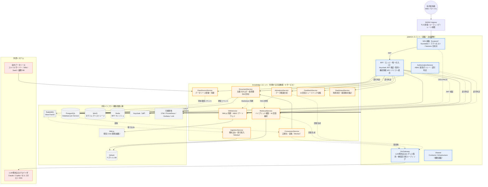
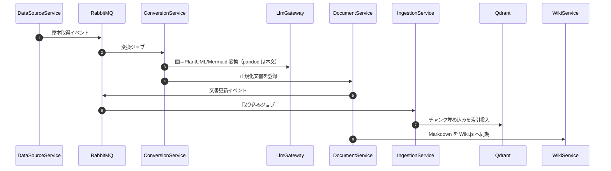
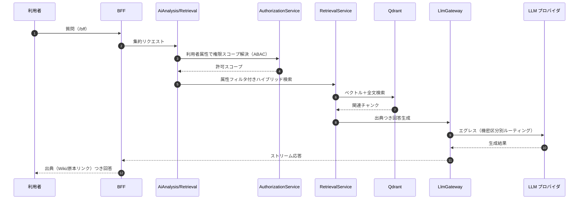

<!-- trace:
ids: [SC-01, SC-02, SC-03, SC-04, SC-05, SC-06, SC-07, SC-08, SC-09, SC-10, SC-11]
adrs: [ADR-0001, ADR-0002, ADR-0003, ADR-0004, ADR-0005, ADR-0007, ADR-0008, ADR-0009, ADR-0010, ADR-0011, ADR-0018, ADR-0019, ADR-0020, ADR-0027]
iadrs: [IADR-0017, IADR-0026, IADR-0048, IADR-0056, IADR-0121]
specs: []
issues: [#497, #580, #591]
-->

# システム構成図: microservices-platform（基盤 + knowledge ユニット）

> 本書はマイクロサービスプラットフォーム基盤（platform ユニット）と、それに付随する可変機能
> （knowledge ユニット）を俯瞰するシステム構成図である。上流計画書
> `01_architecture-overview.md`（計画リポ）（fixed）
> と `02_service-decomposition.md`（計画リポ）
> を、現時点の実装（**11 サービス + BFF**・ユニット第一のリポジトリ構成・.NET 10）に合わせて詳細化した。

## 起点となる計画書（トレーサビリティ）

- 技術検討: `06_technical/01_architecture-overview.md`、`02_service-decomposition.md`、`10_composability-design.md`
- 計画 ADR: マイクロサービス採用、サービス境界・Database per Service（実装で 11 サービス確定）、メッセージング（MassTransit/RabbitMQ。後継の Wolverine 採用により Superseded・注記は #580）、ABAC 認可、
  ベクトル DB=Qdrant、LLM ゲートウェイ、Wiki エンジン、コンポーザブルアーキテクチャ、ユニット第一のリポジトリ構成
- 実装 ADR: Istio STRICT mTLS をサービス間認証の第一防御とする（先行していた「内部サービス認証・ネットワーク隔離」を Superseded し、ネットワーク隔離は多層防御へ格下げ）、ユニット構成
- 補足: 実装は `.NET 10 / C# 13` に統一済みで、**計画側の制約も `.NET 10` である**（03_tech-stack-selection.md（計画リポ）の確定スタック一覧と、.NET 10 アップグレードの計画 ADR〔Accepted・2026-07-23〕）。
  実装が先行していた経緯は、バックエンドの .NET 10 採用を決めた実装 ADR と draft/feedback/20260709_dotnet10-target-framework-deviation（計画リポ） に残る（**旧「計画は `.NET 8`」の記述は 2026-08-05 / #497 で是正した**。[tech-requirements.md](tech-requirements.md) の「差異: なし（解消済み）」と一致させた）。

## 読み方（凡例）

- **platform ユニット（基盤・主成果物）** = 太枠。認証・認可（ABAC）・LLM エグレス統制・エッジ集約（BFF）・
  SPA 基盤・共有契約/横断基盤を、機能ドメインから独立した再利用可能な土台として提供する。
- **knowledge ユニット（付随する可変機能）** = 社内ナレッジの横断検索・AI 回答・Wiki 連携を提供する 9 サービス。
  基盤の上で組み替え可能な一機能ユニットであり、追加の可変機能ユニット（例: ai-stock-trading）と同じ枠組みで載る。
- **依存規則**: 可変ユニット → platform は共有契約・横断基盤のみ参照可。platform → 可変ユニットは
  合成点（フロント features 合成点・BFF エンドポイント合成点）のみ。
- 実線 = 同期 API / 実装済みの連携。破線 = イベント・認可判定・エグレス等の非同期/横断連携。

## 全体システム構成図

## 主要データフロー

### 1. 取り込み・正規化（非同期）

### 2. RAG 検索・AI 回答（同期＋ストリーミング）

## サービス責務（実装 11 サービス + BFF）

| ユニット | サービス | 責務 | 主な通信 |
| --- | --- | --- | --- |
| platform | `Bff` | エッジ集約（フロントの唯一の入口）・構成情報 API・ドリフト検出 | REST / Redis |
| platform | `AuthorizationService` | ABAC 属性ポリシー管理・認可判定 | REST（同期） |
| platform | `LlmGateway` | LLM/埋め込みプロバイダへのエグレス集約・機密区分別ルーティング | REST / 外部 API |
| knowledge | `DocumentService` | 文書カタログ・版管理（DB 所有）・更新イベント発行・Wiki 同期 | REST / イベント |
| knowledge | `DataSourceService` | データソース登録・定期同期・原本取得 | REST / イベント |
| knowledge | `ConversionService` | 正規化（pandoc + LLM 図変換）・変換パイプライン | イベント / GW |
| knowledge | `IngestionService` | パース→チャンク→埋め込み→Qdrant 索引投入 | イベント / Qdrant |
| knowledge | `RetrievalService` | ABAC フィルタ付きハイブリッド検索・AI 回答編成 | REST（同期） |
| knowledge | `AiAnalysisService` | データ範囲分析・対話 | REST / ストリーム |
| knowledge | `WikiService` | Wiki.js 同期・ABAC ゲートウェイ（閲覧/編集は Wiki.js に委譲） | REST / GraphQL |
| knowledge | `FeedbackService` | AI 回答へのフィードバック収集 | REST / イベント |
| knowledge | `DashboardService` | 利用状況・検索傾向のダッシュボード集計 | REST |

> knowledge フロントエンドは 11 画面（検索・結果・文書・Wiki・データソース・変換・分析・ABAC 管理・
> 運用・構成）を features として持ち、platform の SPA 基盤（合成点）へ登録する。

## デプロイ構成

- **ローカル（dev）**: docker-compose（`deploy/docker-compose.yml`・`scripts/compose-up.sh`）。内部サービスは
  `expose` のみでホスト非公開。公開は frontend(:3100) / BFF(:5000) / Keycloak(:8080) /
  Wiki.js(:3001) / Grafana(:3000)。
- **stg / prod**: Kubernetes（k3s）＋ Helm / ArgoCD（GitOps）、Istio サービスメッシュ
  （サービスメッシュの決定に基づき、STRICT mTLS をサービス間認証の第一防御とする）、NGINX Ingress。秘匿は Vault。イメージレジストリは Harbor。
- **ビルド**: ユニット別 slnx（`dotnet build src/platform/backend/backend.slnx` /
  `src/knowledge/backend/backend.slnx`・.NET 10）、フロントは pnpm workspace（`src/`・Node 22。
  #591: 従前は「npm workspaces」と書いていたが、SPA 新スタック移行の実装 ADR により pnpm workspace へ移行済み）。

## 関連仕様

- 上流計画（fixed）: アーキテクチャ概要（計画リポ）、サービス分割設計（計画リポ）
- ユニット規約: [`src/README.md`](../../src/README.md)
- 拡張ユニットの例: ai-stock-trading（`src/ai-stock-trading/` へ submodule リンク）の
  システム構成図（計画リポ）
