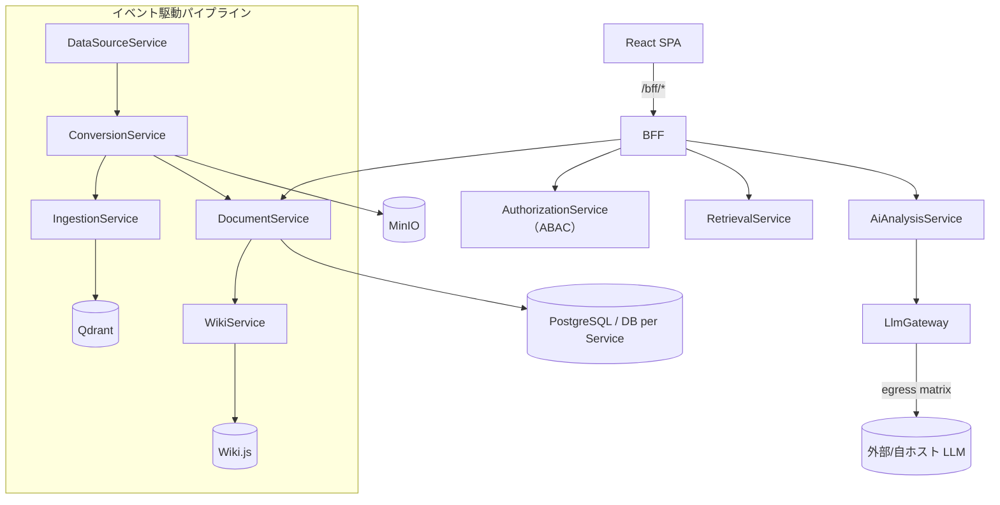

<!-- trace:
ids: [FR-14]
adrs: [ADR-0002, ADR-0004, ADR-0005, ADR-0007, ADR-0008, ADR-0019, ADR-0020, ADR-0027, ADR-0028, ADR-0029, ADR-0030, ADR-0031, ADR-0032, ADR-0041]
iadrs: [IADR-0002, IADR-0009, IADR-0012, IADR-0024, IADR-0025, IADR-0026, IADR-0027, IADR-0028, IADR-0029, IADR-0037, IADR-0048, IADR-0049, IADR-0056, IADR-0117, IADR-0121, IADR-0124, IADR-0125, IADR-0134, IADR-0216, IADR-0219]
specs: [20260803_issue-455_backend-application-standard]
issues: [#184, #196, #197, #198, #209, #441, #455, #490, #838, planning#146, planning#160, planning#161, planning#162, planning#180, planning#390]
-->

# 技術要件書

> 必須ドキュメント（リポジトリ単位）。本リポジトリの技術要件を定める。雛形は `docs/templates/tech_requirements_template.md`。
> 確定判断は実装ADR（`.ai-context/adr/`）に残す。単一情報源は各設定ファイル（`src/Directory.Build.props` 等）。
>
> **リポジトリの位置づけ**: 主たる成果物は**マイクロサービスプラットフォーム基盤（platform ユニット）**。
> ナレッジ活用機能（knowledge ユニット）は基盤に付随する必須の可変機能セットである
> （issue #209。リポジトリ最上位のユニット構成〔`src/<unit>/{backend,frontend}` = platform / knowledge〕を定めた実装 ADR。
> フォルダ構成・依存規則は [`src/README.md`](../../src/README.md)）。

## 起点となる計画書（トレーサビリティ）

- 技術検討（06_technical）: `03_tech-stack-selection.md`（実装フレームワーク・データストア・実行基盤）、
  `10_composability-design.md`（コンポーザビリティ）
- 関連 ADR / 非機能要件: 認可＝ABAC / Keycloak OIDC ／ サービスメッシュ Istio（mTLS）／ CI/CD GitOps（ArgoCD+Helm）／
  ランタイム Kubernetes（k3s）／ 非機能要件（性能・可用性・セキュリティ・運用・拡張性）
- 計画制約との差異: **なし（解消済み）**。実装は **.NET 10 / C# 13** で、計画側も
  .NET 10 アップグレードの計画 ADR（Accepted・2026-07-23）で
  実装フレームワークを **.NET 10（LTS）** に確定した。実装が先行していた経緯は、バックエンドの .NET 10 採用を決めた実装 ADR と
  `feedback/20260709_dotnet10-target-framework-deviation.md` に記録している（旧「計画 fixed は .NET 8」との乖離は同計画 ADR で解消）。

## 技術スタック

| 区分 | 採用 | バージョン | 備考 |
| --- | --- | --- | --- |
| 言語（バックエンド） | C# | 13（`LangVersion 13`） | 単一情報源 [`src/Directory.Build.props`](../../src/Directory.Build.props)。Nullable/ImplicitUsings 有効 |
| ランタイム（バックエンド） | .NET | 10（`net10.0`） | .NET 10 アップグレードの計画 ADR（計画側も .NET 10 で確定）／実装側の先行採用の判断。`global.json` は SDK 8.0.0 + `rollForward: latestMajor` |
| フレームワーク（バックエンド） | ASP.NET Core（Minimal API） | .NET 10 同梱 | アプリケーション層の標準はバックエンド標準ライブラリの計画 ADR（後述「バックエンドアプリケーション層標準」）。ORM は EF Core |
| パッケージ管理 | Central Package Management | — | バージョンは [`src/Directory.Packages.props`](../../src/Directory.Packages.props) に集約。ソリューションは `.slnx` |
| 言語（フロントエンド） | TypeScript | 5.6 | **pnpm workspace** ルート = `src/`（メンバの正本は [`src/pnpm-workspace.yaml`](../../src/pnpm-workspace.yaml) 自身。ユニット・共有パッケージのほか `src/` の外の**雛形**を含む。SPA 新スタック移行の決定 2）。Node は CI と揃え 22 |
| フレームワーク（フロントエンド） | React + Vite | **React 19** / **Vite 6**（ESM） | SPA。フロントエンドスタックの計画 ADR が確定したスタックへ移行中（SPA 新スタック移行の実装 ADR が 5 段に分割）。**第 2 段の項目は消化済み**（#490 = ルータ／共通シェル／旧画面のルート載せ替え、#496 = shadcn/ui 本移植／Lingui／Storybook）。**第 2 段の完了条件は未達**——旧 13 画面の削除・再実装が #452 に残っている（項目の消化と完了条件は別である）。基盤(`platform/frontend`)/画面(`knowledge/frontend` の features)分離（ユニット構成の実装 ADR）。BFF は `/bff/*` 経由 |
| 状態管理（フロントエンド） | TanStack Query | 5 | フロントエンドスタックの計画 ADR。サーバー状態の唯一の入口（`foundation/api/queryClient.ts`）。**グローバルストア（Redux）は持たない**（ESLint で機械強制）。クライアント状態の Zustand は使う画面が出る段で導入 |
| ルーティング（フロントエンド） | **TanStack Router** | 1.170 | 同計画 ADR。移行第 2 段（#490。ルート木の実装 ADR）で `react-router-dom` から差し替え済み（platform / knowledge から依存ごと撤去。ESLint で再混入を禁止）。ユニット合成は型付きルート factory のタプル、AST（submodule）だけ旧契約の実行時ブリッジが残る |
| API 契約（フロントエンド） | orval（OpenAPI → 型・TanStack Query フック・MSW モック） | 8 | 同計画 ADR。**手書きクライアント禁止**（ESLint で機械強制）。入力は `docs/api/openapi.yaml` の `/bff/` 配下のみ。生成物はコミットし CI で再生成差分を検査（SPA 新スタック移行の決定 3） |
| CSS / UI（フロントエンド） | Tailwind CSS v4 + shadcn/ui 派生プリミティブ + lucide-react | 4 | 共有 UI パッケージ `@platform/ui`（`src/packages/ui`。SPA 新スタック移行の決定 4 と、共有 UI プリミティブの実装 ADR の決定 1）。収録は Button / StatusBadge / Input / Textarea / Select / Label / Table 一式 / Card / Alert / Tabs。**ドメイン・通信・ルーティング・認証・表示文言は入れない**。公開面は `src/index.ts` 1 ファイル（深い参照は ESLint で禁止）。**外部 CDN・Web フォント・analytics を使わない**（08_data-egress-policy。`scripts/check-static-egress.js` がビルド成果物を走査して機械検査する）。色だけで意味を持たせない（INDEX 決定 21） |
| i18n（フロントエンド） | **Lingui**（ja / en） | 6 | 同計画 ADR（コンパイル時抽出）。カタログは `platform/frontend/src/foundation/i18n/locales/<locale>/messages.{po,ts}` にコミットし、`pnpm run i18n` の再生成差分と `scripts/check-i18n-catalogs.js`（全ロケールの `msgstr` 非空）と `lingui compile --strict` の 3 段で未翻訳を止める（共有 UI プリミティブの実装 ADR の決定 3・4）。**切替 UI は持たない**（計画の §共通シェル に要素が無い）。適用は platform の foundation のみで、画面文言は #452 |
| コンポーネントカタログ | **Storybook** | 10 | 同計画 ADR。`src/packages/ui/.storybook/`。対象は `@platform/ui` のプリミティブのみ。テレメトリ／クラッシュレポートは無効化し、外部 egress はビルド成果物の走査で検査する（同実装 ADR の決定 5） |
| 認証（利用者） | Keycloak（OIDC / Authorization Code + PKCE） | — | 認可＝ABAC の計画 ADR。SPA は public client `platform-spa`（`oidc-client-ts`）。**計画側が定める BFF セッション方式へ移行予定**（#439。SPA 新スタック移行の決定 6。それまで現行方式を維持する） |
| データストア（業務） | PostgreSQL | — | DB per Service。jsonb 属性は EF Core の ValueComparer で content 比較 |
| データストア（ベクトル） | Qdrant | — | モデル別コレクション・決定的チャンク ID |
| オブジェクトストレージ | MinIO（S3 互換） | RELEASE.2025-04-08 | 正規化本文・資産。ClusterIP のみ（バケット/キー設計の実装 ADR）。資格情報は k8s Secret |
| メッセージング | RabbitMQ / Kafka（**Wolverine**） | — | メッセージング基盤とブローカーの計画 ADR。イベント駆動パイプライン。契約は `Shared.Contracts`。**現行実装は MassTransit で、Wolverine への置き換えは各サービスの再実装 issue（#438〜#451）で行う** |
| 実行基盤 | k3s（Kubernetes） | — | ランタイムの計画 ADR。Helm `deploy/helm/microservices-platform`、Namespace `microservices-platform` |
| サービスメッシュ | Istio（Envoy mTLS） | — | サービスメッシュの計画 ADR と STRICT mTLS の実装判断。（`PeerAuthentication`/`DestinationRule`） |
| CI/CD・GitOps | ArgoCD + Helm | — | GitOps の計画 ADR。Git を単一の真実源に宣言的同期（`deploy/argocd/`） |
| コンテナレジストリ | Harbor | — | 同計画 ADR。`global.image.registry: harbor.internal`、Pull は `imagePullSecrets` |
| 可観測性 | OpenTelemetry（OTLP） | — | `Otlp__Endpoint` で collector へ送出。トレース相関に利用 |

## アーキテクチャ概要

マイクロサービス（DB per Service）＋ BFF 集約＋イベント駆動パイプライン。フロント（SPA）は BFF のみを叩き、
BFF が ABAC スコープ解決（AuthorizationService）と各サービス呼び出しを集約する。取り込みは
DataSource→Conversion→Ingestion→（Document/Wiki）のイベントパイプラインで、段の有効/無効・購読は宣言的
構成（`pipeline.json`。宣言的パイプライン構成の実装 ADR）で組み替える。



## バックエンドアプリケーション層標準

計画側がバックエンド標準ライブラリの計画 ADR（Accepted）と
12_backend-application-stack（計画リポ）（`fixed`）で
アプリケーション層のライブラリ標準と設計様式を確定した。棚卸し表の**全量は計画書が正**であり、本節は
実装リポジトリで守る要点と本リポ固有の具体化のみを記す（作業仕様書:
仕様書: バックエンドアプリケーション層標準の確立と機械的強制）。

### 設計様式

- Pragmatic Clean Architecture ＋ **Vertical Slice**（Feature 単位。不要な Repository / Service 抽象を作らない）
- API は **ASP.NET Core Minimal API**（.NET 10）
- CQRS のローカルディスパッチも **Wolverine ハンドラに統一**する。独自 Dispatcher・**MediatR は使わない**
- **Domain 層は `Platform.Shared.Kernel` を除き外部ライブラリへ依存しない**。Result 型は共有カーネルに**自前の公開型**（`Result` / `Result<T>` / `Error`）として置き、**その内部実装としてのみ** `CSharpFunctionalExtensions` を使う。
  `Domain` / `Application` / `Api` / `Infrastructure` は共有カーネルが公開する型だけを参照し、外部ライブラリの型・名前空間を直接参照しない（Result 型の外部ライブラリを定めた計画 ADR の決定 1・2。2026-08-04 にバックエンド標準ライブラリの選定基準 3 を改定した）
  - **共有カーネルが持ち込んでよい外部パッケージは Result 型の実装 1 つに限る**（同 決定 3）。`scripts/check-backend-libraries.js` が機械的に強制する（許可は `Platform.Shared.Kernel` プロジェクトに限定。許可リスト外が入れば fail）

### プロジェクト構成（サービス単位）

**標準構成は 8 要素である**（計画 12_backend-application-stack（計画リポ）
§`SharedKernel` の粒度・`Worker` の追加。2026-08-17 に `Worker` を加えて 7 → 8 とした。
実装側の追随は、`SharedKernel` の粒度と `Worker` の追加を定めた実装 ADR の決定 2 である）。

```text
src/<unit>/backend/Services/<Name>Service/
 ├── src/
 │    ├── <Name>.Api             # エンドポイント定義・DI 構成・ProblemDetails 変換
 │    ├── <Name>.Worker          # 常駐処理を主とするサービスの実行入口（Api と排他）
 │    ├── <Name>.Application     # ユースケース（Wolverine ハンドラ）・検証・マッピング
 │    ├── <Name>.Domain          # エンティティ・値オブジェクト（外部依存なし）
 │    ├── <Name>.Infrastructure  # EF Core・Redis・オブジェクトストレージ等の実装
 │    ├── <Name>.Contracts       # 公開契約（proto・イベント・DTO）
 │    └── <Name>.SharedKernel    # Result / Error・共通基底（過度な共通化は避ける）
 └── tests/<Name>.Tests/{Unit, Integration}
```

**`Api` と `Worker` は同一サービス内で排他である。** いずれか一方のみを持ち、**持たない側は空フォルダを作らない**
（実行入口は 1 サービスに 1 つであり、「空の実行入口」という状態が存在しないため）。実装の現況は
`Api` 9 サービス / `Worker` 2 サービス（`ConversionService` / `IngestionService`）である。
**`Worker` が HTTP 面を持つことは `Worker` であることと矛盾しない** —— 区別の軸はホストの主目的である。

**実体が無い要素は、空フォルダ ＋ `.gitkeep` を置く**（`.csproj` は作らない。計画 §規範性・粒度・置き場）。
**適用済みである**（#838。**55 件 ＋ 雛形 1 件**。件数の内訳の正は
同実装 ADR の決定 3）。

**`Tests` は 1 プロジェクトである。Unit / Integration はプロジェクトを分けず、フォルダで分ける**
（計画 12_backend-application-stack（計画リポ）
§規範性・粒度・置き場。利用者裁定 2026-08-04）。プロジェクトを分けるとビルド時間と
参照管理のコストが増えるためである。`.csproj` の実名はサービスのホスト種別に合わせてよい
（実装の現況は `<Name>.Api.Tests` / `<Name>.Worker.Tests`）。

**共有カーネルはサービス単位とユニット単位が併存する**（同実装 ADR の決定 1。
計画 §`SharedKernel` の粒度。利用者裁定 2026-08-17）。**置き分けは次のとおりである。**

| 置き場 | 何を置くか |
| --- | --- |
| **サービス単位** `Services/<Name>Service/src/<Name>.SharedKernel/` | **自サービスに閉じた共通基底**。上の構成図の 1 要素であり、実体が無ければ `.gitkeep` を置く対象に含まれる |
| **ユニット単位** `src/platform/backend/Shared/Platform.Shared.Kernel/` | **サービス境界をまたいで同一性が要る型** —— **契約に載る `Result` / `Error`**。BFF がサービスの結果を集約し、`Platform.Shared.Contracts` のイベント契約が失敗を表現するため、単一の型でなければならない |

本リポジトリはユニット第一構成（実装 ADR と、計画側のユニット第一リポジトリ構成の決定）を採り、ユニット外から参照できるのは
`src/platform/backend/Shared/` のプロジェクトのみである（[`src/README.md`](../../src/README.md) の依存規則）。
**`Platform.Shared.Kernel` は併存として引き続き有効であり、廃止しない。**
**サービス単位の枠は「作ってよい」の意味ではない** —— 境界をまたぐ型をそちらへ置けば置き分けに反する。

> **［2026-08-17 / #455］従前は「共有カーネルはサービス単位に置かない」と書いていた**
> （共有カーネルの配置を定めた実装 ADR が案 B を却下したことに従っていた）。
> **利用者裁定が計画の構成図を正とし、サービス単位を標準構成として認めたため、併存の形へ改めた。**
> 同実装 ADR の決定 1〜4（`Platform.Shared.Kernel` の新設・ユニット外参照 2 → 3）は有効である。

この配置は、ユニット構成の実装 ADR の §決定 3 の**部分改定**にあたる。同決定はユニット外参照を
`src/platform/backend/Shared/` の **2 プロジェクト**（`Platform.Shared.Contracts` / `Platform.Shared.Infrastructure`）
のみに限っていたが、共有カーネルの配置を定めた実装 ADR が
`Platform.Shared.Kernel` を加えて **3 プロジェクトへ改定**した（2026-08-03 / #455）。改定はこの 1 点に限り、
「platform → 可変ユニットは禁止」「統合テストの例外」は引き続き有効である。
`Platform.Shared.Kernel` が持てる .NET 標準以外の `PackageReference` は **Result 型の実装 1 つのみ**である
（現行 `CSharpFunctionalExtensions`。2026-08-04 に Result 型の外部ライブラリを定めた計画 ADR が、
バックエンド標準ライブラリの計画 ADR の選定基準 3 の「ゼロ」を「名指しの 1 つ」へ改定した）。
同選定基準 3 を成立させるための置き場であり、
`scripts/check-backend-libraries.js` が `*.Domain.csproj` の許容 `ProjectReference` を同プロジェクトのみ
とし、あわせて**同プロジェクトの `PackageReference` を許可リストの 1 件に限る**形で機械強制する。**実体プロジェクトは未作成**で、最初にそれを必要とする
サービス再実装 issue（#438〜#451）が作成する。

### ライブラリ標準（要点）

| 用途 | 採用 | 使わない |
| --- | --- | --- |
| ローカル/リモートハンドラ・Outbox | Wolverine | MediatR・独自 Dispatcher・MassTransit |
| マッピング | Riok.Mapperly（ソースジェネレータ） | AutoMapper・Mapster |
| 検証 | FluentValidation | — |
| Result 表現 | `Platform.Shared.Kernel` の自前 Result / Error（**内部実装のみ** CSharpFunctionalExtensions。Result 型の計画 ADR） | OneOf |
| エラー応答 | 標準 `AddProblemDetails()` + `IExceptionHandler` | Hellang.Middleware.ProblemDetails |
| ロギング | 標準 `ILogger` + OpenTelemetry Logs | Serilog 系（Seq 含む） |
| キャッシュ | HybridCache（L1）+ Redis（L2） | — |
| レジリエンス | Polly（`Microsoft.Extensions.Http.Resilience` 経由） | — |
| テスト | xUnit **v3**・**AwesomeAssertions**・NSubstitute・Testcontainers・Respawn | FluentAssertions（v8 商用化）・`Xunit.SkippableFact`（v3 対応版が無い。`Assert.Skip` を使う） |
| API ドキュメント / バージョニング | Microsoft.AspNetCore.OpenApi + Scalar / Asp.Versioning.Http | Kiota・NSwag |

バージョンの単一情報源は [`src/Directory.Packages.props`](../../src/Directory.Packages.props)（CPM）である。

### 機械的強制と移行の進め方

不採用ライブラリの混入は [`scripts/check-backend-libraries.js`](../../scripts/check-backend-libraries.js) が
`.csproj` と MSBuild の `.props` / `.targets`（`Directory.Build.props` は配下の全プロジェクトへ
`PackageReference` を一括注入できるため。[#471](https://github.com/endazon/microservices-platform/issues/471)）の
`PackageReference`・`GlobalPackageReference` と `.cs` の `using` を走査して検出し、CI で止める。
**CPM の `PackageVersion`（版の中央定義）は違反にしない** — 下記 ratchet の消化が終わるまで、
[`src/Directory.Packages.props`](../../src/Directory.Packages.props) は不採用パッケージの版定義を正当に持つ。ただし**現行実装は MassTransit を
広範に使用中**（実測 2026-08-21: `.csproj` **15**、`.cs` **36**）であるため、即時禁止では
「成果物は正しいのに赤」が常態化する（同じ判断の先例は [`scripts/README.md`](../../scripts/README.md) の
`check-permission-denials.js` の**段階ポリシー**——赤の常態化は「赤を無視する学習」を生み検査の目的そのものを
壊すため、許容値までは警告に留める。計画側に記録された前段の失敗モードと段階ポリシーの導入経緯を参照）。
よって **ratchet 方式**を採る。

- 既知の違反は `scripts/backend-library-baseline.json` にプロジェクト単位で記録する
- baseline に無いプロジェクトでの違反は **fail**（新規混入を止める）
- baseline 内の違反は warn（残件として実行サマリに出す）
- baseline にあるのに違反が消えた場合も **fail**（baseline の減らし忘れを検出する）

各サービスの再実装 issue（#438〜#451）は、移行と同時に baseline から自プロジェクトを削除する。baseline が
空になった時点で不採用パッケージを `Directory.Packages.props` から削除する。

**`Serilog` は消化済みである**（ログの出口を Serilog から OTel Logging SDK へ移す実装 ADR。#455）。
ログの出口を `builder.Logging.AddOpenTelemetry()`（OTel Logging SDK）へ移し、`Serilog.AspNetCore` /
`Serilog.Sinks.OpenTelemetry` の `PackageReference`・`PackageVersion`・baseline エントリ 13 件を削除した
（実測 2026-08-16: `Serilog` の `.csproj` 3 → **0**、`using Serilog` を持つ `.cs` 13 → **0**）。
**`FluentAssertions` も消化済みである**（表明を v7 互換フォークの `AwesomeAssertions` へ移す。#455 A-3）。
platform 3 プロジェクト（段 1）・knowledge 11 プロジェクト（段 2）を移し、`PackageReference` と baseline
エントリ 14 件、および `PackageVersion` を削除した（実測 2026-08-21: `FluentAssertions` の `.csproj` 14 → **0**、
`using FluentAssertions` を持つ `.cs` 150 → **0**）。

**残件は 42 件 → 29 件 → 26 件 → 15 件**（`MassTransit` **のみ**）。`Serilog` と `FluentAssertions` は
不採用のまま `BANNED` に残るため、再混入は引き続き fail する。

> **［2026-08-21 更新］本節の実測値を数え直した。** 直前の値のうち、`FluentAssertions` の
> `.csproj` **14 → 11**・残件 **29 → 26** は platform ユニット 3 プロジェクトの移行によるものである。
> **残りは移行と無関係に古くなっていた** —— `MassTransit` の `.cs` は **59 と書いてあったが実測 36**、
> `FluentAssertions` の `.cs` は **129 と書いてあったが（移行前の時点で）150** だった。
> **導出値は走査ではなく計算し直す**（規則 7）。
>
> 🔴 **数え方を書き残す。** 単位（**ファイル数**であって行数ではない）とパターンが変わると値が変わり、
> 次に読む人が再現できない（実際に AI レビューが再現を試みて一致せず、指摘として挙がった）。
>
> ```
> # .csproj（不採用ライブラリを PackageReference で参照するプロジェクト数）
> git grep -l 'PackageReference Include="MassTransit'    -- '*.csproj' ':!src/ai-stock-trading' | wc -l
> git grep -l 'PackageReference Include="FluentAssertions"' -- '*.csproj' ':!src/ai-stock-trading' | wc -l
>
> # .cs（using を持つ**ファイル数**。-l はファイル、-n は行なので値が変わる）
> git grep -l '^using MassTransit'      -- '*.cs' ':!src/ai-stock-trading' | wc -l
> git grep -l '^using FluentAssertions' -- '*.cs' ':!src/ai-stock-trading' | wc -l
>
> # v3 移行の対象テストプロジェクト数
> git grep -l 'Microsoft.NET.Test.Sdk' -- '*.csproj' ':!src/ai-stock-trading' | wc -l
> ```
>
> **`^using MassTransit` は末尾を固定していない**ので `using MassTransit.Testing;` などのサブ名前空間も拾う。
> 完全一致（`^using MassTransit;`）にすると **30** になる。差の 6 は**サブ名前空間だけを使うファイル**であり、
> **依存の実態としては 36 が正しい**（`MassTransit` パッケージへの参照であることに変わりはない）。

> **［2026-08-21 追記 / #455 A-3 段 2］同じ節をこの日のうちに二度直した。** 上の更新は
> platform ユニットだけを移した時点（段 1）の値であり、knowledge ユニット 11 プロジェクトを移した
> 段 2 で **`FluentAssertions` の系列がすべて 0 になった**ため、`.csproj` **11 → 0**・`.cs` **96 → 0**・
> 残件 **26 → 15** へ再び書き換えた。**是正のたびに「この変更で新たに誤りになる自分の記述」を
> 引き直す**（規則 10）——「残件がある」「広範に使用中」と書いた直前の文がまさにそれである。
> 上の測定コマンドは残す（`FluentAssertions` の 2 本は現在 **0** を返すのが正しい姿であり、
> 非 0 が出たら再混入である）。

**xUnit は標準どおり v3 である**（`xunit.v3` 3.2.2 ＋ `xunit.runner.visualstudio` 3.1.5）。
`xunit.runner.visualstudio` は v2 用（2.x）と v3 用（3.x）で別系列であり、**CPM は 1 パッケージ
1 バージョンしか持てない**ため、**16** のテストプロジェクトを**同時に**切り替えた
（実測 2026-08-21。`Microsoft.NET.Test.Sdk` を参照する `.csproj` の数。**従前ここには 30 と
書いていたが根拠が無かった**。🔴 **`src/ai-stock-trading` は自前の `Directory.Packages.props` を持ち
本リポと CPM を共有しないため対象外**。同 submodule は先に v3 へ移行済みで、本切替の参照実装になった）。

以後は逆に **`xunit`（v2 本体）を参照するプロジェクトを作ってはならない**（非互換の runner と
組み合わさる）。`check-backend-libraries.js` の `xunitRunnerMismatch` は `templates/` を含めて
**両方向**を検査する —— 「`xunit.v3` ＋ runner 2.x」も「`xunit` ＋ runner 3.x」も fail させ、
**一斉切替でしか成立しないという性質そのものを機械が担保する**。

付随して次を撤去・置換した。

- **`Xunit.SkippableFact` を撤去**（v3 対応版が無い。1.5.61 も `xunit.extensibility.execution` v2 に依存）。
  動的スキップは v3 標準の **`Assert.Skip` / `Assert.SkipUnless` / `Assert.SkipWhen`** を使う。
  🔴 **v2 のうちに外してはならなかった** —— v2 には動的スキップが無く、先に外すと
  「真の Skipped」が「何もしない Passed」へ退化する。
- **`if (cond) return;` のソフトスキップを `Assert.Skip*` へ改めた**（`PandocConversionServiceTests` の
  3 箇所）。従前は pandoc 未導入の CI で **走らなかったケースが Passed として報告されていた**。
- **`IAsyncLifetime` の戻り値型が `Task` → `ValueTask`**（v3 の破壊的変更。9 ファイル）。
- **`ITestOutputHelper` が `Xunit.Abstractions` → `Xunit` へ移動**（1 ファイル）。
- **アナライザ `xUnit1051` は `src/Directory.Build.props` でテストプロジェクトのみ抑止**した。
  `TestContext.Current.CancellationToken` の採用は全テストの呼び出し側を書き換える別作業であり、
  切替そのものの射程を超える（抑止しないと **1,886 件**の助言警告が実害のある警告を埋める）。

**年 1 回、AwesomeAssertions・Wolverine のライセンス / 保守状況を点検する**（バックエンド標準ライブラリの計画 ADR のフォローアップ）。
手順は[運用仕様書](../operations/)に記載する。

## 非機能要件の実現方針

| 区分 | 目標 | 実現方針 |
| --- | --- | --- |
| 性能 | 検索 p95 1.5s / RAG 初回 5s / 取り込み 1万件・時 / 更新 15 分以内反映 | ハイブリッド検索＋ベクトル索引（Qdrant）、SSE ストリーミング。**負荷試験は未実施** で目標達成の実測が未追跡。フロントの初期ロードは**計画に上限値が無い**ため、判定はビルドツールの既定予算（500 kB/チャンク）と前後の実測差で行う（バンドル分割境界の実装 ADR。#512 時点の実測: 最大チャンク 274.33 kB / 初期ロード 577.54 kB・gzip 177.94 kB） |
| 可用性 | 99.9%（月間ダウンタイム約 43 分以内） | HPA + PodDisruptionBudget（#197・`scaling`）、readiness/liveness プローブ、RollingUpdate、GitOps ロールバック（Git revert） |
| セキュリティ | 認証・認可・データ越境統制・監査ログ | Keycloak OIDC＋ ABAC fail-closed、Istio STRICT mTLS ＋ NetworkPolicy、deny-by-default／存在秘匿、LLM egress マトリクス（埋め込みの機密区分ルーティング）。詳細は `docs/security/security.md` |
| 運用・保守 | 検出 5 分以内 / MTTR 30 分以内 | OTel 可観測性、ArgoCD GitOps、構成ドリフト検出、起動時 fail-fast。**監視アラート・バックアップ・Runbook は整備中** |
| 拡張性 | 段の挿抜・購入部品の差し替え | 宣言的パイプライン構成（`pipeline.json`）＋ Foundation/Composable 構造。契約は `Shared.Contracts`。共通エンベロープ・契約テストは条件付き繰延（コンポーザビリティ標準の段階適用） |

## 開発・ビルド・テスト・デプロイ

- **バックエンド**: `dotnet build` / `dotnet test`（xUnit **v3**）/
  `dotnet format --verify-no-changes`（CI lint ゲート）を
  ユニット別ソリューション（[`src/platform/backend/backend.slnx`](../../src/platform/backend/backend.slnx) /
  [`src/knowledge/backend/backend.slnx`](../../src/knowledge/backend/backend.slnx)）毎に実行する。
- **フロントエンド**（`src/` で実行。パッケージ管理は **pnpm**）: `pnpm run lint`（ESLint flat config。
  Redux 不使用・手書き HTTP クライアント禁止・BFF 境界を機械強制する。SPA 新スタック移行の決定 8）/
  `pnpm run typecheck` / `pnpm run test`（Vitest）/ `pnpm run test:coverage`（v8・しきい値ラチェット）/
  `pnpm run codegen`（orval。BFF OpenAPI から生成。再生成差分は CI が検査する）/ E2E は Playwright。
  **バンドルはルート単位に分割する**（バンドル分割境界の実装 ADR）——画面は `lazyRouteComponent` で遅延させ、
  共通シェル・認証・`@platform/ui` のプリミティブ・React ランタイム・TanStack Query は初期ロードに残す
  （`manualChunks` の 3 規則 = `vendor-react` / `ui` / `vendor-query`）。
  内訳の実測は `pnpm --filter @platform/frontend run build:analyze`（`ANALYZE_BUNDLE=1`。
  出力 `dist/stats.json` は生成物でコミットしない）。
- **CI**: バックエンド [`ci.yml`](../../.github/workflows/ci.yml)、フロント [`frontend.yml`](../../.github/workflows/frontend.yml) /
  [`frontend-tests.yml`](../../.github/workflows/frontend-tests.yml)。セキュリティ（gitleaks/dependency-review）・CodeQL。
  コミット/PR 件名はトレーサビリティ規約を機械検査（`check-commit-messages.js` / `pr-title.yml`）。
- **デプロイ**: ArgoCD が `deploy/helm/microservices-platform` を宣言的同期。構成変更のみで段の組み替え・
  スケール調整が完結する（GitOps）。

## 未決事項

- 性能目標の負荷試験・実測。達成状況に応じ HPA しきい値（#197 `scaling.hpa`）を調整する。
- 監視アラート閾値・バックアップ/リストア・Runbook の整備。
- ~~計画制約「.NET 8」の更新 or 是正の計画側判断（実装側の先行採用の判断 / plan-feedback）。~~
  **決着済み（2026-07-23）**: 計画側が .NET 10 アップグレードの計画 ADR（Accepted）で
  .NET 10（LTS）に確定し、乖離は解消した。残る作業は同 ADR のフォローアップ
  （個別プロセス文書に残る「.NET 8」表記の順次追随）で、計画側の担当である。
- バックエンド標準ライブラリ標準への移行残件: 不採用ライブラリの baseline を各サービス再実装 issue で解消し、
  空になった時点で `Directory.Packages.props` から不採用パッケージを削除する。**残るのは `MassTransit`
  のみ**である（Wolverine 移行。🔴 部分移行は禁止——「MT 発行 → Wolverine 購読」の組が 1 つでもできると、
  ビルドもユニットテストもトポロジ検査も通ったまま業務イベントが消える）。
  **xUnit v2 → v3 と `Xunit.SkippableFact` の v3 代替（`Assert.Skip`）は決着済みである**（上記）。
- サービス間 HTTP の `Refit` は棚卸し表に記載が無い。gRPC / REST の使い分け基準を定めた計画 ADR（内部同期は gRPC）との関係は #441 で決着する。
