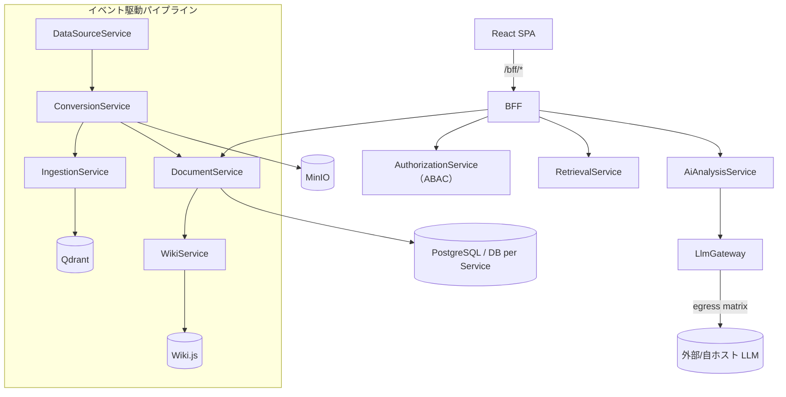

# 技術要件書

> 必須ドキュメント（リポジトリ単位）。本リポジトリの技術要件を定める。雛形は `docs/templates/tech_requirements_template.md`。
> 確定判断は実装ADR（`docs/adr/`）に残す。単一情報源は各設定ファイル（`src/Directory.Build.props` 等）。
>
> **リポジトリの位置づけ**: 主たる成果物は**マイクロサービスプラットフォーム基盤（platform ユニット）**。
> ナレッジ活用機能（knowledge ユニット）は基盤に付随する必須の可変機能セットである
> （issue #209 / [IADR-0056](../adr/IADR-0056_repo-unit-structure-platform-knowledge.md)。
> フォルダ構成・依存規則は [`src/README.md`](../../src/README.md)）。

## 起点となる計画書（トレーサビリティ）

- 技術検討（06_technical）: `03_tech-stack-selection.md`（実装フレームワーク・データストア・実行基盤）、
  `10_composability-design.md`（コンポーザビリティ）
- 関連 ADR / 非機能要件（NFR）: ADR-0004（Keycloak OIDC）／ADR-0005（Istio mTLS）／ADR-0007（ArgoCD+Helm）／
  ADR-0008（k3s）／NFR（性能・可用性・セキュリティ・運用・拡張性）
- 計画制約との差異: **なし（解消済み）**。実装は **.NET 10 / C# 13** で、計画側も
  [ADR-0020](../../planning/projects/microservices-platform/07_adr/ADR-0020_dotnet-10-upgrade.md)（Accepted・2026-07-23）で
  実装フレームワークを **.NET 10（LTS）** に確定した。実装が先行していた経緯は [[IADR-0048]] と
  `feedback/20260709_dotnet10-target-framework-deviation.md` に記録している（旧「計画 fixed は .NET 8」との乖離は ADR-0020 で解消）。

## 技術スタック

| 区分 | 採用 | バージョン | 備考 |
| --- | --- | --- | --- |
| 言語（バックエンド） | C# | 13（`LangVersion 13`） | 単一情報源 [`src/Directory.Build.props`](../../src/Directory.Build.props)。Nullable/ImplicitUsings 有効 |
| ランタイム（バックエンド） | .NET | 10（`net10.0`） | ADR-0020（計画側も .NET 10 で確定）／[[IADR-0048]]（実装の先行採用）。`global.json` は SDK 8.0.0 + `rollForward: latestMajor` |
| フレームワーク（バックエンド） | ASP.NET Core（Minimal API） | .NET 10 同梱 | アプリケーション層の標準は ADR-0030（後述「バックエンドアプリケーション層標準」）。ORM は EF Core |
| パッケージ管理 | Central Package Management | — | バージョンは [`src/Directory.Packages.props`](../../src/Directory.Packages.props) に集約。ソリューションは `.slnx` |
| 言語（フロントエンド） | TypeScript | 5.6 | **pnpm workspace** ルート = `src/`（メンバの正本は [`src/pnpm-workspace.yaml`](../../src/pnpm-workspace.yaml) 自身。ユニット・共有パッケージのほか `src/` の外の**雛形**を含む。[[IADR-0121]] 決定 2）。Node は CI と揃え 22 |
| フレームワーク（フロントエンド） | React + Vite | **React 19** / **Vite 6**（ESM） | SPA。ADR-0031 が確定したスタックへ移行中（[[IADR-0121]] が 5 段に分割）。**第 2 段の項目は消化済み**（#490 = ルータ／共通シェル／旧画面のルート載せ替え、#496 = shadcn/ui 本移植／Lingui／Storybook）。**第 2 段の完了条件は未達**——旧 13 画面の削除・再実装が #452 に残っている（項目の消化と完了条件は別である）。基盤(`platform/frontend`)/画面(`knowledge/frontend` の features)分離（[[IADR-0056]]）。BFF は `/bff/*` 経由 |
| 状態管理（フロントエンド） | TanStack Query | 5 | ADR-0031。サーバー状態の唯一の入口（`foundation/api/queryClient.ts`）。**グローバルストア（Redux）は持たない**（ESLint で機械強制）。クライアント状態の Zustand は使う画面が出る段で導入 |
| ルーティング（フロントエンド） | **TanStack Router** | 1.170 | ADR-0031。移行第 2 段（#490 / [[IADR-0124]]）で `react-router-dom` から差し替え済み（platform / knowledge から依存ごと撤去。ESLint で再混入を禁止）。ユニット合成は型付きルート factory のタプル、AST（submodule）だけ旧契約の実行時ブリッジが残る |
| API 契約（フロントエンド） | orval（OpenAPI → 型・TanStack Query フック・MSW モック） | 8 | ADR-0031。**手書きクライアント禁止**（ESLint で機械強制）。入力は `docs/api/openapi.yaml` の `/bff/` 配下のみ。生成物はコミットし CI で再生成差分を検査（[[IADR-0121]] 決定 3） |
| CSS / UI（フロントエンド） | Tailwind CSS v4 + shadcn/ui 派生プリミティブ + lucide-react | 4 | 共有 UI パッケージ `@platform/ui`（`src/packages/ui`。[[IADR-0121]] 決定 4 / [[IADR-0125]] 決定 1）。収録は Button / StatusBadge / Input / Textarea / Select / Label / Table 一式 / Card / Alert / Tabs。**ドメイン・通信・ルーティング・認証・表示文言は入れない**。公開面は `src/index.ts` 1 ファイル（深い参照は ESLint で禁止）。**外部 CDN・Web フォント・analytics を使わない**（08_data-egress-policy。`scripts/check-static-egress.js` がビルド成果物を走査して機械検査する）。色だけで意味を持たせない（INDEX 決定 21） |
| i18n（フロントエンド） | **Lingui**（ja / en） | 6 | ADR-0031（コンパイル時抽出）。カタログは `platform/frontend/src/foundation/i18n/locales/<locale>/messages.{po,ts}` にコミットし、`pnpm run i18n` の再生成差分と `scripts/check-i18n-catalogs.js`（全ロケールの `msgstr` 非空）と `lingui compile --strict` の 3 段で未翻訳を止める（[[IADR-0125]] 決定 3・4）。**切替 UI は持たない**（計画の §共通シェル に要素が無い）。適用は platform の foundation のみで、画面文言は #452 |
| コンポーネントカタログ | **Storybook** | 10 | ADR-0031。`src/packages/ui/.storybook/`。対象は `@platform/ui` のプリミティブのみ。テレメトリ／クラッシュレポートは無効化し、外部 egress はビルド成果物の走査で検査する（[[IADR-0125]] 決定 5） |
| 認証（利用者） | Keycloak（OIDC / Authorization Code + PKCE） | — | ADR-0004。SPA は public client `platform-spa`（`oidc-client-ts`）。**ADR-0032 の BFF セッション方式へ移行予定**（#439・[[IADR-0121]] 決定 6。それまで現行方式を維持する） |
| データストア（業務） | PostgreSQL | — | DB per Service（ADR-0002）。jsonb 属性は EF Core の ValueComparer で content 比較（#184） |
| データストア（ベクトル） | Qdrant | — | モデル別コレクション・決定的チャンク ID（[[IADR-0002]]） |
| オブジェクトストレージ | MinIO（S3 互換） | RELEASE.2025-04-08 | 正規化本文・資産。ClusterIP のみ（[[IADR-0024]]）。資格情報は k8s Secret |
| メッセージング | RabbitMQ / Kafka（**Wolverine**） | — | ADR-0027 / ADR-0028。イベント駆動パイプライン。契約は `Shared.Contracts`。**現行実装は MassTransit で、Wolverine への置き換えは各サービスの再実装 issue（#438〜#451）で行う**（#455 / #441） |
| 実行基盤 | k3s（Kubernetes） | — | ADR-0008。Helm `deploy/helm/microservices-platform`、Namespace `microservices-platform` |
| サービスメッシュ | Istio（Envoy mTLS） | — | ADR-0005 / [[IADR-0026]]。STRICT mTLS（`PeerAuthentication`/`DestinationRule`） |
| CI/CD・GitOps | ArgoCD + Helm | — | ADR-0007。Git を単一の真実源に宣言的同期（`deploy/argocd/`） |
| コンテナレジストリ | Harbor | — | ADR-0007。`global.image.registry: harbor.internal`、Pull は `imagePullSecrets` |
| 可観測性 | OpenTelemetry（OTLP） | — | `Otlp__Endpoint` で collector へ送出。トレース相関に利用 |

## アーキテクチャ概要

マイクロサービス（DB per Service）＋ BFF 集約＋イベント駆動パイプライン。フロント（SPA）は BFF のみを叩き、
BFF が ABAC スコープ解決（AuthorizationService）と各サービス呼び出しを集約する。取り込みは
DataSource→Conversion→Ingestion→（Document/Wiki）のイベントパイプラインで、段の有効/無効・購読は宣言的
構成（`pipeline.json`・[[IADR-0028]]）で組み替える（FR-14）。



## バックエンドアプリケーション層標準（ADR-0030）

計画側が [ADR-0030](../../planning/projects/microservices-platform/07_adr/ADR-0030_backend-application-libraries.md)（Accepted）と
[12_backend-application-stack](../../planning/projects/microservices-platform/06_technical/12_backend-application-stack.md)（`fixed`）で
アプリケーション層のライブラリ標準と設計様式を確定した。棚卸し表の**全量は計画書が正**であり、本節は
実装リポジトリで守る要点と本リポ固有の具体化のみを記す（作業仕様書:
[20260803_issue-455_backend-application-standard.md](../specs/20260803_issue-455_backend-application-standard.md)）。

### 設計様式

- Pragmatic Clean Architecture ＋ **Vertical Slice**（Feature 単位。不要な Repository / Service 抽象を作らない）
- API は **ASP.NET Core Minimal API**（.NET 10）
- CQRS のローカルディスパッチも **Wolverine ハンドラに統一**する。独自 Dispatcher・**MediatR は使わない**
- **Domain 層は `Platform.Shared.Kernel` を除き外部ライブラリへ依存しない**。Result 型は共有カーネルに**自前の公開型**（`Result` / `Result<T>` / `Error`）として置き、**その内部実装としてのみ** `CSharpFunctionalExtensions` を使う。`Domain` / `Application` / `Api` / `Infrastructure` は共有カーネルが公開する型だけを参照し、外部ライブラリの型・名前空間を直接参照しない（計画 ADR-0041 決定 1・2。2026-08-04 に ADR-0030 選定基準 3 を改定）
  - **共有カーネルが持ち込んでよい外部パッケージは Result 型の実装 1 つに限る**（同 決定 3）。`scripts/check-backend-libraries.js` が機械的に強制する（許可は `Platform.Shared.Kernel` プロジェクトに限定。許可リスト外が入れば fail）

### プロジェクト構成（サービス単位）

```text
src/<unit>/backend/Services/<Name>Service/
 ├── src/{<Name>.Api, <Name>.Application, <Name>.Domain, <Name>.Infrastructure, <Name>.Contracts}
 └── tests/<Name>.Tests/{Unit, Integration}
```

**`Tests` は 1 プロジェクトである。Unit / Integration はプロジェクトを分けず、フォルダで分ける**
（計画 [12_backend-application-stack](../../planning/projects/microservices-platform/06_technical/12_backend-application-stack.md)
§規範性・粒度・置き場。利用者裁定 2026-08-04 / planning#180）。プロジェクトを分けるとビルド時間と
参照管理のコストが増えるためである。`.csproj` の実名はサービスのホスト種別に合わせてよい
（実装の現況は `<Name>.Api.Tests` / `<Name>.Worker.Tests`）。

**共有カーネルはサービス単位に置かない**（[IADR-0117](../adr/IADR-0117_platform-shared-kernel-placement.md)）。
本リポジトリはユニット第一構成（[[IADR-0056]]・ADR-0019）を採り、ユニット外から参照できるのは
`src/platform/backend/Shared/` のプロジェクトのみである（[`src/README.md`](../../src/README.md) の依存規則）。
Result / Error はサービスをまたいで同一の型である必要があるため、**`Platform.Shared.Kernel` として 1 つに集約**する。
計画書の構成図はサービス内の論理レイヤを示したものであり、物理配置の具体化として扱う。

この配置は [[IADR-0056]] §決定 3 の**部分改定**にあたる。同決定はユニット外参照を
`src/platform/backend/Shared/` の **2 プロジェクト**（`Platform.Shared.Contracts` / `Platform.Shared.Infrastructure`）
のみに限っていたが、[IADR-0117](../adr/IADR-0117_platform-shared-kernel-placement.md) が
`Platform.Shared.Kernel` を加えて **3 プロジェクトへ改定**した（2026-08-03 / #455）。改定はこの 1 点に限り、
「platform → 可変ユニットは禁止」「統合テストの例外」は引き続き有効である。
`Platform.Shared.Kernel` が持てる .NET 標準以外の `PackageReference` は **Result 型の実装 1 つのみ**である
（現行 `CSharpFunctionalExtensions`。2026-08-04 に計画 ADR-0041 が ADR-0030 選定基準 3 の「ゼロ」を
「名指しの 1 つ」へ改定した）。ADR-0030 選定基準 3 を成立させるための置き場であり、
`scripts/check-backend-libraries.js` が `*.Domain.csproj` の許容 `ProjectReference` を同プロジェクトのみ
とし、あわせて**同プロジェクトの `PackageReference` を許可リストの 1 件に限る**形で機械強制する。**実体プロジェクトは未作成**で、最初にそれを必要とする
サービス再実装 issue（#438〜#451）が作成する。

### ライブラリ標準（要点）

| 用途 | 採用 | 使わない |
| --- | --- | --- |
| ローカル/リモートハンドラ・Outbox | Wolverine | MediatR・独自 Dispatcher・MassTransit |
| マッピング | Riok.Mapperly（ソースジェネレータ） | AutoMapper・Mapster |
| 検証 | FluentValidation | — |
| Result 表現 | `Platform.Shared.Kernel` の自前 Result / Error（**内部実装のみ** CSharpFunctionalExtensions。ADR-0041） | OneOf |
| エラー応答 | 標準 `AddProblemDetails()` + `IExceptionHandler` | Hellang.Middleware.ProblemDetails |
| ロギング | 標準 `ILogger` + OpenTelemetry Logs | Serilog 系（Seq 含む） |
| キャッシュ | HybridCache（L1）+ Redis（L2） | — |
| レジリエンス | Polly（`Microsoft.Extensions.Http.Resilience` 経由） | — |
| テスト | xUnit **v3**（※現行は v2。後述）・**AwesomeAssertions**・NSubstitute・Testcontainers・Respawn | FluentAssertions（v8 商用化） |
| API ドキュメント / バージョニング | Microsoft.AspNetCore.OpenApi + Scalar / Asp.Versioning.Http | Kiota・NSwag |

バージョンの単一情報源は [`src/Directory.Packages.props`](../../src/Directory.Packages.props)（CPM）である。

### 機械的強制と移行の進め方

不採用ライブラリの混入は [`scripts/check-backend-libraries.js`](../../scripts/check-backend-libraries.js) が
`.csproj` と MSBuild の `.props` / `.targets`（`Directory.Build.props` は配下の全プロジェクトへ
`PackageReference` を一括注入できるため。[#471](https://github.com/endazon/microservices-platform/issues/471)）の
`PackageReference`・`GlobalPackageReference` と `.cs` の `using` を走査して検出し、CI で止める。
**CPM の `PackageVersion`（版の中央定義）は違反にしない** — 下記 ratchet の消化が終わるまで、
[`src/Directory.Packages.props`](../../src/Directory.Packages.props) は不採用パッケージの版定義を正当に持つ。ただし**現行実装は MassTransit / FluentAssertions を
広範に使用中**（実測: `.csproj` 15 / 14、`.cs` 59 / 129）であるため、即時禁止では
「成果物は正しいのに赤」が常態化する（同じ判断の先例は [`scripts/README.md`](../../scripts/README.md) の
`check-permission-denials.js` の**段階ポリシー**——赤の常態化は「赤を無視する学習」を生み検査の目的そのものを
壊すため、許容値までは警告に留める。planning#146・planning#160（前段の失敗モード）／
planning#161・planning#162（段階ポリシーの導入））。よって **ratchet 方式**を採る。

- 既知の違反は `scripts/backend-library-baseline.json` にプロジェクト単位で記録する
- baseline に無いプロジェクトでの違反は **fail**（新規混入を止める）
- baseline 内の違反は warn（残件として実行サマリに出す）
- baseline にあるのに違反が消えた場合も **fail**（baseline の減らし忘れを検出する）

各サービスの再実装 issue（#438〜#451）は、移行と同時に baseline から自プロジェクトを削除する。baseline が
空になった時点で不採用パッケージを `Directory.Packages.props` から削除する。

**`Serilog` は消化済みである**（[IADR-0216](../adr/IADR-0216_otel-logging-sdk-replaces-serilog.md)。#455）。
ログの出口を `builder.Logging.AddOpenTelemetry()`（OTel Logging SDK）へ移し、`Serilog.AspNetCore` /
`Serilog.Sinks.OpenTelemetry` の `PackageReference`・`PackageVersion`・baseline エントリ 13 件を削除した
（実測 2026-08-16: `Serilog` の `.csproj` 3 → **0**、`using Serilog` を持つ `.cs` 13 → **0**）。
**残件は 42 件 → 29 件**（`MassTransit` / `FluentAssertions`）。`Serilog` は不採用のまま `BANNED` に残るため、
再混入は引き続き fail する。

**xUnit は標準が v3 だが現行は v2 である。** `xunit.runner.visualstudio` は v2 用（2.x）と v3 用（3.x）で
別系列であり、**CPM は 1 パッケージ 1 バージョンしか持てない**ため、v3 へ移ると既存 30 のテスト
プロジェクトが同時に移らざるを得ない。この切替は独立した issue で行う。それまで **`xunit.v3` を参照する
プロジェクトを作ってはならない**（非互換の runner と組み合わさる）。`check-backend-libraries.js` が
`templates/` を含めて検査し、混入を止める。

**年 1 回、AwesomeAssertions・Wolverine のライセンス / 保守状況を点検する**（ADR-0030 フォローアップ）。
手順は[運用仕様書](../operations/)に記載する。

## 非機能要件の実現方針

| 区分 | 目標 | 実現方針 |
| --- | --- | --- |
| 性能 | 検索 p95 1.5s / RAG 初回 5s / 取り込み 1万件・時 / 更新 15 分以内反映 | ハイブリッド検索＋ベクトル索引（Qdrant）、SSE ストリーミング（[[IADR-0037]]）。**負荷試験は未実施（#196）** で目標達成の実測が未追跡。フロントの初期ロードは**計画に上限値が無い**ため、判定はビルドツールの既定予算（500 kB/チャンク）と前後の実測差で行う（[[IADR-0134]]。#512 時点の実測: 最大チャンク 274.33 kB / 初期ロード 577.54 kB・gzip 177.94 kB） |
| 可用性 | 99.9%（月間ダウンタイム約 43 分以内） | HPA + PodDisruptionBudget（#197・`scaling`）、readiness/liveness プローブ、RollingUpdate、GitOps ロールバック（Git revert） |
| セキュリティ | 認証・認可・データ越境統制・監査ログ | Keycloak OIDC（ADR-0004）＋ ABAC fail-closed（[[IADR-0012]]）、Istio STRICT mTLS（[[IADR-0026]]）＋ NetworkPolicy、deny-by-default／存在秘匿（[[IADR-0009]]）、LLM egress マトリクス（[[IADR-0025]]）。詳細は `docs/security/security.md` |
| 運用・保守 | 検出 5 分以内 / MTTR 30 分以内 | OTel 可観測性、ArgoCD GitOps、構成ドリフト検出（[[IADR-0029]]）、起動時 fail-fast（[[IADR-0028]]）。**監視アラート・バックアップ・Runbook は整備中（#198）** |
| 拡張性 | 段の挿抜・購入部品の差し替え（FR-14） | 宣言的パイプライン構成（`pipeline.json`・[[IADR-0028]]）＋ Foundation/Composable 構造（[[IADR-0027]]）。契約は `Shared.Contracts`。共通エンベロープ・契約テストは条件付き繰延（[[IADR-0049]]） |

## 開発・ビルド・テスト・デプロイ

- **バックエンド**: `dotnet build` / `dotnet test`（xUnit。標準は v3・現行は v2 で各サービス再実装時に切替）/
  `dotnet format --verify-no-changes`（CI lint ゲート）を
  ユニット別ソリューション（[`src/platform/backend/backend.slnx`](../../src/platform/backend/backend.slnx) /
  [`src/knowledge/backend/backend.slnx`](../../src/knowledge/backend/backend.slnx)）毎に実行する。
- **フロントエンド**（`src/` で実行。パッケージ管理は **pnpm**）: `pnpm run lint`（ESLint flat config。
  Redux 不使用・手書き HTTP クライアント禁止・BFF 境界を機械強制する。[[IADR-0121]] 決定 8）/
  `pnpm run typecheck` / `pnpm run test`（Vitest）/ `pnpm run test:coverage`（v8・しきい値ラチェット）/
  `pnpm run codegen`（orval。BFF OpenAPI から生成。再生成差分は CI が検査する）/ E2E は Playwright。
  **バンドルはルート単位に分割する**（[[IADR-0134]]）——画面は `lazyRouteComponent` で遅延させ、
  共通シェル・認証・`@platform/ui` のプリミティブ・React ランタイム・TanStack Query は初期ロードに残す
  （`manualChunks` の 3 規則 = `vendor-react` / `ui` / `vendor-query`）。
  内訳の実測は `pnpm --filter @platform/frontend run build:analyze`（`ANALYZE_BUNDLE=1`。
  出力 `dist/stats.json` は生成物でコミットしない）。
- **CI**: バックエンド [`ci.yml`](../../.github/workflows/ci.yml)、フロント [`frontend.yml`](../../.github/workflows/frontend.yml) /
  [`frontend-tests.yml`](../../.github/workflows/frontend-tests.yml)。セキュリティ（gitleaks/dependency-review）・CodeQL。
  コミット/PR 件名はトレーサビリティ規約を機械検査（`check-commit-messages.js` / `pr-title.yml`）。
- **デプロイ**: ArgoCD が `deploy/helm/microservices-platform` を宣言的同期（ADR-0007）。構成変更のみで段の組み替え・
  スケール調整が完結する（GitOps）。

## 未決事項

- 性能目標の負荷試験・実測（#196）。達成状況に応じ HPA しきい値（#197 `scaling.hpa`）を調整する。
- 監視アラート閾値・バックアップ/リストア・Runbook の整備（#198）。
- ~~計画制約「.NET 8」の更新 or 是正の計画側判断（[[IADR-0048]] / plan-feedback）。~~
  **決着済み（2026-07-23）**: 計画側が [ADR-0020](../../planning/projects/microservices-platform/07_adr/ADR-0020_dotnet-10-upgrade.md)（Accepted）で
  .NET 10（LTS）に確定し、乖離は解消した。残る作業は同 ADR のフォローアップ
  （個別プロセス文書に残る「.NET 8」表記の順次追随）で、計画側の担当である。
- ADR-0030 標準への移行残件（#455）: 不採用ライブラリの baseline を各サービス再実装 issue で解消し、
  空になった時点で `Directory.Packages.props` から不採用パッケージを削除する。xUnit v2 → v3 の切替時期と
  `Xunit.SkippableFact` の v3 代替（`Assert.Skip`）は各サービス側で確定する。
- サービス間 HTTP の `Refit` は棚卸し表に記載が無い。ADR-0029（内部同期は gRPC）との関係は #441 で決着する。
