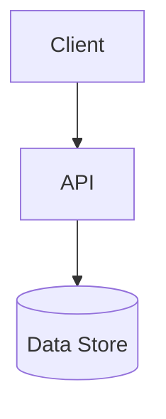

# 技術要件書

> 必須ドキュメント（リポジトリ単位）。本リポジトリの技術要件を定める。雛形は `docs/templates/tech_requirements_template.md`。
> **未記入のまま放置しない**。技術スタック・アーキテクチャ・非機能の実現方針を埋めること。確定判断は実装ADR（`docs/adr/`）に残す。

## 起点となる計画書（トレーサビリティ）

- 技術検討（06_technical）:
- 関連 ADR / 非機能要件（NFR）:

## 技術スタック

| 区分 | 採用 | バージョン | 備考 |
| --- | --- | --- | --- |
| 言語 |  |  |  |
| フレームワーク |  |  |  |
| データストア |  |  |  |
| 実行基盤 | k3s（Kubernetes） | — | ADR-0008。Helm `deploy/helm/knowledge-platform`、Namespace `knowledge-platform` |
| サービスメッシュ | Istio（Envoy mTLS） | — | ADR-0005 / IADR-0024。STRICT mTLS（`PeerAuthentication`/`DestinationRule`）、可観測性は Kiali |
| CI/CD・GitOps | ArgoCD + Helm | — | ADR-0007。Git を単一の真実源に宣言的同期（`deploy/argocd/`） |
| コンテナレジストリ | Harbor | — | ADR-0007。`global.image.registry: harbor.internal`、Pull は `imagePullSecrets` |

## アーキテクチャ概要

## 非機能要件の実現方針

| 区分 | 目標 | 実現方針 |
| --- | --- | --- |
| 性能 |  |  |
| 可用性 |  |  |
| セキュリティ |  |  |
| 運用・保守 |  |  |
| 拡張性 |  |  |

## 開発・ビルド・テスト・デプロイ

<!-- ビルド/テスト/フォーマットのコマンド、CI/CD -->

## 未決事項
