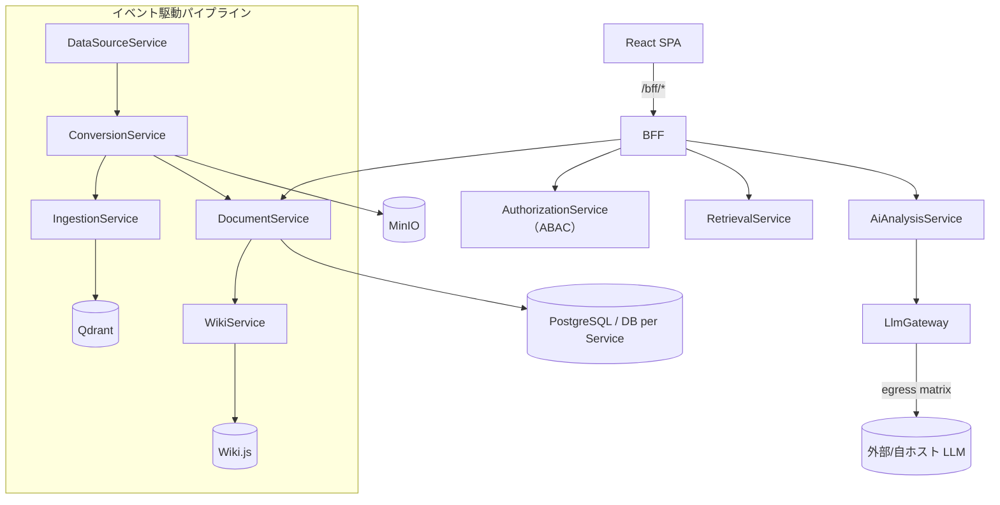

<!-- trace:
ids: [FR-14]
adrs: [ADR-0002, ADR-0004, ADR-0005, ADR-0007, ADR-0008, ADR-0019, ADR-0020, ADR-0027, ADR-0028, ADR-0029, ADR-0030, ADR-0031, ADR-0032, ADR-0041, ADR-0065, ADR-0068, ADR-0077]
iadrs: [IADR-0002, IADR-0009, IADR-0012, IADR-0024, IADR-0025, IADR-0026, IADR-0027, IADR-0028, IADR-0029, IADR-0037, IADR-0048, IADR-0049, IADR-0056, IADR-0117, IADR-0121, IADR-0124, IADR-0125, IADR-0134, IADR-0195, IADR-0196, IADR-0216, IADR-0219, IADR-0229, IADR-0231, IADR-0233, IADR-0234, IADR-0238, IADR-0280, IADR-0282, IADR-0319, IADR-0334, IADR-0349, IADR-0350, IADR-0371, IADR-0383]
specs: [20260803_issue-455_backend-application-standard, 20260821_issue-455_awesome-assertions-knowledge, 20260821_issue-455_xunit-v3-migration, 20260821_issue-455_wolverine-phase0-preconditions, 20260821_issue-455_integration-tests-production-wiring, 20260821_issue-455_workers-in-integration-tests, 20260821_issue-455_two-subscribers-fanout-test, 20260821_issue-455_pipeline-declaration-in-integration-tests, 20260821_issue-455_queue-override-fanout, 20260822_issue-455_wolverine-shared-helper, 20260822_issue-441_wolverine-retry-dlq-defaults, 20260828_arch-foundation_eight-element-materialization, 20260903_issue-1179_slice-split-status-correction, 20260903_issue-1196_operation-semantics-in-standard-docs, 20260904_issue-1064_backend-stack-reference-impl, 20260905_issue-1249-1250-1251_rotten-derived-values]
issues: [#184, #196, #197, #198, #209, #441, #455, #490, #838, #882, #887, #1062, #1064, #1093, #1094, #1179, #1196, #1249, #1251, planning#146, planning#160, planning#161, planning#162, planning#180, planning#390, planning#490, planning#527, planning#532]
-->

# 技術要件書

> 必須ドキュメント（リポジトリ単位）。本リポジトリの技術要件を定める。雛形は `docs/templates/tech_requirements_template.md`。
> 確定判断は実装ADR（`.ai-context/adr/`）に残す。単一情報源は各設定ファイル（`src/Directory.Build.props` 等）。
>
> **リポジトリの位置づけ**: 主たる成果物は**マイクロサービスプラットフォーム基盤（platform ユニット）**。
> ナレッジ活用機能（knowledge ユニット）は基盤に付随する必須の可変機能セットである
> （issue #209。リポジトリ最上位のユニット構成〔`src/<unit>/{backend,frontend}` = platform / knowledge〕を定めた実装 ADR。
> フォルダ構成・依存規則は [`src/README.md`](../../src/README.md)）。

## 起点となる計画書（トレーサビリティ）

- 技術検討（06_technical）: `03_tech-stack-selection.md`（実装フレームワーク・データストア・実行基盤）、
  `10_composability-design.md`（コンポーザビリティ）
- 関連 ADR / 非機能要件: 認可＝ABAC / Keycloak OIDC ／ サービスメッシュ Istio（mTLS）／ CI/CD GitOps（ArgoCD+Helm）／
  ランタイム Kubernetes（k3s）／ 非機能要件（性能・可用性・セキュリティ・運用・拡張性）
- 計画制約との差異: **なし（解消済み）**。実装は **.NET 10 / C# 13** で、計画側も
  .NET 10 アップグレードの計画 ADR（Accepted・2026-07-23）で
  実装フレームワークを **.NET 10（LTS）** に確定した。実装が先行していた経緯は、バックエンドの .NET 10 採用を決めた実装 ADR と
  `feedback/20260709_dotnet10-target-framework-deviation.md` に記録している（旧「計画 fixed は .NET 8」との乖離は同計画 ADR で解消）。

## 技術スタック

| 区分 | 採用 | バージョン | 備考 |
| --- | --- | --- | --- |
| 言語（バックエンド） | C# | 13（`LangVersion 13`） | 単一情報源 [`src/Directory.Build.props`](../../src/Directory.Build.props)。Nullable/ImplicitUsings 有効 |
| ランタイム（バックエンド） | .NET | 10（`net10.0`） | .NET 10 アップグレードの計画 ADR（計画側も .NET 10 で確定）／実装側の先行採用の判断。`global.json` は SDK 8.0.0 + `rollForward: latestMajor` |
| フレームワーク（バックエンド） | ASP.NET Core（Minimal API） | .NET 10 同梱 | アプリケーション層の標準はバックエンド標準ライブラリの計画 ADR（後述「バックエンドアプリケーション層標準」）。ORM は EF Core |
| パッケージ管理 | Central Package Management | — | バージョンは [`src/Directory.Packages.props`](../../src/Directory.Packages.props) に集約。ソリューションは `.slnx` |
| 言語（フロントエンド） | TypeScript | 5.6 | **pnpm workspace** ルート = `src/`（メンバの正本は [`src/pnpm-workspace.yaml`](../../src/pnpm-workspace.yaml) 自身。ユニット・共有パッケージのほか `src/` の外の**雛形**を含む。SPA 新スタック移行の決定 2）。Node は CI と揃え 22 |
| フレームワーク（フロントエンド） | React + Vite | **React 19** / **Vite 6**（ESM） | SPA。フロントエンドスタックの計画 ADR が確定したスタックへ移行中（SPA 新スタック移行の実装 ADR が 5 段に分割）。**第 2 段の項目は消化済み**（#490 = ルータ／共通シェル／旧画面のルート載せ替え、#496 = shadcn/ui 本移植／Lingui／Storybook）。**第 2 段の完了条件は未達**——旧 13 画面の削除・再実装が #452 に残っている（項目の消化と完了条件は別である）。基盤(`platform/frontend`)/画面(`knowledge/frontend` の features)分離（ユニット構成の実装 ADR）。BFF は `/bff/*` 経由 |
| 状態管理（フロントエンド） | TanStack Query | 5 | フロントエンドスタックの計画 ADR。サーバー状態の唯一の入口（`foundation/api/queryClient.ts`）。**グローバルストア（Redux）は持たない**（ESLint で機械強制）。クライアント状態の Zustand は使う画面が出る段で導入 |
| ルーティング（フロントエンド） | **TanStack Router** | 1.170 | 同計画 ADR。移行第 2 段（#490。ルート木の実装 ADR）で `react-router-dom` から差し替え済み（platform / knowledge から依存ごと撤去。ESLint で再混入を禁止）。ユニット合成は型付きルート factory のタプル、AST（submodule）だけ旧契約の実行時ブリッジが残る |
| API 契約（フロントエンド） | orval（OpenAPI → 型・TanStack Query フック・MSW モック） | 8 | 同計画 ADR。**手書きクライアント禁止**（ESLint で機械強制）。入力は `docs/api/openapi.yaml` の `/bff/` 配下のみ。生成物はコミットし CI で再生成差分を検査（SPA 新スタック移行の決定 3） |
| CSS / UI（フロントエンド） | Tailwind CSS v4 + shadcn/ui 派生プリミティブ + lucide-react | 4 | 共有 UI パッケージ `@platform/ui`（`src/packages/ui`。SPA 新スタック移行の決定 4 と、共有 UI プリミティブの実装 ADR の決定 1）。収録は Button / StatusBadge / Input / Textarea / Select / Label / Table 一式 / Card / Alert / Tabs。**ドメイン・通信・ルーティング・認証・表示文言は入れない**。公開面は `src/index.ts` 1 ファイル（深い参照は ESLint で禁止）。**外部 CDN・Web フォント・analytics を使わない**（08_data-egress-policy。`scripts/check-static-egress.js` がビルド成果物を走査して機械検査する）。色だけで意味を持たせない（INDEX 決定 21） |
| i18n（フロントエンド） | **Lingui**（ja / en） | 6 | 同計画 ADR（コンパイル時抽出）。カタログは `platform/frontend/src/locales/<locale>/messages.{po,ts}` にコミットし、`pnpm run i18n` の再生成差分と `scripts/check-i18n-catalogs.js`（全ロケールの `msgstr` 非空）と `lingui compile --strict` の 3 段で未翻訳を止める（共有 UI プリミティブの実装 ADR の決定 3・4）。**切替 UI は持たない**（計画の §共通シェル に要素が無い）。適用は platform の foundation のみで、画面文言は #452 |
| コンポーネントカタログ | **Storybook** | 10 | 同計画 ADR。`src/packages/ui/.storybook/`。対象は `@platform/ui` のプリミティブのみ。テレメトリ／クラッシュレポートは無効化し、外部 egress はビルド成果物の走査で検査する（同実装 ADR の決定 5） |
| 認証（利用者） | Keycloak（OIDC / Authorization Code + PKCE） | — | 認可＝ABAC の計画 ADR。**BFF セッション方式（Token Handler）へ移行済み**（#439）——OIDC は BFF がコンフィデンシャルクライアント `bff` として実施し、SPA はトークンを扱わない（`oidc-client-ts` は撤去済み）。設計は `docs/authz/bff-session-design.md`。public client `platform-spa` は可変ユニット（別リポジトリ）の追随完了まで realm に残る |
| データストア（業務） | PostgreSQL | — | DB per Service。jsonb 属性は EF Core の ValueComparer で content 比較 |
| データストア（ベクトル） | Qdrant | — | モデル別コレクション・決定的チャンク ID |
| オブジェクトストレージ | MinIO（S3 互換） | RELEASE.2025-04-08 | 正規化本文・資産。ClusterIP のみ（バケット/キー設計の実装 ADR）。資格情報は k8s Secret |
| メッセージング | RabbitMQ / Kafka（**Wolverine**） | — | メッセージング基盤とブローカーの計画 ADR。イベント駆動パイプライン。契約は `Shared.Contracts`。**現行実装は MassTransit で、Wolverine への置き換えは各サービスの再実装 issue（#438〜#451）で行う** |
| 実行基盤 | k3s（Kubernetes） | — | ランタイムの計画 ADR。Helm `deploy/helm/microservices-platform`、Namespace `microservices-platform` |
| サービスメッシュ | Istio（Envoy mTLS） | — | サービスメッシュの計画 ADR と STRICT mTLS の実装判断。（`PeerAuthentication`/`DestinationRule`） |
| CI/CD・GitOps | ArgoCD + Helm | — | GitOps の計画 ADR。Git を単一の真実源に宣言的同期（`deploy/argocd/`） |
| コンテナレジストリ | Harbor | — | 同計画 ADR。`global.image.registry: harbor.internal`、Pull は `imagePullSecrets` |
| 可観測性 | OpenTelemetry（OTLP） | — | `Otlp__Endpoint` で collector へ送出。トレース相関に利用 |

## アーキテクチャ概要

マイクロサービス（DB per Service）＋ BFF 集約＋イベント駆動パイプライン。フロント（SPA）は BFF のみを叩き、
BFF が ABAC スコープ解決（AuthorizationService）と各サービス呼び出しを集約する。取り込みは
DataSource→Conversion→Ingestion→（Document/Wiki）のイベントパイプラインで、段の有効/無効・購読は宣言的
構成（`pipeline.json`。宣言的パイプライン構成の実装 ADR）で組み替える。



## バックエンドアプリケーション層標準

計画側がバックエンド標準ライブラリの計画 ADR（Accepted）と
12_backend-application-stack（計画リポ）（`fixed`）で
アプリケーション層のライブラリ標準と設計様式を確定した。棚卸し表の**全量は計画書が正**であり、本節は
実装リポジトリで守る要点と本リポ固有の具体化のみを記す（作業仕様書:
仕様書: バックエンドアプリケーション層標準の確立と機械的強制）。

### 設計様式

- Pragmatic Clean Architecture ＋ **Vertical Slice**（Feature 単位。不要な Repository / Service 抽象を作らない）
- API は **ASP.NET Core Minimal API**（.NET 10）
- CQRS のローカルディスパッチも **Wolverine ハンドラに統一**する。独自 Dispatcher・**MediatR は使わない**
- **Domain 層は `Platform.Shared.Kernel` を除き外部ライブラリへ依存しない**。Result 型は共有カーネルに**自前の公開型**（`Result` / `Result<T>` / `Error`）として置き、**その内部実装としてのみ** `CSharpFunctionalExtensions` を使う。
  `Domain` / `Application` / `Api` / `Infrastructure` は共有カーネルが公開する型だけを参照し、外部ライブラリの型・名前空間を直接参照しない（Result 型の外部ライブラリを定めた計画 ADR の決定 1・2。2026-08-04 にバックエンド標準ライブラリの選定基準 3 を改定した）
  - **共有カーネルが持ち込んでよい外部パッケージは Result 型の実装 1 つに限る**（同 決定 3）。`scripts/check-backend-libraries.js` が機械的に強制する（許可は `Platform.Shared.Kernel` プロジェクトに限定。許可リスト外が入れば fail）

### プロジェクト構成（サービス単位）

**標準構成は、単一プロジェクト＋層フォルダである**（オーナー裁定 2026-08-28。
単一プロジェクト標準を定めた実装 ADR が正本。従前の 8 要素プロジェクト分割
（計画 12_backend-application-stack（計画リポ）§プロジェクト構成）の実体化は
**同裁定で撤回**され、**計画側条文も 2026-08-30 に改定済みである**（環流した issue は closed。
計画側の改定履歴に「単一プロジェクト＋ Vertical Slice フォルダへ改め、旧構成は打ち消し線で残す」と
記録されている）—— 8 つの**関心**はフォルダとユニット共有プロジェクトで維持する）。

```text
src/<unit>/backend/Services/<Name>Service/
 ├── <Name>Service.csproj        # 単一プロジェクト（層をプロジェクト分割しない）
 ├── Program.cs                  # 合成ルート（束ねるだけ。判断を書かない）
 ├── Features/<集約>/<操作>/     # Vertical Slice（Endpoint / Command|Query / Handler / *Consumer / 常駐ジョブ）
 ├── Domain/                     # エンティティ・値オブジェクト（外部依存なし。＋ Errors/）
 ├── Infrastructure/             # Persistence（EF Core・Migrations）・Messaging 等のアダプタ
 ├── Common/                     # サービス固有の横断関心（Exceptions/・Behaviors/）
 └── Tests/<Name>.Tests.csproj   # テストは 1 プロジェクト（フォルダは本体の鏡写し。相手が在るぶんだけ作る）
```

#### 「操作」とは何か（契機の形では決めない）

**操作とは、そのサービスが外部からの 1 つの契機に応えて行う 1 つのユースケースである**
（オーナー裁定 2026-09-03。「操作」の語義を定めた計画 ADR が正本）。

🔴 **契機の形（HTTP 要求・イベント購読・スケジュール実行・チャットコマンド）では決めない。**
形は実装の都合で変わるからである —— **同じユースケースが HTTP からもスケジュールからも駆動される
ことはあり、契機で切ると 1 つのユースケースが 2 つの操作に割れる。**
**契機が 2 つある操作は 1 つの操作である。** `DataSourceService/Features/DataSources/Sync/` が実例で、
`Endpoint.cs`（HTTP）と `DataSourceSyncHostedService.cs`（スケジュール）が**同じ操作フォルダに同居する**。
🔴 **HTTP 端点を 1 つも持たない操作フォルダも正しい形である** ——
`GraphService/Features/KnowledgeHealth/Report/` は `Endpoint.cs` を持たず、
唯一の契機がスケジュール実行である（`KnowledgeHealthCollector.cs` /
`KnowledgeHealthHostedService.cs` / `KnowledgeHealthOptions.cs` の 3 件）。
**「操作＝登録表に登録された HTTP 端点」と読んではならない** —— この読みは計画側で明示的に退けられた。
**端点がどこで宣言されているかという実装の都合で答えが変わってしまう**うえ、
**基盤が既に採っている形と食い違う**からである。

**分界は「入口の配線」と「操作の処理」である。** これは「登録表は 2 段目に残し、操作の処理を
3 段目へ下ろす」という既存の分界をそのまま延長したものであり、**新しい規則ではない。**

| | どこに置くか |
| --- | --- |
| **入口の配線** | **現在の置き場に残す** —— HTTP の登録表（`<集約>Endpoints.cs`）は 2 段目、イベント購読の宣言は `Infrastructure/Messaging`、常駐ジョブの起動と間隔設定は常駐ジョブの置き場 |
| **操作の処理** | `Features/<集約>/<操作>/` へ下ろす |

**判定の 1 問は従来どおり「そのファイルが 1 つの操作にしか使われないか」である。**
本節が与えるのは、その問いの主語である。

**`Api` と `Worker` は同一サービス内で排他である。** いずれか一方のみを持ち、**持たない側は空フォルダを作らない**
（実行入口は 1 サービスに 1 つであり、「空の実行入口」という状態が存在しないため）。
**ただし排他なのは `Program.cs` の形であって、ディレクトリ階層でも `.csproj` 名でもない**
（2026-08-30 の計画側改定）—— **`Services/<Name>/Worker/` のような中間ディレクトリは置かず、
`.csproj` 名にも `.Worker` を付けない**（追跡下の `*Worker*.csproj` は 0 件である）。実装の現況は
**`Api` 12 サービス / `Worker` 2 サービス**（`ConversionService` / `IngestionService`）である
（2026-08-28 の移送完了時点で数え直した。knowledge 10 ＋ platform 4 ＝ 14 サービス）。
**`Worker` が HTTP 面を持つことは `Worker` であることと矛盾しない** —— 区別の軸はホストの主目的である。

**参照方向（`Domain` は `Features` / `Infrastructure` / `Common` の振る舞いを知らない）は
フォルダ＝名前空間で守り、機械検査は名前空間走査版が稼働している。**

🔴 **［2026-08-28 追記］移送は完了した。** 従前ここは「移送完了までは現行配置
（`src/<Name>.<Api|Worker>/Foundation/ ・ Composable/`）が実態であり、新規コードも現行配置で書く」と
書いていたが、**14 サービス全件が新配置へ移送済み**であり `Services/<Name>/src/` は 1 つも残っていない。
**新規コードは新配置（サービス直下の単一プロジェクト＋ `Features/` `Domain/` `Infrastructure/` `Common/` `Tests/`）で書く。**
🔴 **［2026-09-03 追記］操作単位のスライス分割（`Features/<集約>/<操作>/`）は完了した。**
従前ここは「スライス分割はまだ行っていない —— 端点は集約フォルダ直下に 1 枚のまま置かれている」と
書いていたが、**端点は全件が操作フォルダへ降りており、集約フォルダ直下に端点は 1 つも残っていない**。
🔴 **集約フォルダ直下に残るのは、複数の操作が使うものだけ**である —— 各操作の `Map` を束ねる**登録表**の
ほか、DTO 束・ストア・ポート・共有ヘルパ・常駐ジョブが、**いずれも「2 つ以上の操作が使う」ときに
かぎり**ここに残る。**これらは「降ろし残し」ではなく、「使う操作を数えた結果として集約の側に属する」と
裁定されたもの**であり、操作フォルダへ複写しない（複写すると片方だけ直したときに黙ってズレる）。
🔴 **常駐ジョブは無条件に集約直下ではない。1 操作しか駆動しないなら 3 段目である。**
`NotificationService` の `NotificationMaintenanceHostedService.cs` は 1 巡で
`DispatchEmails/EmailOutboxDispatcher` と `PurgeExpired/NotificationRetention` の **2 操作を駆動する
ので 2 段目**である（**操作の処理はそれぞれ 3 段目にあり、2 段目に居るのは入口の配線だけ**である）。
対して `KnowledgeHealth/Report/` と `DataSources/Sync/` の常駐ジョブは **1 操作なので 3 段目**である。
**段は「内容の抽象度」でも「契機の形」でもなく、「使う操作を数えた結果」で決める。**
**ただし完了したのは端点の段であって、`Command` / `Handler` までの分割は一部にとどまる** ——
太いエンドポイントのハンドラ化・値オブジェクト化・ドメインイベント導入は引き続き別作業である。

**`Tests` は 1 プロジェクトである**（計画 12_backend-application-stack（計画リポ）
§規範性・粒度・置き場。利用者裁定 2026-08-04）。プロジェクトを分けるとビルド時間と
参照管理のコストが増えるためである。フォルダは Unit / Integration の種別区分ではなく
**実装のスライスを鏡写しにする**（2026-08-28 裁定。**種別区分の計画側条文は 2026-08-30 に部分改定済みで、
「本体の鏡写し」へ改まっている**）。🔴 **鏡写しの相手は「そのテストが検証する本体の要素が置かれた
ディレクトリ」であり、`Features/` と `Domain/` に限らない** —— `Infrastructure/<Sub>/`・`Common/<Sub>/`・
`Domain/Ports/` も写す（計画側条文が挙げるのは `Tests/Features/` ／ `Tests/Domain/` の 2 つだが、
それは形の例示であり、相手の解決規則は実装側の決定記録が持つ。詳細は
[テスト戦略](../tests/TEST_STRATEGY.md)）。**`.csproj` の実名はホスト種別を含めず `<Name>.Tests` とする**
（**規約は全サービスへ適用済みで、旧名 `<Name>.Api.Tests` / `<Name>.Worker.Tests` は残っていない**。
ここでもサービス数は本文に書かない —— 数えるときは
`git ls-files 'src/*/backend/Services/*/Tests/*.csproj'` と
`git ls-files | grep -E '.(Api|Worker).Tests.csproj'` が正本である）。

**共有カーネルはユニット単位に一本化する**（2026-08-28 裁定。サービス単位の
`SharedKernel` 要素と `.gitkeep` の枠は撤回）。

| 置き場 | 何を置くか |
| --- | --- |
| **ユニット単位** `src/platform/backend/Shared/Platform.Shared.Kernel/` | **サービス境界をまたいで同一性が要る型** —— **契約に載る `Result` / `Error`・DDD 基底型**。BFF がサービスの結果を集約し、`Platform.Shared.Contracts` のイベント契約が失敗を表現するため、単一の型でなければならない。サービス個別の `Common/Result.cs` は置かない |
| **サービス単位** `Services/<Name>Service/Common/` | **自サービスに閉じた横断関心**（`Exceptions/`・`Behaviors/`）。共通「基底」の複製は置かない |

本リポジトリはユニット第一構成（実装 ADR と、計画側のユニット第一リポジトリ構成の決定）を採り、ユニット外から参照できるのは
`src/platform/backend/Shared/` のプロジェクトのみである（[`src/README.md`](../../src/README.md) の依存規則）。
**`Platform.Shared.Kernel` は併存として引き続き有効であり、廃止しない。**
**サービス単位の枠は「作ってよい」の意味ではない** —— 境界をまたぐ型をそちらへ置けば置き分けに反する。

> **［2026-08-17 / #455］従前は「共有カーネルはサービス単位に置かない」と書いていた**
> （共有カーネルの配置を定めた実装 ADR が案 B を却下したことに従っていた）。
> **利用者裁定が計画の構成図を正とし、サービス単位を標準構成として認めたため、併存の形へ改めた。**
> 同実装 ADR の決定 1〜4（`Platform.Shared.Kernel` の新設・ユニット外参照 2 → 3）は有効である。

この配置は、ユニット構成の実装 ADR の §決定 3 の**部分改定**にあたる。同決定はユニット外参照を
`src/platform/backend/Shared/` の **2 プロジェクト**（`Platform.Shared.Contracts` / `Platform.Shared.Infrastructure`）
のみに限っていたが、共有カーネルの配置を定めた実装 ADR が
`Platform.Shared.Kernel` を加えて **3 プロジェクトへ改定**した（2026-08-03 / #455）。改定はこの 1 点に限り、
「platform → 可変ユニットは禁止」「統合テストの例外」は引き続き有効である。
`Platform.Shared.Kernel` が持てる .NET 標準以外の `PackageReference` は **Result 型の実装 1 つのみ**である
（現行 `CSharpFunctionalExtensions`。2026-08-04 に Result 型の外部ライブラリを定めた計画 ADR が、
バックエンド標準ライブラリの計画 ADR の選定基準 3 の「ゼロ」を「名指しの 1 つ」へ改定した）。
同選定基準 3 を成立させるための置き場であり、
`scripts/check-backend-libraries.js` が `*.Domain.csproj` の許容 `ProjectReference` を同プロジェクトのみ
とし、あわせて**同プロジェクトの `PackageReference` を許可リストの 1 件に限る**形で機械強制する。
**実体プロジェクトは作成済みである**（`src/platform/backend/Shared/Platform.Shared.Kernel` ＋
`Platform.Shared.Kernel.Tests`）。なお `*.Domain.csproj` 規則の対象は現在 0 件である ——
層プロジェクト分割の撤回により `*.Domain.csproj` そのものが存在せず、Domain の外部依存ゼロは
**フォルダ（名前空間）走査**の側が担保している。

### ライブラリ標準（要点）

| 用途 | 採用 | 使わない |
| --- | --- | --- |
| ローカル/リモートハンドラ・Outbox | Wolverine | MediatR・独自 Dispatcher・MassTransit |
| マッピング | Riok.Mapperly（ソースジェネレータ） | AutoMapper・Mapster |
| 検証 | FluentValidation | — |
| Result 表現 | `Platform.Shared.Kernel` の自前 Result / Error（**内部実装のみ** CSharpFunctionalExtensions。Result 型の計画 ADR） | OneOf |
| エラー応答 | 標準 `AddProblemDetails()` + `IExceptionHandler` | Hellang.Middleware.ProblemDetails |
| ロギング | 標準 `ILogger` + OpenTelemetry Logs | Serilog 系（Seq 含む） |
| キャッシュ | HybridCache（L1）+ Redis（L2） | — |
| レジリエンス | Polly（`Microsoft.Extensions.Http.Resilience` 経由） | — |
| テスト | xUnit **v3**・**AwesomeAssertions**・NSubstitute・Testcontainers・Respawn | FluentAssertions（v8 商用化）・`Xunit.SkippableFact`（v3 対応版が無い。`Assert.Skip` を使う） |
| API ドキュメント / バージョニング | Microsoft.AspNetCore.OpenApi + Scalar / Asp.Versioning.Http | Kiota・NSwag |

バージョンの単一情報源は [`src/Directory.Packages.props`](../../src/Directory.Packages.props)（CPM）である。

#### 浸透の状況（検証・マッピング・Result 表現）

**表は「定めた標準」であり、全量が働いている状態ではない。** 検証・マッピング・Result 表現の 3 つは
**着手前（2026-09-04）にはいずれも版だけが中央宣言されていて、参照するプロジェクトが 1 つも無かった**。
単一プロジェクトへの移送で層プロジェクトを撤去した際、そこに載っていた
`Platform.Shared.Kernel` の参照が一緒に落ちている（`.csproj` に「使う」というコメントだけが残っていた）。

🔴 **現況の数は本文に書かない。** 浸透の比率は展開作業のたびに動く導出値であり、書けばその場で腐る
（この節自身が、参照を 1 つ足した当の変更で「0 件」と書いて偽になった）。**数えるときは実測する** ——
`git grep -h "PackageReference" -- '*.csproj' ':!src/ai-stock-trading' | grep -ci FluentValidation`
（`Mapperly` も同様）と
`git grep "<ProjectReference" -- 'src/*/backend/Services/*/*.csproj' | grep -c Kernel`
が正本である（分母のサービス数も `git ls-files 'src/*/backend/Services/*/*.csproj'` から数える）。

**`FeedbackService` を 3 つの参照実装とした**（#1064）。展開の指針は次のとおりである。

- **検証**: 端点内のガード節を `AbstractValidator<T>` へ移す。🔴 **規則の宣言順が応答の契約である**
  —— 端点は最初の失敗（`Errors[0]`）だけを本文に載せるため、順序を入れ替えると本文が変わる。
  登録は**アセンブリ走査を使わず 1 検証器 1 行の明示**とする（走査は「検証器を消しても何も止まらない」
  形になる）。
- **マッピング**: 手書きの `To*()` を `[Mapper]` の生成マッパへ移す。置き場は
  「1 操作にしか使われないなら操作フォルダ、2 操作以上が使うなら集約フォルダ」の基準どおりで、
  **手書きだった頃と変わらない**。生成物は `obj/` 配下に出るため**カバレッジ床は動かない**。
- **Result 表現**: `ProjectReference` を足すだけにしない。失敗経路を `Result` / `Error` で束ね、
  `ErrorKind` から HTTP へ写す点を**端点に 1 箇所だけ**置く。参照だけがあって使われていない状態は、
  撤回された `.gitkeep` 規範と同じく「適合しているように見える」だけである。

**残りのサービスへの展開は別 issue が持つ。** `Error` → ProblemDetails の共通変換は応答本文の
変更を伴うため、同じ波には載せない。

### 機械的強制と移行の進め方

不採用ライブラリの混入は [`scripts/check-backend-libraries.js`](../../scripts/check-backend-libraries.js) が
`.csproj` と MSBuild の `.props` / `.targets`（`Directory.Build.props` は配下の全プロジェクトへ
`PackageReference` を一括注入できるため。[#471](https://github.com/endazon/microservices-platform/issues/471)）の
`PackageReference`・`GlobalPackageReference` と `.cs` の `using` を走査して検出し、CI で止める。
**CPM の `PackageVersion`（版の中央定義）は違反にしない** — 下記 ratchet の消化が終わるまで、
[`src/Directory.Packages.props`](../../src/Directory.Packages.props) は不採用パッケージの版定義を正当に持つ。ただし**現行実装は MassTransit を
広範に使用中**（実測 2026-08-21: `.csproj` **13**、`.cs` **36**）であるため、即時禁止では
「成果物は正しいのに赤」が常態化する（同じ判断の先例は [`scripts/README.md`](../../scripts/README.md) の
`check-permission-denials.js` の**段階ポリシー**——赤の常態化は「赤を無視する学習」を生み検査の目的そのものを
壊すため、許容値までは警告に留める。計画側に記録された前段の失敗モードと段階ポリシーの導入経緯を参照）。
よって **ratchet 方式**を採る。

- 既知の違反は `scripts/backend-library-baseline.json` にプロジェクト単位で記録する
- baseline に無いプロジェクトでの違反は **fail**（新規混入を止める）
- baseline 内の違反は warn（残件として実行サマリに出す）
- baseline にあるのに違反が消えた場合も **fail**（baseline の減らし忘れを検出する）

各サービスの再実装 issue（#438〜#451）は、移行と同時に baseline から自プロジェクトを削除する。baseline が
空になった時点で不採用パッケージを `Directory.Packages.props` から削除する。

**`Serilog` は消化済みである**（ログの出口を Serilog から OTel Logging SDK へ移す実装 ADR。#455）。
ログの出口を `builder.Logging.AddOpenTelemetry()`（OTel Logging SDK）へ移し、`Serilog.AspNetCore` /
`Serilog.Sinks.OpenTelemetry` の `PackageReference`・`PackageVersion`・baseline エントリ 13 件を削除した
（実測 2026-08-16: `Serilog` の `.csproj` 3 → **0**、`using Serilog` を持つ `.cs` 13 → **0**）。
**`FluentAssertions` も消化済みである**（表明を v7 互換フォークの `AwesomeAssertions` へ移す。#455 A-3）。
platform 3 プロジェクト（段 1）・knowledge 11 プロジェクト（段 2）を移し、`PackageReference` と baseline
エントリ 14 件、および `PackageVersion` を削除した（実測 2026-08-21: `FluentAssertions` の `.csproj` 14 → **0**、
`using FluentAssertions` を持つ `.cs` 150 → **0**）。

**残件は 42 件 → 29 件 → 26 件 → 15 件 → 13 件**（`MassTransit` **のみ**。最後の 2 件は
`Knowledge.Contracts` / `Platform.Shared.Contracts` の**参照だけがあり実コードで使っていなかった**
分の撤去である）。`Serilog` と `FluentAssertions` は
不採用のまま `BANNED` に残るため、再混入は引き続き fail する。

> **［2026-08-21 更新］本節の実測値を数え直した。** 直前の値のうち、`FluentAssertions` の
> `.csproj` **14 → 11**・残件 **29 → 26** は platform ユニット 3 プロジェクトの移行によるものである。
> **残りは移行と無関係に古くなっていた** —— `MassTransit` の `.cs` は **59 と書いてあったが実測 36**、
> `FluentAssertions` の `.cs` は **129 と書いてあったが（移行前の時点で）150** だった。
> **導出値は走査ではなく計算し直す**（規則 7）。
>
> 🔴 **数え方を書き残す。** 単位（**ファイル数**であって行数ではない）とパターンが変わると値が変わり、
> 次に読む人が再現できない（実際に AI レビューが再現を試みて一致せず、指摘として挙がった）。
>
> ```
> # .csproj（不採用ライブラリを PackageReference で参照するプロジェクト数）
> git grep -l 'PackageReference Include="MassTransit'    -- '*.csproj' ':!src/ai-stock-trading' | wc -l
> git grep -l 'PackageReference Include="FluentAssertions"' -- '*.csproj' ':!src/ai-stock-trading' | wc -l
>
> # .cs（using を持つ**ファイル数**。-l はファイル、-n は行なので値が変わる）
> git grep -l '^using MassTransit'      -- '*.cs' ':!src/ai-stock-trading' | wc -l
> git grep -l '^using FluentAssertions' -- '*.cs' ':!src/ai-stock-trading' | wc -l
>
> # v3 移行の対象テストプロジェクト数
> git grep -l 'Microsoft.NET.Test.Sdk' -- '*.csproj' ':!src/ai-stock-trading' | wc -l
> ```
>
> **`^using MassTransit` は末尾を固定していない**ので `using MassTransit.Testing;` などのサブ名前空間も拾う。
> 完全一致（`^using MassTransit;`）にすると **30** になる。差の 6 は**サブ名前空間だけを使うファイル**であり、
> **依存の実態としては 36 が正しい**（`MassTransit` パッケージへの参照であることに変わりはない）。

> **［2026-08-21 追記 / #455 A-3 段 2］同じ節をこの日のうちに二度直した。** 上の更新は
> platform ユニットだけを移した時点（段 1）の値であり、knowledge ユニット 11 プロジェクトを移した
> 段 2 で **`FluentAssertions` の系列がすべて 0 になった**ため、`.csproj` **11 → 0**・`.cs` **96 → 0**・
> 残件 **26 → 15** へ再び書き換えた。**是正のたびに「この変更で新たに誤りになる自分の記述」を
> 引き直す**（規則 10）——「残件がある」「広範に使用中」と書いた直前の文がまさにそれである。
> 上の測定コマンドは残す（`FluentAssertions` の 2 本は現在 **0** を返すのが正しい姿であり、
> 非 0 が出たら再混入である）。

**xUnit は標準どおり v3 である**（`xunit.v3` 3.2.2 ＋ `xunit.runner.visualstudio` 3.1.5）。
`xunit.runner.visualstudio` は v2 用（2.x）と v3 用（3.x）で別系列であり、**CPM は 1 パッケージ
1 バージョンしか持てない**ため、**16** のテストプロジェクトを**同時に**切り替えた
（実測 2026-08-21。`Microsoft.NET.Test.Sdk` を参照する `.csproj` の数。**従前ここには 30 と
書いていたが根拠が無かった**。🔴 **`src/ai-stock-trading` は自前の `Directory.Packages.props` を持ち
本リポと CPM を共有しないため対象外**。同 submodule は先に v3 へ移行済みで、本切替の参照実装になった）。

以後は逆に **`xunit`（v2 本体）を参照するプロジェクトを作ってはならない**（非互換の runner と
組み合わさる）。`check-backend-libraries.js` の `xunitRunnerMismatch` は `templates/` を含めて
**両方向**を検査する —— 「`xunit.v3` ＋ runner 2.x」も「`xunit` ＋ runner 3.x」も fail させ、
**一斉切替でしか成立しないという性質そのものを機械が担保する**。

付随して次を撤去・置換した。

- **`Xunit.SkippableFact` を撤去**（v3 対応版が無い。1.5.61 も `xunit.extensibility.execution` v2 に依存）。
  動的スキップは v3 標準の **`Assert.Skip` / `Assert.SkipUnless` / `Assert.SkipWhen`** を使う。
  🔴 **v2 のうちに外してはならなかった** —— v2 には動的スキップが無く、先に外すと
  「真の Skipped」が「何もしない Passed」へ退化する。
- **`if (cond) return;` のソフトスキップを `Assert.Skip*` へ改めた**（`PandocConversionServiceTests` の
  3 箇所）。従前は pandoc 未導入の CI で **走らなかったケースが Passed として報告されていた**。
- **`IAsyncLifetime` の戻り値型が `Task` → `ValueTask`**（v3 の破壊的変更。9 ファイル）。
- **`ITestOutputHelper` が `Xunit.Abstractions` → `Xunit` へ移動**（1 ファイル）。
- **アナライザ `xUnit1051` は `src/Directory.Build.props` でテストプロジェクトのみ抑止**した。
  `TestContext.Current.CancellationToken` の採用は全テストの呼び出し側を書き換える別作業であり、
  切替そのものの射程を超える（抑止しないと**実測 943 件**の助言警告が実害のある警告を埋める）。
  🔴 **従前ここは「1,886 件」と書いていたが、これは 2 倍の重複計上だった** ——
  MSBuild は 1 件の警告をビルド中の行と末尾のサマリの 2 箇所へ出すため、ログ行を素朴に数えると
  実数の 2 倍になる。**実数は 943 件**（16 プロジェクト中 13 プロジェクトに分布）。数え直しは
  `dotnet build <slnx> -t:Rebuild -p:NoWarn= -m:1`（`-m:1` を落とすとノード接頭辞が付いて一意化に失敗する）。
  段階採用は**許可リスト**（移行済みだけを列挙し、挙がったものは `NoWarn` を失って
  `WarningsAsErrors` に入る）で行う —— `TreatWarningsAsErrors` は `false` なので、
  **`NoWarn` を外すだけでは再発しても CI は緑のままである**。
  🔴 **［2026-08-28 追記］段階採用は完了した**（本リポジトリのテストプロジェクト 20 本すべてが
  許可リストに載る）。**従前ここは「抑止は恒久ではなく、完了時に外す」と書いていたが、これは誤りで、
  器は完了後も残す。** 外すと移行済みが `WarningsAsErrors` を失って再発が warning へ落ち、
  同時に別プロジェクトの submodule（`src/ai-stock-trading`）が `NoWarn` を失って警告ノイズが復活する
  （本 props は import-chain で submodule へ届き、そのテストプロジェクトは全 38 本が `Tests` で終わる）。
  許可リストの意味だけが「未移行の受け皿」から**強制の対象一覧**へ変わる。
  残件の単一情報源は [`scripts/xunit1051-baseline.json`](../../scripts/xunit1051-baseline.json)、
  一致の検査は `scripts/check-xunit1051-ratchet.js` が行う。

**年 1 回、AwesomeAssertions・Wolverine のライセンス / 保守状況を点検する**（バックエンド標準ライブラリの計画 ADR のフォローアップ）。
手順は[運用仕様書](../operations/)に記載する。

## 非機能要件の実現方針

| 区分 | 目標 | 実現方針 |
| --- | --- | --- |
| 性能 | 検索 p95 1.5s / RAG 初回 5s / 取り込み 1万件・時 / 更新 15 分以内反映 | ハイブリッド検索＋ベクトル索引（Qdrant）、SSE ストリーミング。**負荷試験は未実施** で目標達成の実測が未追跡。フロントの初期ロードは**計画に上限値が無い**ため、判定はビルドツールの既定予算（500 kB/チャンク）と前後の実測差で行う（バンドル分割境界の実装 ADR。#512 時点の実測: 最大チャンク 274.33 kB / 初期ロード 577.54 kB・gzip 177.94 kB） |
| 可用性 | 99.9%（月間ダウンタイム約 43 分以内） | HPA + PodDisruptionBudget（#197・`scaling`）、readiness/liveness プローブ、RollingUpdate、GitOps ロールバック（Git revert） |
| セキュリティ | 認証・認可・データ越境統制・監査ログ | Keycloak OIDC＋ ABAC fail-closed、Istio STRICT mTLS ＋ NetworkPolicy、deny-by-default／存在秘匿、LLM egress マトリクス（埋め込みの機密区分ルーティング）。詳細は `docs/security/security.md` |
| 運用・保守 | 検出 5 分以内 / MTTR 30 分以内 | OTel 可観測性、ArgoCD GitOps、構成ドリフト検出、起動時 fail-fast。**監視アラート・バックアップ・Runbook は整備中** |
| 拡張性 | 段の挿抜・購入部品の差し替え | 宣言的パイプライン構成（`pipeline.json`）＋ 固定/可変分離（サービスは `Features/` ＝段・`Domain/Ports/` ＝ポート・`Infrastructure/ExternalServices/` ＝アダプタ、共有基盤は `Foundation/` / `Composable/`）。契約は `Shared.Contracts`。共通エンベロープ・契約テストは条件付き繰延（コンポーザビリティ標準の段階適用） |

## 開発・ビルド・テスト・デプロイ

- **バックエンド**: `dotnet build` / `dotnet test`（xUnit **v3**）/
  `dotnet format --verify-no-changes`（CI lint ゲート）を
  ユニット別ソリューション（[`src/platform/backend/backend.slnx`](../../src/platform/backend/backend.slnx) /
  [`src/knowledge/backend/backend.slnx`](../../src/knowledge/backend/backend.slnx)）毎に実行する。
- **フロントエンド**（`src/` で実行。パッケージ管理は **pnpm**）: `pnpm run lint`（ESLint flat config。
  Redux 不使用・手書き HTTP クライアント禁止・BFF 境界を機械強制する。SPA 新スタック移行の決定 8）/
  `pnpm run typecheck` / `pnpm run test`（Vitest）/ `pnpm run test:coverage`（v8・しきい値ラチェット）/
  `pnpm run codegen`（orval。BFF OpenAPI から生成。再生成差分は CI が検査する）/ E2E は Playwright。
  **バンドルはルート単位に分割する**（バンドル分割境界の実装 ADR）——画面は `lazyRouteComponent` で遅延させ、
  共通シェル・認証・`@platform/ui` のプリミティブ・React ランタイム・TanStack Query は初期ロードに残す
  （`manualChunks` の 3 規則 = `vendor-react` / `ui` / `vendor-query`）。
  内訳の実測は `pnpm --filter @platform/frontend run build:analyze`（`ANALYZE_BUNDLE=1`。
  出力 `dist/stats.json` は生成物でコミットしない）。
- **CI**: バックエンド [`ci.yml`](../../.github/workflows/ci.yml)、フロント [`frontend.yml`](../../.github/workflows/frontend.yml) /
  [`frontend-tests.yml`](../../.github/workflows/frontend-tests.yml)。セキュリティ（gitleaks/dependency-review）・CodeQL。
  コミット/PR 件名はトレーサビリティ規約を機械検査（`check-commit-messages.js` / `pr-title.yml`）。
- **デプロイ**: ArgoCD が `deploy/helm/microservices-platform` を宣言的同期。構成変更のみで段の組み替え・
  スケール調整が完結する（GitOps）。

## 未決事項

- 性能目標の負荷試験・実測。達成状況に応じ HPA しきい値（#197 `scaling.hpa`）を調整する。
- 監視アラート閾値・バックアップ/リストア・Runbook の整備。
- ~~計画制約「.NET 8」の更新 or 是正の計画側判断（実装側の先行採用の判断 / plan-feedback）。~~
  **決着済み（2026-07-23）**: 計画側が .NET 10 アップグレードの計画 ADR（Accepted）で
  .NET 10（LTS）に確定し、乖離は解消した。残る作業は同 ADR のフォローアップ
  （個別プロセス文書に残る「.NET 8」表記の順次追随）で、計画側の担当である。
- バックエンド標準ライブラリ標準への移行残件: 不採用ライブラリの baseline を各サービス再実装 issue で解消し、
  空になった時点で `Directory.Packages.props` から不採用パッケージを削除する。**残るのは `MassTransit`
  のみ**である（Wolverine 移行。射程と分割は下記「Wolverine 移行の前提」を参照）。
  **xUnit v2 → v3 と `Xunit.SkippableFact` の v3 代替（`Assert.Skip`）は決着済みである**（上記）。
- サービス間 HTTP の `Refit` は棚卸し表に記載が無い。gRPC / REST の使い分け基準を定めた計画 ADR（内部同期は gRPC）との関係は #441 で決着する。

### Wolverine 移行の前提（射程の実測。#455 / #441）

🔴 **「MT 発行 → Wolverine 購読」の組を作ってはならない。** RabbitMQ の exchange / queue 名の
導出規則が両者で異なるため、binding の無い exchange へ publish した結果**メッセージが黙って
捨てられる**（publisher confirms は成功を返す）。**どの検査がこれを止めるかを正確に把握しておく。**

| 防壁 | 現状 | 備考 |
| --- | --- | --- |
| **ビルド** | ⚠️ **経路によって違う**（2026-08-22 実測） | `PipelineExtensions.AddPlatformPipelineStep` は現在コンパイルエラーになる。ただし止めているのは型制約そのものではなく**本体実装**であり、`IntrospectionExtensions` の `AddStep` 経路は**既に何も強制していない**。下記［2026-08-22 訂正］を参照 |
| ユニットテスト | ⚠️ 半分 | 購読側を差し替えるとテストは落ちるが、**それは追随漏れの検出であって転送互換性の検証ではない** |
| **トポロジ検査** | ✅ **止まる** | `check-event-topology.js` はトランスポートを記録し、同一イベントで発行側と購読側のトランスポートが食い違ったら fail する。従前は `IConsumer<T>` と `Handle(T)` を同じ集合へ入れて素通りしていた（射程外だった） |
| **封じ込め検査** | ✅ **止まる**（走査範囲に既知の限界あり） | `check-backend-libraries.js` 規則 5 が、キュー名前置・規約ローカルルーティング無効化・サービスロケーション許可の適用点を共通ヘルパ 1 ファイルへ閉じ込める。許可外での使用に加え、**本拠から消えたこと**も fail させる。**走査されない領域**は下記［2026-08-22 訂正］を参照 |
| 統合テスト | ⚠️ **fan-out の退行（手順 3）だけは捕まえる** | 2 購読者同時受信テストを置いた（後述）。トランスポートの取り違え（MT 発行 → Wolverine 購読）そのものは依然として射程外である |

> **［2026-08-21 訂正］従前ここには「ビルドもユニットテストもトポロジ検査も通ったまま
> 業務イベントが消える」と書いていた。ビルドについては誤りである。** 上表の型制約が
> **現存する唯一の実効的な安全弁**であり、実際に止まる。
>
> 🔴 **ただしこの安全弁は、上記 2 つの登録経路の型制約を緩めた瞬間に消える。** 危険が本当に
> 発現するのは**その後**である。したがって **トランスポート認識の検査を、型制約を緩める作業より
> 先に入れる**（着手順の拘束）。前者は 2026-08-21 に入った（上表・#883）。
>
> ［2026-08-22 追記 / #455 U4］**「共通ヘルパを Wolverine 対応にした瞬間に消える」と書いていたが、
> より正確には「型制約を緩めた瞬間に消える」である。** 共通ヘルパ
> （`Foundation/Extensions/WolverineExtensions.cs`）は Wolverine 対応になったが、
> **安全弁は無傷のまま残っている** —— 新ヘルパは既存の MassTransit 登録経路と併存する別 API で
> あり、`PipelineExtensions` / `IntrospectionExtensions` を 1 行も変えていないためである。
> 消えるのは型制約を緩める作業（U5）であって、ヘルパの新設ではない。
>
> 🔴 **この着手順は散文から機械へ移した。** `PartialMigrationSafetyValveTests` が型制約の存在を
> assert するため、**U5 はこのテストを落とさずに制約を緩められない**（判断の記録は実装ADRにある）。
>
> 🔴 ［2026-08-22 訂正 / #455 U4 の独立検証］**「`IConsumer<T>` を捨てたコンシューマの登録を
> コンパイルエラーにする」は誤りである。** 型制約に現れるのは**非ジェネリックなマーカー
> `MassTransit.IConsumer`** であり、`IConsumer` と `IPipelineStep` だけを実装して `IConsumer<T>` を
> 持たない型は**制約を満たしてビルドが通る**（プローブを置いて BUILD_EXIT=0 を実測）。その場合
> `PipelineExtensions` の `inputType is not null` により **input 宣言の突合が黙ってスキップされる**。
> 実際の Wolverine 化はマーカーごと捨てるため CS0311 で止まるが、**止めている根拠は
> 「`IConsumer<T>` の喪失」ではない。**
>
> 🔴 **コンパイル時の強制力は、型制約ではなく本体実装の副作用である。** `bus.AddConsumer<TConsumer>()`
> が `class` + `IConsumer` を、`TConsumer.StepName` が `IPipelineStep` の static abstract を要求している。
> 制約だけを外す変異は 3 通りとも**テストではなくコンパイルが落ちた**（CS0311 / CS0704 / CS0452。
> テストは 1 件も実行されない）。逆に**本体を U5 相当（`bus.AddConsumer` 撤去）へ変えると
> BUILD_EXIT=0 になり、落ちるのは `PartialMigrationSafetyValveTests` だけになった**。
> つまりこの安全弁は U5 に対して独立に効くのではなく、**U5 が本体を書き換えた瞬間に
> 型制約と一緒に失われる**。以後の防壁はテストとトポロジ検査だけである。
>
> 🔴 **`AddStep` 経路では、コンパイラは既に何も強制していない。** 本体が `typeof(TConsumer)` と
> `TConsumer.StepName` しか使わないため、`IConsumer` 制約を外す変異は **BUILD_EXIT=0 で通り、
> 落ちたのはテスト 1 件だけだった**。この経路の唯一の防壁はテストである。
>
> 🔴 **封じ込め検査には走査されない領域がある。** `SKIP_DIRS` は `dist` / `coverage` を
> **ディレクトリ名一致で任意の深さ**から除外し、ファイルは `utf8` 固定で読む。そのため
> (1) `dist/` という名のディレクトリ配下の `.cs`、(2) UTF-16 の `.cs` は検査器から不可視である一方、
> **MSBuild は両方ともコンパイルする**（`error CS1061` がファイルを名指しすることで確認）。
> 現時点で該当ディレクトリ・該当エンコーディングのファイルは**いずれも 0 件**であり実害は無いが、
> **将来 fail-open になり得る**。`check-event-topology.js` も同じ `SKIP_DIRS` を持つ。
>
> 🔴 ［2026-08-22 追記 / #441］**「U5（型制約の緩和）で安全弁を外す」という単位は起こさない。**
> 上の段落群が U5 と呼んでいた作業は、実測の結果 2 つの別々の作業に分かれた（判断の記録は実装ADRにある）。
> 登録経路のほうはレシーバ自体が撤去対象のライブラリの型であり、**制約を緩めるのではなくメソッドごと削除**する。
> 自己申告経路のほうは制約を狭めても意味が残る一方、**入力型の導出元を移さないと突合が黙って空洞化**するため
> **置き換え**になる。いずれも移行チェーンの最終単位（C3）で行う。
>
> 🔴 **あわせて「安全弁は検査器側へ移った」も言い過ぎである。** トポロジ検査は**見える発行だけを覆う
> 部分的な網**であり（発行側トランスポートを和集合で取るため、旧トランスポートの発行元が 1 つでも
> 残ると食い違いがすべて隠れる。加えて一部の `Publish` は検査器から不可視）、登録点に対して全域だった
> 型制約とは**等価ではない**。外す前に要る証跡は実装ADRが定める。

**統合テストは本番配線を通るようになった**（2026-08-21。#455 Phase 0 / U0a）。従前
`IntegrationTestFactory` はサービス自身のメッセージング配線をアセンブリ単位で除去してから
テスト自前のバスへ差し替えており、**本番の配線が 1 行も通っていなかった**。除去をやめ、
`AddMassTransit` / `AddPlatformPipelineStep` / `UsePlatformRetry` /
`AddPlatformIntrospection` をそのまま通すようにした（**43 / 43 通過・件数不変**）。

🔴 **手順 3 の退行は試験できるようになった**（2026-08-21 / U0c・U0e）。
**Phase 0 の穴は塞がった** —— コード経路（U0c）と**宣言経路**（U0e）の両方で試験する。

1. ~~**`Pipeline:ConfigPath` を設定していない。**~~
   ✅ **塞いだ**（2026-08-21 / U0d）。統合テストは**本番が読む正本の `pipeline.json`** を
   `Pipeline:ConfigPath` に指して起動する（テストへ複製していない —— 複製は本番の宣言から
   必ず遅れ、「宣言と実装の一致」を検査するはずのテストが**古い宣言との一致**を検査するようになる）。
   これにより `AddPlatformPipelineStep` の起動時 fail-fast（未宣言の段・`consumer` 完全名の不一致・
   `input` の不一致・`enabled:false`）が**正本の宣言に対して**試験されるようになった。

   🔴 **［2026-08-21 訂正］この項は当初「4 つの fail-fast を検査するテストが 1 件も無かった」と
   書いていた。誤りである。** 規則 2〜5 は `ConversionService.Tests/PipelineStepRegistrationTests`
   が**単体テストとして既に検査していた**（未宣言→起動失敗 / `consumer` 不一致→起動失敗 /
   `input` 不一致→起動失敗 / `enabled:false`→購読を作らない）。**「テストが無い」ではなく
   「テストは合成した宣言に対してのみ在り、出荷される `pipeline.json` に対しては無かった」が正しい。**

   **この区別が本質である。** 単体テストは手で組んだ `PipelineStepOptions` を使うため、
   **出荷される宣言ファイルが実装から乖離しても捕まえられない**。U0d が足したのはそちら側で、
   コンシューマのクラス名や namespace を変えたときに**正本の宣言が古くなったこと**を検出する。
   **変異試験で実測済み** —— 宣言の `consumer` 完全名を 1 文字変えると
   「段 'wiki-sync' の consumer 宣言 '…ConsumerX' が実装 '…Consumer' と一致しません」で起動が落ちる。
   ✅ **`queue` 上書きの経路も塞いだ**（2026-08-21 / U0e）。正本の 5 段はいずれも `queue` を
   持たないため（実測）、**本番ファイルから実行時に派生**させ `ingest` と `wiki-sync` へ
   **同一の queue 名**を入れたフィクスチャで試験する（手で書き写さない —— 書き写せば腐る）。
   🔴 **この試験は自己検証的である** —— 上書きが効けば競合コンシューマになり丁度 1 つが受信し、
   上書きが無視されれば既定キューが別々になり両方受信して**落ちる**。
   **変異試験で実測済み**: `registration.Endpoint(...)` を無効化すると `received = 2` で落ちる。

   🔴 **宣言経路のほうが危険である。** `pipeline.json` は GitOps で配送される運用物であり、
   **コードレビューを経ずに変わり得る**（「設定変更」として扱われやすい）。U0c が塞いだコード経路は
   実装者の誤りをレビューで止められる可能性があるが、宣言経路にはその機会が無い。

   🔴 **この作業には、成功と見分けのつかない失敗の形があった。**
   `AddPlatformPipelineConfig` はパスが解決できないと**黙って何もせずに返る**ため、
   設定に失敗しても例外は出ず、**宣言が 1 行も読まれないまま全テストが緑**になる。
   実際に最初の実装はこの状態に陥っていた（`ConfigureAppConfiguration` で足した値は
   **読まれる時点に間に合わない** —— `Program.cs` はビルダ構築中に即座に読む）。
   **「宣言が実際に載っていること」を assert するテスト**を置いてあり、これが検出した。
   🔴 **統合テストの config 上書きが効くかどうかは、値が読まれる時点で決まる。**
   `RabbitMq:ConnectionString` が `ConfigureAppConfiguration` で効くのは遅延して読まれるからであり、
   **一般化してはならない。**
2. ~~**`DocumentUpdated` の 2 購読者が同時に生きている状態を作るテストが無い。**~~
   ✅ **塞いだ**（2026-08-21 / U0c）。器（DbContext を要求しない基底 ＋ 両 Worker の `TestMarker`）
   を用意したうえで、**2 購読者ホストを同時に立て、1 回だけ発行し、両方が終端の副作用まで
   実行したことを assert する統合テスト**を置いた。観測点は Wiki 側が実 Postgres への行 upsert、
   取り込み側がベクトルストアへの upsert である。
   **変異試験で実測済み** —— 2 購読者を同一キュー名へ寄せると（＝手順 3 を怠った状態）
   **このテストだけが落ち、既存 43 件は全て緑のまま**だった（Failed 1 / Passed 43 / Total 44）。
   落ち方も期待どおりで、**片方は受信し、もう片方が受信しなかった**（競合コンシューマの形）。
   ⚠️ Qdrant・LLM ゲートウェイ・Wiki.js はコンテナで立てていないため、**外向きのポートは
   フェイクである**。差し替えていないのはメッセージングの配線であり、試験の対象もそこである。

**手順 3・4・5 は共通ヘルパへ入った**（2026-08-22。#455 U4）。
`Platform.Shared.Infrastructure/Foundation/Extensions/WolverineExtensions.cs` が
リスニングキュー名へのサービス名前置（`ListenToPlatformQueue`）と、規約ローカルルーティングの
無効化・サービスロケーションの常時許可（`UsePlatformMessagingDefaults`）を提供する。
**リポジトリ内で唯一の実装箇所**であり、手順 6 に従って `check-backend-libraries.js` 規則 5 が
他ファイルでの使用を fail させる。

🔴 **手順 5 の既定値は `NotAllowed` である**（実測）。設定しなければ `internal` 実装型に依存する
ハンドラは最初のメッセージ受信時に落ちる。実行時コンパイル（Wolverine のコード生成方式）と組み合わさるため
**起動時には現れない**。手順 3〜5 はいずれも「怠っても起動し、ビルドもテストも通り、実行時に
静かに壊れる」種類の設定であり、だからこそ計画 ADR が封じ込めを要求している。

⚠️ **本ヘルパはまだどのサービスからも呼ばれていない**（器だけを作った）。5 コンシューマの
移し替えは別 PR の射程である。

**一斉性の下限はイベントグラフの連結成分である。** メッセージングを行う 5 サービスは
`RawDocumentFetched` → `DocumentNormalized` → `DocumentUpdated` / `DocumentDeleted` で
**1 つの連結成分**を成す。素朴な一斉切替は起票規格（400 行）に収まらない。
**先に両トランスポートで購読させておけば、発行側の切替は 1 イベント単位に縮む** ——
二重購読の期間は手間ではなく、レビュー可能な単位に割るための必須条件である。
