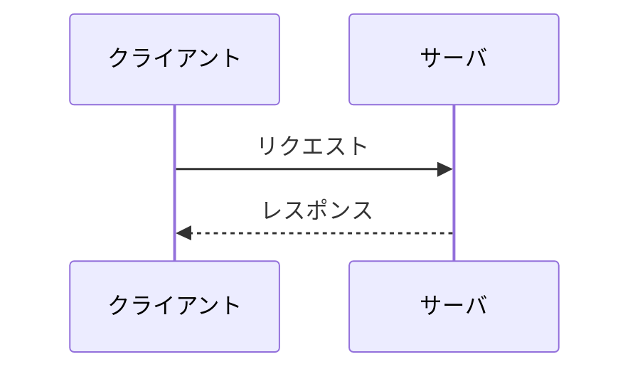

<!-- trace:
ids: []
adrs: []
iadrs: []
specs: []
issues: []
-->
<!-- 起点 ID・関連 ADR/IADR・仕様書名・修飾付き issue 参照は本文へ書かず、上の trace ブロックへ入れる（scripts/check-trace-blocks.js が検査する） -->

# 通信仕様書: <インターフェース名 / API 群>

> API・インターフェース単位で作成する。計画リポジトリのユースケース・業務フロー・技術検討を実装向けに詳細化する。

## 概要

<!-- 対象インターフェースの種別（REST / gRPC / メッセージング 等）・プロトコル・基本方針 -->

## エンドポイント一覧

| メソッド | パス | 概要 |
| --- | --- | --- |
|  |  |  |

## エンドポイント詳細

### <メソッド> <パス>

- 概要:
- 認証・認可:

リクエスト:

| 区分 | 名前 | 型 | 必須 | 説明 |
| --- | --- | --- | --- | --- |
| パスパラメータ |  |  |  |  |
| クエリ |  |  |  |  |
| ボディ |  |  |  |  |

レスポンス:

| ステータス | 条件 | ボディ / 説明 |
| --- | --- | --- |
| 200 |  |  |
| 4xx/5xx |  |  |

エラー:

| エラーコード | 条件 | 対応 |
| --- | --- | --- |
|  |  |  |

## シーケンス

## 非機能・運用

<!-- タイムアウト・リトライ・レート制限・冪等性・バージョニング 等 -->

## 関連仕様

- 機能仕様書:
- データ仕様書:

## 未決事項
