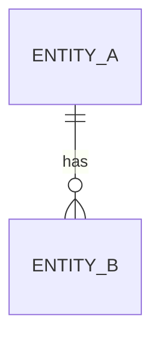

<!-- trace:
ids: []
adrs: []
iadrs: []
specs: []
issues: []
-->
<!-- 起点 ID・関連 ADR/IADR・仕様書名・修飾付き issue 参照は本文へ書かず、上の trace ブロックへ入れる（scripts/check-trace-blocks.js が検査する） -->

# データ仕様書: <対象データ / エンティティ>

> エンティティ / 集約単位で作成する（DB 設計を含む）。計画リポジトリの要求・技術検討・ADR を実装向けに詳細化する。

## 概要

<!-- 対象データの役割・ライフサイクル・永続化の有無 -->

## エンティティ定義

| 属性 | 型 | 必須 | 制約（一意/既定値/範囲） | 説明 |
| --- | --- | --- | --- | --- |
|  |  |  |  |  |

## ER 図

## キー・インデックス・関連

| 種別 | 対象 | 説明 |
| --- | --- | --- |
| 主キー |  |  |
| 外部キー |  |  |
| インデックス |  |  |

## 整合性・制約ルール

<!-- 一意制約・参照整合性・業務上の不変条件など -->

## 永続化方針

<!-- 採用 DB / テーブル / スキーマ。採用根拠は技術要件書・ADR を参照する -->

## マイグレーション・初期データ

<!-- スキーマ変更方針、シードデータの有無 -->

## 関連仕様

- 機能仕様書:
- 通信仕様書:
- 技術要件書:

## 未決事項
