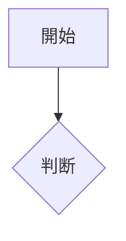

# 機能仕様書: <機能名>

> 機能（FR）単位で作成する。計画リポジトリ（`project-planning`）の要求・ユースケースを実装向けに詳細化する。

## 起点となる計画書（トレーサビリティ）

- 機能要求（FR）:
- ユースケース（UC）:
- 業務フロー（04_workflows）:
- 計画書リンク:

## 概要

<!-- この機能が何を実現するか。利用者・前提・位置づけ -->

## 機能詳細

<!-- 入力・処理・出力と業務ルールを具体的に。判断基準は数値・条件で書く -->

| 項目 | 内容 |
| --- | --- |
| 入力 |  |
| 処理 |  |
| 出力 |  |
| 業務ルール |  |

## 処理フロー / 状態遷移

## 例外・エラー処理

<!-- ユースケースの例外フローを実装観点で具体化する -->

| 条件 | 振る舞い | エラー表示 |
| --- | --- | --- |
|  |  |  |

## 受け入れ基準

<!-- 計画書の受け入れ基準を実装可能な粒度で確定する -->

- [ ]
- [ ]

## 関連仕様

- 画面仕様書:
- 通信仕様書:
- データ仕様書:
- テスト仕様書:

## 未決事項

<!-- 着手前に解消すべき論点 -->
