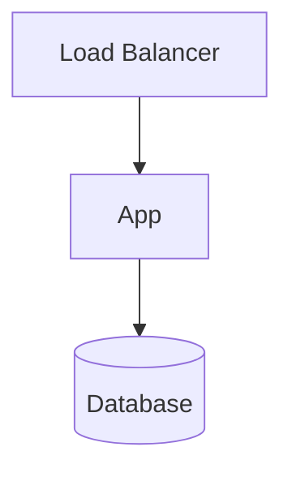

# インフラ・構成仕様書

> 任意。環境構成・インフラ構成を定める（技術要件書から環境面を分離したい場合）。計画リポジトリの技術検討・ADR を詳細化する。

## 起点となる計画書（トレーサビリティ）

- 技術検討（06_technical）/ ADR:
- 非機能要件（可用性・拡張性）:
- 計画書リンク:

## 環境一覧

| 環境 | 用途 | 規模 / スペック | 備考 |
| --- | --- | --- | --- |
| dev |  |  |  |
| stg |  |  |  |
| prod |  |  |  |

## 構成図

## 主要コンポーネント

| コンポーネント | 種別 / サービス | 設定の要点 |
| --- | --- | --- |
|  |  |  |

## ネットワーク・セキュリティ境界

<!-- VPC/サブネット・通信経路・公開範囲・ファイアウォール -->

## IaC・プロビジョニング

<!-- 採用 IaC（Terraform 等）・構成管理・適用フロー -->

## 関連仕様

- 技術要件書:
- 運用仕様書:
- セキュリティ仕様書:

## 未決事項
