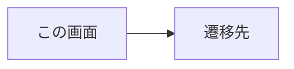

# 画面仕様書: <画面名>（SC-xx）

> 画面（SC）単位で作成する。計画リポジトリの画面設計（05_screens）を実装向けに詳細化する。

## 起点となる計画書（トレーサビリティ）

- 画面（SC）:
- 関連ユースケース（UC）:
- 関連機能要求（FR）:
- 計画書リンク:

## 画面概要・目的

<!-- この画面の役割・利用シーン -->

## レイアウト / 主要素

<!-- 画面構成の概略。必要ならワイヤーフレーム（draw.io）へのリンク -->

## 表示・入力項目

| 項目 | 種別 | 必須 | 初期値 | 形式・制約 | 説明 |
| --- | --- | --- | --- | --- | --- |
|  |  |  |  |  |  |

## バリデーション

| 項目 | 条件 | エラーメッセージ |
| --- | --- | --- |
|  |  |  |

## アクション・イベント

| 操作 | 挙動 | 遷移先 |
| --- | --- | --- |
|  |  |  |

## 画面遷移

## 権限・表示条件

<!-- ロール別の表示/非表示・活性条件など -->

## 計画（モックアップ・画面設計）との対応

計画側の画面設計（`05_screens/01_screens.md` の §主要素・§入力/バリデーション と `mockups/`）が
定める要素を 1 行ずつ挙げ、**実装状況を 3 値で判定する**。

| 計画側の要素 | 実装 | 満たしていない条件 / 理由 | 計画側の該当箇所 |
| --- | --- | --- | --- |
|  | する / **一部する** / しない |  | `01_screens.md:NNN` |

> **「する／しない」の二値にしないこと。** 画面要素の多くは「要素がある／ない」だけでなく
> **「要素はあるが制約を満たさない」**という中間状態を取る。二値で判定すると、この中間が
> 「する」に吸収されて**集計から消える**。
>
> 実際に、二値判定のせいで**部分未実装が 2 件、集計から漏れた**事例がある（planning issue
> [#201](https://github.com/endazon/project-planning/issues/201) / [#198](https://github.com/endazon/project-planning/issues/198) / [#199](https://github.com/endazon/project-planning/issues/199)）。
>
> - タグ入力は実装されている（＝「する」）が、**「既定タグ辞書に整合」という制約だけ**が
>   満たされていなかった。
> - KPI カードは実装されている（＝「する」）が、**指標の意味が違っていた**（一意利用者数 vs
>   イベント件数）。API 契約はイベント件数しか返せず、画面が表示していたのは別物だった。
>
> どちらも**起票後の追加調査で判明**した。「一部する」の行には**満たしていない条件を必ず書く**
> —— 書かないと「する」と同じ扱いに戻り、穴が再び開く。
>
> **「しない」と判定した要素は、理由も併せて残すこと。** とくに「対応する API 契約が無いため
> 実装しない」場合は、**繰り延べであって放棄ではない**ことが読み取れるように書く。計画側へ
> 環流する（`/plan-feedback`）判断の材料にもなる。

## 関連仕様

- 機能仕様書:
- 通信仕様書:

## 未決事項
