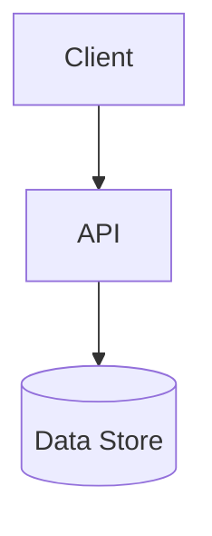

<!-- trace:
ids: []
adrs: []
iadrs: []
specs: []
issues: []
-->
<!-- 起点 ID・関連 ADR/IADR・仕様書名・修飾付き issue 参照は本文へ書かず、上の trace ブロックへ入れる（scripts/check-trace-blocks.js が検査する） -->

# 技術要件書

> リポジトリ単位で1つ作成する（基盤文書）。計画リポジトリの技術検討（06_technical）・ADR・非機能要件を実装向けに確定する。
> 確定済みの技術・設計判断は ADR を一次情報とし、本書はその実装上の要件をまとめる。

## 技術スタック

| 区分 | 採用 | バージョン | 備考 |
| --- | --- | --- | --- |
| 言語 |  |  |  |
| フレームワーク |  |  |  |
| 主要ライブラリ |  |  |  |
| データストア |  |  |  |
| インフラ / 実行環境 |  |  |  |

## アーキテクチャ概要

## 採用方針と根拠

<!-- 主要な技術選定の方針。根拠となる ADR は本文へ書かず、冒頭の trace ブロック（adrs）へ入れる -->

## 非機能要件の実現方針

| 区分 | 目標 | 実現方針 |
| --- | --- | --- |
| 性能 |  |  |
| 可用性 |  |  |
| セキュリティ |  |  |
| 運用・保守 |  |  |
| 拡張性 |  |  |

## 開発・ビルド・テスト・デプロイ

<!-- ビルド/テスト/フォーマットのコマンド、CI/CD、環境構成 -->

## 制約・前提

<!-- 技術・運用上の制約。守るべき境界 -->

## 未決事項
