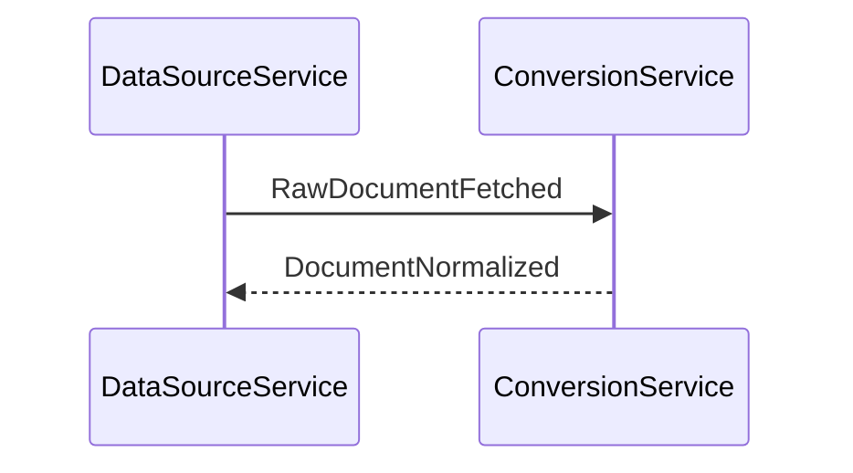

# golden: office-docx-report
# Office(docx) 原本（図 2 件・コード化 1 件＋画像保持 1 件）。混在時の順序・空行と .jpg への写像を固定する。
# 原本は読んでいない。入力は変換器出力を模した Markdown である（IADR-0298 決定 2）。

## input
contentType     : application/vnd.openxmlformats-officedocument.wordprocessingml.document
originalPath    : /docs/design/system-architecture.docx
storageUri      : storage://bucket/raw/system-architecture.docx
confidentiality : internal

## result
documentId      : e7656827-eb8c-514e-a73c-310e6f5af1dd
markdownKey     : e7656827eb8c514ea73c310e6f5af1dd/document.md
markdownUri     : storage://normalized/e7656827eb8c514ea73c310e6f5af1dd/document.md
diagramsCoded   : 1
diagramsRetained: 1
markdownLength  : 378
markdownSha256  : 28a0c37d72db382e423bf59d5b0653affd02df8bdf019802cd801a57c917b4a9

## assets
1) key=e7656827eb8c514ea73c310e6f5af1dd/assets/fig-2.jpg uri=storage://normalized/e7656827eb8c514ea73c310e6f5af1dd/assets/fig-2.jpg contentType=image/jpeg bytes=30 sha256=ac1053bb46f5680eb48b3a1babe9f9274f2e8a86aaea544122c8c0b130af20e6

## diagramCoderCalls
1) figureId=fig-1 confidentiality=internal
2) figureId=fig-2 confidentiality=internal

## figures
1) id=fig-1 coded=true language=|mermaid| code=|sequenceDiagram\n    participant DS as DataSourceService\n    participant CS as ConversionService\n    DS->>CS: RawDocumentFetched\n    CS-->>DS: DocumentNormalized| imageUri=(null) imageContentType=(null) caption=|sequence-normalization|
2) id=fig-2 coded=false language=(null) code=(null) imageUri=|storage://normalized/e7656827eb8c514ea73c310e6f5af1dd/assets/fig-2.jpg| imageContentType=|image/jpeg| caption=|screen-mockup|

## markdown
--8<-- markdown begin
# システム構成設計書

## 全体構成

本システムはマイクロサービス構成を採る。

## 正規化変換の流れ

原本は変換サービスが受け取り、本文と図に分けて処理する。

## 画面

管理画面は変換ジョブの一覧と詳細を提供する。

--8<-- markdown end
